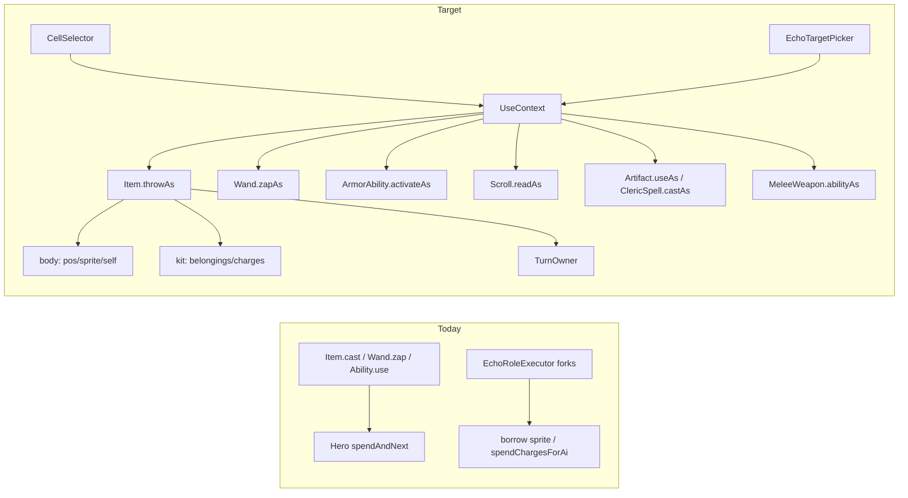

# Dual-consumer arsenal seam (Hero + Echo)

## Opinion

[`EchoRoleExecutor`](core/src/main/java/com/shatteredpixel/shatteredpixeldungeon/heroechoes/online/EchoRoleExecutor.java) reimplements SpiritBow (and forks potions/wands) because arsenal APIs are **Hero-shaped**:

- `user.sprite` / `user.pos` for VFX
- `user.spendAndNext` / `busy` for turns
- backpack detach, wand/armor charges, talent / QuickSlot / `Dungeon.hero` riders

Echo is not one actor. It splits three roles that Hero collapses into self:

| Role     | Hero           | Echo                                                                                                                                                       |
| -------- | -------------- | ---------------------------------------------------------------------------------------------------------------------------------------------------------- |
| **body** | self           | [`EchoBoss`](core/src/main/java/com/shatteredpixel/shatteredpixeldungeon/actors/mobs/EchoBoss.java) — pos, sprite, **self-buff target**                    |
| **kit**  | self           | phantom [`Hero`](core/src/main/java/com/shatteredpixel/shatteredpixeldungeon/actors/hero/Hero.java) — belongings, wand/armor charges, Hero-shaped formulas |
| **turn** | `spendAndNext` | AI returns `true` (no phantom spend)                                                                                                                       |

Self-drink potions already apply buffs to the **boss**, not the kit hero — so any seam that pretends one `ItemUser` owns inventory + body + turn under-models Echo.

**Don’t** make every item take two consumer types with duplicated branches. **Don’t** put `ItemUser` on `Hero` / `EchoBoss`. **Do** introduce a call-site **`UseContext`**, then three execute entry points that both consumers share.



## Chosen approach

0. **Green Hero characterization tests** before production changes (SpiritBow first).
1. Add **`UseContext`** (not an actor interface) near items — constructed at the call site.
2. Add **`Item.throwAs(ctx, cell)`** — shared throwable execute (VFX via existing [`castVisual`](core/src/main/java/com/shatteredpixel/shatteredpixeldungeon/items/Item.java), effect, resource, turn policy).
3. Migrate **SpiritBow** first onto `throwAs`; thin Echo bow fork.
4. Later pipelines on the **same** context:
   - potions / stones / bombs / missiles → `throwAs`
   - wands / staff → `Wand.zapAs(ctx, cell)` (fold [`spendChargesForAi`](core/src/main/java/com/shatteredpixel/shatteredpixeldungeon/items/wands/Wand.java))
   - armor abilities → `ArmorAbility.activateAs(ctx, cell)`
   - scrolls → `Scroll.readAs(ctx)`
   - artifacts / cleric / duelist → `useAs` / `castAs` / `abilityAs`

### `UseContext` (minimal)

```java
// Conceptual shape — body ≠ kit ≠ turn
record UseContext(
  Char body,       // pos, sprite, self-buff target
  Hero kit,        // belongings, charges, Hero formulas / curUser
  TurnOwner turns, // spendAndNext vs Echo no-op (executor returns spent)
  boolean heroFX   // QuickSlot, identify, Seer Shot, talent riders
) {}
```

| Concern  | Hero                    | Echo (`UseContext.echo(boss)`) |
| -------- | ----------------------- | ------------------------------ |
| `body`   | hero                    | boss                           |
| `kit`    | hero                    | phantom echo hero              |
| `turns`  | `spendAndNext` / `busy` | no-op (caller marks turn spent)|
| `heroFX` | true                    | false                          |

No pass-through actor wrapper class: factory builds a context from boss + echo hero. Sprite borrow for `Char.attack` hit VFX stays an **internal** detail of the shot path, not the public API.

### Aim vs execute

Execute APIs never open CellSelector. Cell is already chosen.

| Layer       | Player Hero                                       | EchoBoss                                                                                                                           |
| ----------- | ------------------------------------------------- | ---------------------------------------------------------------------------------------------------------------------------------- |
| **Aim**     | `CellSelector` / quickslot                        | [`EchoTargetPicker`](core/src/main/java/com/shatteredpixel/shatteredpixeldungeon/heroechoes/online/EchoTargetPicker.java) / policy |
| **Execute** | `throwAs` / `zapAs` / `activateAs` / `readAs`     | same with `echoCtx`                                                                                                                |

### Execute pipelines (same context)

| API                                  | Covers                                        | Status |
| ------------------------------------ | --------------------------------------------- | ------ |
| `Item.throwAs(ctx, cell)`            | potions, stones, bombs, missiles, SpiritArrow | **done** |
| `Wand.zapAs(ctx, cell)`              | wands, staff zap                              | **done** |
| `ArmorAbility.activateAs(ctx, …)`    | charge skills                                 | **done** |
| `Scroll.readAs(ctx)`                 | scrolls                                       | **partial** (base + Recharging/Rage; more TBD) |
| `Potion.drinkAs(ctx)`                | self-drink → `apply(ctx.body)`                | **done** |
| `CloakOfShadows.useAs(ctx)`          | stealth toggle                                | **done** |
| `HolyTome.castAs` / `ClericSpell.castAs` | cleric spells                            | **partial** (HolyWard; inventory spells refuse) |
| `MeleeWeapon.abilityAs(ctx, cell)`   | duelist weapon abilities                      | **partial** (Scimitar, Quarterstaff) |

Hero public APIs become thin wrappers (busy / QuickSlot / flurry / Seer Shot stay Hero-only overlays when `heroFX`).

## Out of scope (until later todos)

- Making `EchoBoss` extend `Hero`
- Changing policy generation / item ids
- `ItemUser` interface on Char / Hero / EchoBoss
- InventoryStone bag-UI self-activate for Echo (pending)
- Full Char-safe coverage for every scroll (pending)
- UI-heavy armor ability edges (Trinity, WarpBeacon tele, SmokeBomb empty-cell) for Echo (pending)
- Remaining artifacts / cleric spells / duelist weapons beyond MVP (pending)

## Verification (TDD)

1. Before production change: Hero SpiritBow characterization tests green.
2. Through bow refactor: those + existing Echo SpiritBow tests stay green.
3. After seam: UseContext-driven tests (Hero + Echo → shared `throwAs`); do not weaken Step 0 assertions.
4. Each later pipeline: Hero characterization first, then migrate, then thin the matching Echo fork.
5. Combat paths use `EchoTestSupport.installEchoBossLevel` (linked sprites; phantom kit sprite-less).

## Why not alternatives

| Approach                                      | Why not                                                                            |
| --------------------------------------------- | ---------------------------------------------------------------------------------- |
| Borrow sprite + call `Hero.cast` / `wandUsed` | Wrong turn owner; talent/QuickSlot/identify on phantom                             |
| `ItemUser` on Hero + EchoBoss                 | Collapses body/kit/turn; self-drink needs body ≠ kit; invites pass-through adapter |
| EchoBoss extends Hero                         | Wrong lifecycle (Mob AI vs Hero turn/UI)                                           |
| Keep growing executor forks                   | Does not scale across throwables + charged skills                                  |

---

## Done (as of 2026-07-22)

### Seam core

- [`UseContext`](core/src/main/java/com/shatteredpixel/shatteredpixeldungeon/items/UseContext.java) — `hero(Hero)`, `echo(EchoBoss)`; `TurnOwner.NO_OP` vs hero `busy` / `spendAfterThrow`
- Pattern: mechanical effects on `ctx.body`; GLog / SpellSprite / identify behind `heroFX`; inventory/charges on `ctx.kit`; turns via `ctx.turns`

### Throwables / bow / missiles

- [`Item.throwAs`](core/src/main/java/com/shatteredpixel/shatteredpixeldungeon/items/Item.java); Hero `cast` → `throwAs(UseContext.hero)`
- [`SpiritBow.SpiritArrow.throwAs`](core/src/main/java/com/shatteredpixel/shatteredpixeldungeon/items/weapon/SpiritBow.java); Echo bow fork removed
- Generic [`MissileWeapon`](core/src/main/java/com/shatteredpixel/shatteredpixeldungeon/items/weapon/missiles/MissileWeapon.java) via shared `throwAs`
- [`Bomb.throwAs`](core/src/main/java/com/shatteredpixel/shatteredpixeldungeon/items/bombs/Bomb.java)
- Throwable [`Runestone`](core/src/main/java/com/shatteredpixel/shatteredpixeldungeon/items/stones/Runestone.java) (not `InventoryStone`) via `throwAs`

### Potions

- [`Potion.drinkAs`](core/src/main/java/com/shatteredpixel/shatteredpixeldungeon/items/potions/Potion.java) → `apply(ctx.body)`
- Many potions/elixirs: `apply(Hero)` → `apply(Char)` (Haste-style); Hero-only kept for Strength / Experience / Might / MindVision / MagicalSight
- Echo self-drink: data-driven `defaultAction() == AC_DRINK` + role exceptions (`HEAL`, `CLEANSE*`, `PURITY`, `HASTE`, `INVIS`, `LEVITATE`); Hero-only refuse without consume
- [`PotionOfDragonsBreath`](core/src/main/java/com/shatteredpixel/shatteredpixeldungeon/items/potions/exotic/PotionOfDragonsBreath.java) — `breatheAs(ctx, cell)` shared cone; `drinkAs` refuses (needs aim); Hero CellSelector → `breatheAs`; executor wires before self-drink

### Wands / staff

- [`Wand.zapAs`](core/src/main/java/com/shatteredpixel/shatteredpixeldungeon/items/wands/Wand.java); unified `wandUsed(UseContext)` (always charge spend; riders/turn when `heroFX`)
- [`MagesStaff.zapAs`](core/src/main/java/com/shatteredpixel/shatteredpixeldungeon/items/weapon/melee/MagesStaff.java)

### Armor abilities

- [`ArmorAbility.activateAs`](core/src/main/java/com/shatteredpixel/shatteredpixeldungeon/actors/hero/abilities/ArmorAbility.java); abilities use `activate(ClassArmor, UseContext, Integer)`
- Effects on `ctx.body`; charge/talents on `ctx.kit`; turns via `ctx.turns`
- Notable fixes: SpectralBlades ally check uses `user.alignment`; SmokeBomb + WarpBeacon recall use shared `appear` / `recallToBeacon` for Hero and Echo; Feint relocate + AfterImage owner kit/body

### Scrolls (partial)

- [`Scroll.readAs(UseContext)`](core/src/main/java/com/shatteredpixel/shatteredpixeldungeon/items/scrolls/Scroll.java); Hero `execute` → `readAs`
- Default `doReadAs`: Echo (`!heroFX`) returns false unless subclass overrides
- Char-safe: [`ScrollOfRecharging`](core/src/main/java/com/shatteredpixel/shatteredpixeldungeon/items/scrolls/ScrollOfRecharging.java), [`ScrollOfRage`](core/src/main/java/com/shatteredpixel/shatteredpixeldungeon/items/scrolls/ScrollOfRage.java)
- Executor wires `instanceof Scroll` → `readAs`

### [`EchoRoleExecutor`](core/src/main/java/com/shatteredpixel/shatteredpixeldungeon/heroechoes/online/EchoRoleExecutor.java)

Handles via shared seam (no item-class forks for effect logic):

| Item / path | API |
| ----------- | --- |
| Potion | `drinkAs` / `throwAs` |
| Scroll | `readAs` |
| ClassArmor | `activateAs` |
| Wand | `zapAs` |
| SpiritBow | `knockArrow().throwAs` |
| MagesStaff | `zapAs` |
| MissileWeapon / Bomb / throwable Runestone | `throwAs` |
| CloakOfShadows | `useAs` |
| HolyTome | `castAs` (capability `"spell"` field) |
| MeleeWeapon (DUELIST, not MagesStaff) | `abilityAs` |

### Artifacts / cleric / duelist (MVP)

- [`CloakOfShadows.useAs`](core/src/main/java/com/shatteredpixel/shatteredpixeldungeon/items/artifacts/CloakOfShadows.java) — stealth buff on `ctx.body`
- [`HolyTome.castAs`](core/src/main/java/com/shatteredpixel/shatteredpixeldungeon/items/artifacts/HolyTome.java) + [`ClericSpell.castAs`](core/src/main/java/com/shatteredpixel/shatteredpixeldungeon/actors/hero/spells/ClericSpell.java); [`HolyWard`](core/src/main/java/com/shatteredpixel/shatteredpixeldungeon/actors/hero/spells/HolyWard.java) Char-safe; inventory spells refuse Echo
- [`MeleeWeapon.abilityAs`](core/src/main/java/com/shatteredpixel/shatteredpixeldungeon/items/weapon/melee/MeleeWeapon.java); shared helpers: [`Scimitar`](core/src/main/java/com/shatteredpixel/shatteredpixeldungeon/items/weapon/melee/Scimitar.java) / [`Quarterstaff`](core/src/main/java/com/shatteredpixel/shatteredpixeldungeon/items/weapon/melee/Quarterstaff.java); [`RoundShield.guardAbility`](core/src/main/java/com/shatteredpixel/shatteredpixeldungeon/items/weapon/melee/RoundShield.java); [`Sword.cleaveAbility`](core/src/main/java/com/shatteredpixel/shatteredpixeldungeon/items/weapon/melee/Sword.java) (WornShortsword→Greatsword); unmigrated weapons refuse when `body != kit`
- [`MissileWeapon.rangedHit`](core/src/main/java/com/shatteredpixel/shatteredpixeldungeon/items/weapon/missiles/MissileWeapon.java) — null-safe heap sprite after drop (headless / no GameScene)

### Tests (representative)

- [`EchoRoleExecutorTest`](core/src/test/java/com/shatteredpixel/shatteredpixeldungeon/heroechoes/online/EchoRoleExecutorTest.java) — potions (incl. Stamina/ArcaneArmor/Hero-only refuse), MissileWeapon, SpiritBow, Bomb, StoneOfBlast, Scroll Recharging/Upgrade refuse, Endure armor ability
- [`SpiritBowThrowAsTest`](core/src/test/java/com/shatteredpixel/shatteredpixeldungeon/items/weapon/SpiritBowThrowAsTest.java) / Hero cast characterization
- [`PotionThrowAsTest`](core/src/test/java/com/shatteredpixel/shatteredpixeldungeon/items/potions/PotionThrowAsTest.java)
- [`WandZapAsTest`](core/src/test/java/com/shatteredpixel/shatteredpixeldungeon/items/wands/WandZapAsTest.java)
- [`BombThrowAsTest`](core/src/test/java/com/shatteredpixel/shatteredpixeldungeon/items/bombs/BombThrowAsTest.java)
- [`RunestoneThrowAsTest`](core/src/test/java/com/shatteredpixel/shatteredpixeldungeon/items/stones/RunestoneThrowAsTest.java)
- ArmorAbilityActivateAsTest (NaturesPower, Endure, Shockwave, SmokeBomb, SpectralBlades, low charge)
- [`CloakOfShadowsUseAsTest`](core/src/test/java/com/shatteredpixel/shatteredpixeldungeon/items/artifacts/CloakOfShadowsUseAsTest.java)
- [`HolyWardCastAsTest`](core/src/test/java/com/shatteredpixel/shatteredpixeldungeon/items/artifacts/HolyWardCastAsTest.java)
- [`MeleeWeaponAbilityAsTest`](core/src/test/java/com/shatteredpixel/shatteredpixeldungeon/items/weapon/melee/MeleeWeaponAbilityAsTest.java)
- EchoRoleExecutor: STEALTH / HOLY_WARD / WEAPON_ABILITY

## Remaining

1. **InventoryStone** self-activate for Echo (no bag UI)
2. **More scrolls** — Char-safe `doReadAs` beyond Recharging/Rage
3. **Armor ability UI edges** — Trinity, WarpBeacon teleport, SmokeBomb empty-cell targeting
4. **More artifacts** beyond CloakOfShadows; **more cleric spells** beyond HolyWard; **more duelist weapons** beyond Scimitar/Quarterstaff
5. Broader potion/elixir Char coverage audit if any `apply(Hero)` leftovers still matter for Echo
