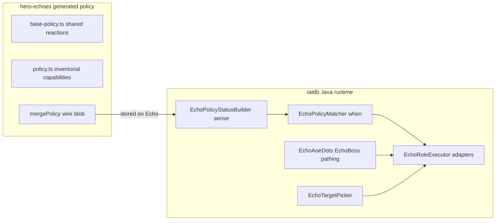

# Echo policy — survival, AoE, targeting, LOS, blockers

> **Plan status:** re-baselined against the working tree. A substantial part of the
> original plan (all of §2/§2b/§2c Java pathing, the `role_not_ready` leaf, the status
> aliases for purity/paralysis/invuln/shield, `lastAttackerPos`/`policyFocusCell`, and the
> hunting-melee fallthrough suppression) **is already implemented** as uncommitted work.
> See [§0 Baseline](#0-baseline--what-is-already-done) before planning any of it again.
> The remaining work is concentrated in `hero-echoes` and in the **hard gates** that the
> landed status aliases do not yet drive.

---

## 0. Baseline — what is already done

Measured against the working tree, not against memory. All of the following is **present
but uncommitted** on branch `upstream-first-echo-adapters`.

| Plan section                          | State           | Evidence                                                                                                                                                                    |
| ------------------------------------- | --------------- | --------------------------------------------------------------------------------------------------------------------------------------------------------------------------- |
| §2b gas-growth path mask              | **Done**        | [`EchoAoeDots.isAoeHazardForPath` / `isPredictedGasAt` / `predictedGasVolume`](../../core/src/main/java/com/shatteredpixel/shatteredpixeldungeon/heroechoes/policy/EchoAoeDots.java) |
| §2c harmful-plant path mask           | **Done**        | `EchoAoeDots.isHarmfulPlantAt` — exactly the 7 plants in the plan's table                                                                                                   |
| §2 bestExit scoring                   | **Partly done** | `exitScore` = pocket-avoidance (`hasClearNeighbour`, +1000) + `gasClearance` ×10 + kite/approach distance. This is **depth-1**, not the planned BFS depth-2                  |
| §3 `role_not_ready` when-leaf         | **Done**        | [`EchoPolicyWhen`](../../core/src/main/java/com/shatteredpixel/shatteredpixeldungeon/heroechoes/policy/EchoPolicyWhen.java) line 87 + test                                   |
| §5 attack-direction memory            | **Done**        | [`EchoBoss.lastAttackerPos()` / `policyFocusCell()`](../../core/src/main/java/com/shatteredpixel/shatteredpixeldungeon/actors/mobs/EchoBoss.java)                            |
| §8 `purity` / `paralysis_immunity` aliases | **Done**   | [`EchoPolicyStatusBuilder.statusNames`](../../core/src/main/java/com/shatteredpixel/shatteredpixeldungeon/heroechoes/policy/EchoPolicyStatusBuilder.java)                    |
| §9 `invulnerable` / `timed_shield` aliases | **Done**   | same, plus `EchoBoss.enemyInvulnerableOrShielded()`                                                                                                                         |
| §9 hunting-melee fallthrough suppression | **Done**     | `EchoBoss.act()` → `spend(TICK)` WAIT when invuln/shielded                                                                                                                  |

**Not done — this is the actual remaining scope:**

| Area                                                                                     | Nothing exists |
| ---------------------------------------------------------------------------------------- | -------------- |
| Every `hero-echoes` change: `CLEAR_LOS`, `CLEAR_PLANT`, `PATH_THROUGH`, `BLIND` caps     | grep: 0 hits   |
| Every new reaction id (`aoe_trapped_*`, `disengage_invuln_*`, `melee_*_close`, `clear_*`) | grep: 0 hits   |
| `plant_blocked` / `los_blocked` / `path_blocked` sense flags                              | grep: 0 hits   |
| **Hard gates** — purity and invuln/shield only *name* statuses; no role is unreadied      | see §8, §9     |
| §4 attack readiness (`virtualRoleFeasible` still `default: return true`)                  | see §4         |
| `retreat_hp` consumed at match time (defined, written, never read)                        | see §1         |

### 0a. Blocking hygiene — do these first

1. **TDD debt.** The landed WIP is **+634 production lines against +13 test lines**
   (only [`EchoPolicyWhenTest`](../../core/src/test/java/com/shatteredpixel/shatteredpixeldungeon/heroechoes/policy/EchoPolicyWhenTest.java)).
   `EchoAoeDots` (+167: gas prediction, plant mask, exit scoring) and `EchoBoss` (+125)
   have **no tests at all**. The repo's TDD rule is mandatory for production behavior, so
   this is a violation to repay, not a backlog item. Write characterization tests for the
   landed behavior **before** any new production code in this plan.
2. **Branch.** `AGENTS.md` says feature work happens on `main`; the working tree is on
   `upstream-first-echo-adapters` with 28 modified files, ~20 of them unrelated to echo
   policy (`Berserk`, `Combo`, `Momentum`, wands, glyphs, curses, plus a +336-line
   `NullSpriteVfxSafetyTest`). Split the echo-policy slice from the adapter slice before
   committing, or this plan's diff is unreviewable.
3. **`lastAttackerPos` is not bundled.** It is a plain field, absent from
   `storeInBundle`/`restoreFromBundle`, so it resets to `-1` across a save/load mid-fight.
   Either bundle it or state explicitly that focus memory is intentionally
   session-scoped — the CLEAR_LOS design in §5 depends on it.
4. **Link paths in this document.** From `.cursor/plans/`, `../../` is the **iatdb repo
   root**. `../../core/...` is correct; `../../../hero-echoes/...` is required to reach the
   sibling repo. All hero-echoes links below use the corrected depth.

---

## Ownership: Java runtime vs generated policy

Split is intentional: **Java owns truth about the live fight** (sense, legality, pathing,
execute). **Generated policy owns intent** (which role when, priorities, kit→role maps,
tuning numbers). Policy never reimplements blob math or Ballistica; Java never hard-codes
inventorial reaction ladders that belong in the playbook.



### What must not cross the line

- **Do not** put gas evolve math, Ballistica, or FOV ray tests into TypeScript policy.
- **Do not** hard-code inventorial "if has LiquidFlame then clear bush" ladders only in
  Java — map items in generated capabilities; Java only marks the role ready/unready.
- **Do** fail closed in Java when legality fails (purity, no aim, growth ring) so a bad or
  custom policy cannot waste kit.
- **Do** express preference/priority in generated reactions so playbook changes ship with
  the backend without a client rebuild when only thresholds/order change.

### New shared id strings

The status builder currently spells `"purity"`, `"paralysis_immunity"`, `"invulnerable"`,
`"timed_shield"` as inline literals, and this plan adds `plant_blocked`, `los_blocked`,
`path_blocked`. Put all of them as constants on
[`EchoPolicyHazards`](../../core/src/main/java/com/shatteredpixel/shatteredpixeldungeon/heroechoes/policy/EchoPolicyHazards.java)
(today it holds only `FIRE_AOE` / `PAYOFF_AOE`) so Java and the
[`DebugStrategyKit`](../../core/src/main/java/com/shatteredpixel/shatteredpixeldungeon/heroechoes/debug/DebugStrategyKit.java)
mirror cannot drift on a typo.

---

## Priority map — collisions must be resolved first

[`EchoPolicyMatcher.sortByPriorityDescending`](../../core/src/main/java/com/shatteredpixel/shatteredpixeldungeon/heroechoes/policy/EchoPolicyMatcher.java)
uses `Collections.sort`, which is **stable**: equal priorities are silently decided by
merge-array order (base before delta). That is not a contract anyone should rely on.

Occupied today:

| Band      | Owner                                                                                        |
| --------- | ---------------------------------------------------------------------------------------------- |
| 110–100   | base survival ladder (`finish_him` 110 … `blind_defense_ranged` 100); **101 is the commented-out `door_break` slot** |
| 106, 104  | **delta** `blink_escape` @106 and `cleric_lay_on_hands` @104 — 104 already collides with base `cleanse_debuff` @104 |
| 88–83     | delta kite package: `kite_blink` @86, `kite_knockback` @85, `kite_cc` @84, `kite_fear` @83   |
| 80–68     | base setup/payoff/imbues + delta class reactions                                             |

Consequences for this plan's proposed numbers:

- `melee_cc_close` @86 **collides with `kite_blink` @86**. Reserve **93–90** for the melee
  close-in package instead (haste 93, blind 92, CC 91) — above the kite band, below the
  disengage band, and clear of the survival ladder.
- `clear_bush_for_los` @101 reuses the dead `door_break` slot. Acceptable, but state it so
  re-enabling `door_break` later is a conscious conflict.
- Keep the disengage block at **99/98/97** (free today).
- Keep trapped-AoE at **108/107** — but note these **displace** the existing
  `burn_step_into_water` @108 / `burn_use_frost` @107. Move trapped-AoE to **96/95/94**
  instead: burning-in-water is a strictly better response than fighting while burning.
- Move `clear_plant_blocker` to **89**, `path_blocked_pierce` to **82**,
  `path_blocked_blink` to **81** (clear of the kite band).

**Add a hero-echoes unit test** asserting that every reaction id in a fully merged policy
(base + each class delta) has a **unique priority**. This is the cheapest guard against
the whole class of bug and should land with the first hero-echoes change.

---

## 1. Low-HP survival priority

**Goal:** When pressured, spend the turn on living, not on optional setup.

**Correction to the original plan:** the thresholds are not merely "unwired" — the
survival reactions use **hardcoded** bands that contradict `retreat_hp`:

| Reaction              | Hardcoded today | Source                                                                         |
| --------------------- | --------------- | ------------------------------------------------------------------------------ |
| `blink_escape` @106   | `self_hp_below: 0.35` | [`policy.ts`](../../../hero-echoes/src/lib/echo/policy.ts)                |
| `cleric_lay_on_hands` @104 | `self_hp_below: 0.35` | same                                                                  |
| `tuning.retreat_hp`   | `0.25`, MAGE `0.3` | [`base-policy.ts`](../../../hero-echoes/src/lib/echo/base-policy.ts) + `policy.ts` |

`retreat_hp` is written into the wire blob and into the Payload delta schema, but **no
Java code reads it** (only [`DebugStrategyKit`](../../core/src/main/java/com/shatteredpixel/shatteredpixeldungeon/heroechoes/debug/DebugStrategyKit.java)
writes its own `0.3`). So this task is "derive the bands from `retreat_hp` at generate
time and delete the 0.35 constants", not "add a new lookup".

### Priority ladder (reactions, highest first among survival)

Reuse existing ids; only reorder / gate.

| Pri     | Reaction             | When (extra gates)                                                        | Why                                                                     |
| ------- | -------------------- | ------------------------------------------------------------------------- | ------------------------------------------------------------------------- |
| 109     | `leave_aoe_dot`      | unchanged                                                                 | DoT ticks kill faster than most heals                                   |
| 108–107 | burn → water / frost | unchanged                                                                 | keeps precedence over trapped-fight (see priority map)                  |
| **106** | `blink_escape`       | `retreat_hp`-derived band + close + BLINK                                 | Space before potion                                                     |
| **105** | `heal_when_hurt`     | band + HEAL; **not** `aoe_dot` unless LEAVE_AOE unready _and_ no fight role | Avoid drinking in fire when a step-out exists                         |
| 104     | cleanse              | unchanged (resolve the `cleric_lay_on_hands` tie)                         |                                                                         |
| 103     | haste_disengage      | unchanged                                                                 |                                                                         |
| 102     | invis_escape         | unchanged                                                                 |                                                                         |
| 100     | blind_defense        | unchanged                                                                 |                                                                         |

**Wire `tuning.retreat_hp` (generated policy only):** at generate/merge time in
hero-echoes, write numeric `self_hp_below` / `self_hp_above` on survival reactions from
`tuning.retreat_hp` (+ small offsets for the haste/blink bands). The Java matcher keeps
comparing floats — **no new `"retreat_hp"` when-keyword**.

**Finish vs survive:** keep `finish_him` @110 only when in the `enemy_hp_below` finish band
**and** the echo is not self-critical (`self_hp_above: retreat_hp`).

---

## 2. Leave AoE — remaining work only

Implemented (see §0): adjacent-only step, hazard-masked candidate filter, pocket-avoidance,
gas-clearance scoring, kite/approach tiebreak, and blink land cells sharing the mask.

**Remaining, and worth questioning:** the original plan asked for **BFS depth-2** exit
scoring on top of depth-1 `hasClearNeighbour`. Depth-1 already avoids the 1-tile pocket
case the plan names. Recommend **dropping depth-2** from this slice (it is listed under
"out of scope" for full multi-tile AoE pathfinding anyway) unless a concrete failing
scenario is produced first. If kept, it needs its own failing test before implementation.

**Test debt to repay here (§0a):** seeded high-volume toxic cloud → CLOSE_IN / leave /
blink all refuse the neighbour the evolve formula fills next; a cell two tiles outside the
growth ring stays legal; Firebloom/Sorrowmoss refused, Sungrass pathable.

---

## 2c. Harmful plants — remaining work only

The **avoid** half is done. What remains is the **clear-when-blocking** half.

### Java — sense as removable blocker

When hunting focus is `policyFocusCell()` and:

- the shortest path with harmful plants treated as impassable is null or much longer, **and**
- the shortest path ignoring those plant cells has a harmful plant on it,

set self flag **`plant_blocked`** and remember **`plant_blocker_cell`** (first harmful
plant on the short path). Same shape as `path_blocked` for sheep (§7).

`CLEAR_PLANT` ready when: `plant_blocked` ∧ kit has a clear item ∧ Ballistica/throw can
legally aim `plant_blocker_cell` ∧ self-safe for fire tools.

### Generated policy — role `CLEAR_PLANT`

[`Fire.burn`](../../core/src/main/java/com/shatteredpixel/shatteredpixeldungeon/actors/blobs/Fire.java)
calls `plant.wither()`, so the fire clearers double as plant clearers:

| Item                    | How it removes the plant |
| ----------------------- | ------------------------ |
| `PotionOfLiquidFlame`   | Seeds fire → wither      |
| `WandOfFireblast`       | Cone fire → wither       |
| `PotionOfDragonsBreath` | Cone fire                |
| `IncendiaryDart`        | Thrown fire              |

Share one item-list helper (e.g. `fireClearItems(kit)`) between `CLEAR_PLANT` and
`CLEAR_LOS` so the two stay in sync. This is a shared data source, not a forwarding facade,
so it does not trip the no-pass-through-wrappers rule.

```text
clear_plant_blocker  @89
when: plant_blocked (self) ∧ role_ready CLEAR_PLANT
do:   CLEAR_PLANT → plant_cell
```

Aim the **plant cell**, not the hero — so hero `purity` must **not** unready CLEAR_PLANT
(the purity hard gate in §8 covers `SETUP_CC`/`PAYOFF_AOE` only). If CLEAR_PLANT is not
ready: path around, else fight-when-trapped / WAIT / blink past.

**Do not** clear beneficial plants (`Sungrass`, `Earthroot`, `Mageroyal`, `Swiftthistle`,
`Starflower`, `BlandfruitBush`). **Do not** step on a plant as the clear method.

### Tests

- Sense: plant on sole corridor → `plant_blocked` + blocker cell; CLEAR_PLANT ready with LiquidFlame.
- Execute/match: `clear_plant_blocker` spends the fire tool at the plant cell; plant gone; path opens next turn.
- Beneficial plant never sets `plant_blocked`.
- Hero has `purity` → CLEAR_PLANT still ready (regression guard against over-broad gating).

---

## 3. Fight if it cannot leave AoE

Trapped = `self_status: aoe_dot` ∧ `role_not_ready: LEAVE_AOE`. The `role_not_ready` leaf
**already exists** — only the reactions remain.

New reactions in [`base-policy.ts`](../../../hero-echoes/src/lib/echo/base-policy.ts)
(stripped automatically if the role has no kit items), renumbered per the priority map so
they do not displace the burn responses:

```text
aoe_trapped_purity   @96  when: aoe_dot ∧ ¬LEAVE_AOE ∧ PURITY        do: PURITY
aoe_trapped_ranged   @95  when: aoe_dot ∧ ¬LEAVE_AOE ∧ enemy_in_los ∧ RANGED  do: RANGED → enemy_cell
aoe_trapped_melee    @94  when: aoe_dot ∧ ¬LEAVE_AOE ∧ distance_lte 1 ∧ MELEE do: MELEE
```

PURITY first: cancelling the blob beats trading damage inside it. Note the status does not
currently distinguish gas from fire — if PURITY is mapped and the trap is fire, the potion
still helps (`BlobImmunity` covers fire), so no gas/fire discrimination is needed.

Mirror in [`DebugStrategyKit`](../../core/src/main/java/com/shatteredpixel/shatteredpixeldungeon/heroechoes/debug/DebugStrategyKit.java).

---

## 4. Target hero correctly and be in range

**This is the least-specified section and needs a concrete design before implementation.**
The original "extend `virtualRoleFeasible`" is not sufficient:
`virtualRoleFeasible(role, boss, enemy, level)` handles only
`MOVE_TO_WATER`/`MOVE_TO_GRASS`/`LEAVE_AOE`/`BLINK` and returns `true` by default. It runs
while **walking capability entries** — it does not know which item will be picked, because
selection happens later in
[`EchoRoleResolver`](../../core/src/main/java/com/shatteredpixel/shatteredpixeldungeon/heroechoes/policy/EchoRoleResolver.java).
A Ballistica check needs the resolved item's collision mode and range.

**Two-layer design:**

1. **Cheap readiness guard** in `virtualRoleFeasible` — item-independent facts only:
   - `MELEE`: hero alive ∧ (adjacent ∨ weapon reach) ∧ visible-or-adjacent.
   - `RANGED` / `FINISHER`: hero alive ∧ `enemy_in_los` (or the blind-defense cloak path).
2. **Authoritative legality** in item selection — `EchoRoleResolver` must skip a candidate
   item whose Ballistica from boss→hero collides short of the hero, or whose practical
   range is exceeded. If every candidate fails, the role resolves to nothing and the
   matcher falls through.

[`EchoTargetPicker.pick`](../../core/src/main/java/com/shatteredpixel/shatteredpixeldungeon/heroechoes/policy/EchoTargetPicker.java)
returns `-1` for illegal aim so the executor fails closed. **Do not invent fake targets.**

Open question to settle before coding: whether layer 2 belongs in `EchoRoleResolver` or in
a legality predicate the resolver calls. Prefer the latter if the resolver would otherwise
need to import Ballistica and every item type.

---

## 5. Attack direction + clear bushes for FOV

`lastAttackerPos` and `policyFocusCell()` are landed (§0). Remaining:

### Sense — `los_blocked`

Each hunt turn after the FOV update, when `!enemyInLos` and `policyFocusCell() >= 0`: set
self flag `los_blocked` if a Ballistica ray boss → focus is interrupted by `HIGH_GRASS` or
`FURROWED_GRASS`. Distinguish this from "occluded by a wall", where CLEAR_LOS is useless
and repositioning is the answer — the flag must mean *grass on the ray*, not merely *no LOS*.

### Role `CLEAR_LOS`

Ready when `los_blocked` ∧ kit has a CLEAR_LOS item ∧ the blocking grass cell is legally
aimable.

```text
clear_bush_for_los  @101   (reuses the dead door_break slot — see priority map)
when: enemy_in_los false ∧ los_blocked ∧ role_ready CLEAR_LOS
do:   CLEAR_LOS → bush_cell
```

Stepping into grass also clears it (trample), so only spend CLEAR_LOS when a single step
cannot open LOS this turn.

---

## 6. Items that clear bushes → `CLEAR_LOS`

Flammable grass is destroyed by fire (`Fire.evolve` → `Level.destroy`); trample on step.
Prefer items already supported by the Echo adapters.

| Item                                     | How it clears              | Notes                                            |
| ---------------------------------------- | -------------------------- | ------------------------------------------------ |
| `PotionOfLiquidFlame`                    | Seeds fire on / near grass | Also PAYOFF_AOE — fine to appear in several caps |
| `WandOfFireblast`                        | Cone fire, WONT_STOP       | Prefer when charged; self-safety check           |
| `PotionOfDragonsBreath`                  | Cone                       | Targeted breathe adapter exists                  |
| `IncendiaryDart`                         | Thrown fire                | Only if the throw path is supported              |
| `Bomb` / blast stones                    | Terrain destroy            | Only if already executable; else skip            |
| Soft: step (`CLOSE_IN` / `*move_closer`) | `HighGrass.trample`        | Prefer when grass is adjacent toward focus       |

**Not** clearers: `WandOfPrismaticLight` (discovers/maps, does not remove HIGH_GRASS),
`WandOfRegrowth` (grows grass). Note Prismatic *does* apply `Blindness` — that is why it
is the `BLIND` item in §10, not a `CLEAR_LOS` item.

Map in [`policy.ts` `inventorialCapabilities`](../../../hero-echoes/src/lib/echo/policy.ts)
+ an empty stub in `basePolicy.capabilities.CLEAR_LOS`.

---

## 7. Items that pass through sheep / soft blockers → `PATH_THROUGH`

### Sense

Signature is
`Dungeon.findPath(Char ch, int to, boolean[] pass, boolean[] vis, boolean chars)` — the
last parameter is **`chars`**, where `true` means *treat characters as blocking*. The
original plan wrote `ignoreChars=`, which is inverted; do not copy that naming into code.

Set `path_blocked` (+ optional `blocker_cell`) when `findPath(..., chars = true)` is null
or very long **and** `findPath(..., chars = false)` gives a short path with a `Sheep` (or
other non-enemy blocker) on it.

Sheep have infinite evasion and ignore damage — **do not** map "kill the sheep". Bypass only.

### Role `PATH_THROUGH`

| Item                    | Bypass style                            | Use when                                        |
| ----------------------- | --------------------------------------- | ----------------------------------------------- |
| `WandOfDisintegration`  | `Ballistica.WONT_STOP` — through chars  | Blocker between echo and hero; hero in the line |
| `WandOfFireblast`       | WONT_STOP cone                          | Same; fire hazard check                         |
| `PotionOfDragonsBreath` | WONT_STOP breathe                       | Same                                            |
| `StoneOfBlink`          | Teleport past the flock                 | Already BLINK; reaction also fires on `path_blocked` |
| `EtherealChains`        | Pull self past terrain                  | Only if in the executor support matrix          |

Anything not already in the executor support matrix is **out of this slice** — add support
first, fail don't fake.

```text
path_blocked_pierce  @82  when: path_blocked ∧ enemy_in_los ∧ PATH_THROUGH  do: PATH_THROUGH → enemy_cell
path_blocked_blink   @81  when: path_blocked ∧ BLINK                        do: BLINK → blink_cell
```

If pierce is not ready, fall through to existing mob hunting.

---

## 8. Skip blob potions under hero purity (not post-paralysis lockout)

The two buffs are already **correctly disambiguated in sense** (§0). What is missing is the
**hard gate**.

| Buff                                                                                                                           | Source                          | Duration | Immunities                          | Alias                  |
| ------------------------------------------------------------------------------------------------------------------------------ | ------------------------------- | -------- | ----------------------------------- | ---------------------- |
| [`BlobImmunity`](../../core/src/main/java/com/shatteredpixel/shatteredpixeldungeon/actors/buffs/BlobImmunity.java)             | `PotionOfPurity`, Mageroyal     | 20f      | Broad harmful blobs                 | `purity`               |
| [`Paralysis.Immunity`](../../core/src/main/java/com/shatteredpixel/shatteredpixeldungeon/actors/buffs/Paralysis.java) (nested) | `Paralysis.detach` on Hero/Echo | **3f**   | **`Paralysis` + `ParalyticGas` only** | `paralysis_immunity` |

`statusNames` still also emits the auto-lowercased `getSimpleName()` for every buff, so the
ambiguous bare `"immunity"` **remains in the status set**. Reactions must never key on it;
consider adding a hero-echoes lint/test that rejects `immunity` in any generated `when`.

### Hard gate (Java, fail closed)

If the enemy has `purity`, do **not** mark `SETUP_CC` or `PAYOFF_AOE` ready — even if a
custom policy omits `enemy_status_none`. This needs the enemy status set inside the
capability loop in `EchoPolicyStatusBuilder`, which currently computes enemy statuses
*after* the loop; reorder so `statusNames(enemy)` is available to the readiness gate.

Wasted under `BlobImmunity`: `SETUP_CC` → `PotionOfParalyticGas`, `PotionOfSnapFreeze`,
`StoneOfShock`; `PAYOFF_AOE` → `PotionOfCorrosiveGas`, `PotionOfToxicGas`,
`PotionOfLiquidFlame`.

**Not gated by purity:** `FEAR`, `KNOCKBACK`, non-blob `RANGED`, `CLEAR_LOS`, `CLEAR_PLANT`.

### Generated policy

Add `{ enemy_status_none: ['purity'] }` to every `SETUP_CC` / `PAYOFF_AOE` `when` and to
`gas_then_ignite` steps in
[`base-policy.ts`](../../../hero-echoes/src/lib/echo/base-policy.ts),
[`policy.ts`](../../../hero-echoes/src/lib/echo/policy.ts), and `DebugStrategyKit`.

### Under `paralysis_immunity` only (3-turn lockout)

- **Do not** unready `SETUP_CC` / `PAYOFF_AOE` wholesale — SnapFreeze, Shock, toxic,
  corrosive and flame all still work.
- **Do** skip `PotionOfParalyticGas` during SETUP_CC item selection (`FIRST_LEGAL` walks
  past it). If it is the only SETUP_CC item, SETUP_CC is not ready.
- Reactions keep `enemy_status_none: ['paralysed', 'frozen']` for CC timing.

### Tests

- `BlobImmunity` → statuses contain `purity`; SETUP_CC / PAYOFF_AOE not ready.
- `Paralysis.Immunity` only → `paralysis_immunity` present, `purity` absent; PAYOFF_AOE
  still ready; SETUP_CC ready iff a non-ParalyticGas item exists; ParalyticGas never chosen.
- Matcher: under `purity`, `setup_cc` / `standalone_payoff_aoe` / recipe steps do not fire.
- hero-echoes: generated reactions key on `purity`, never on `immunity`.

---

## 9. Run if hero is invulnerable or timed-shielded

Sense aliases and the fallthrough suppression are landed (§0). Remaining: the **hard gate**
and the **run reactions** — plus one sense bug.

### Sense bug to fix

`statusNames` currently does `ch.buff(Barrier.class) != null && ch.shielding() > 0`.
`Char.shielding()` sums **every** `ShieldBuff`, so a Barrier at 0 alongside any other
shield reads as `timed_shield`. Use `barrier.shielding() > 0` on the Barrier instance.
`EchoBoss.enemyInvulnerableOrShielded()` already does this correctly — the two must agree.

Also drop or specify the original plan's vague "other short-lived `ShieldBuff` subclasses
(e.g. `AscendBuff`)": as written it is unimplementable without an explicit allowlist. Ship
Barrier only in this slice.

`EchoBoss.enemyInvulnerableOrShielded()` uses fully-qualified inline type names; convert to
imports to match `master` style.

### Java — hard gate (fail closed)

While the enemy has `invulnerable` or `timed_shield`, do **not** mark ready: `MELEE`,
`RANGED`, `FINISHER`, `WEAPON_ABILITY`, `PAYOFF_AOE`, and damage-aimed armor/cleric roles.

Still allowed: `LEAVE_AOE`, self heal/cleanse, `CLEAR_LOS`, `CLEAR_PLANT`, `PATH_THROUGH`,
`KEEP_DISTANCE`, `BLINK`, `HASTE`, `INVIS`, `WAIT`.

**Interaction with the landed WAIT suppression:** `tryPolicyAct()` runs *before* the
suppression check, so LEAVE_AOE and the disengage reactions below still win the turn; the
WAIT is only the floor when no policy role spends the turn. Keep it as the floor — do not
delete it once the disengage reactions land, or a kit with no BLINK/HASTE/KEEP_DISTANCE
will start punching the ankh glow again.

Keep `enemyShieldRatio` for `finish_him`; disengage keys off **presence**, not the ratio.

### Generated policy — run reactions

```text
disengage_invuln_blink   @99  when: enemy_status_any [invulnerable, timed_shield] ∧ role_ready BLINK   do: BLINK → blink_cell
disengage_invuln_step    @98  when: enemy_status_any [invulnerable, timed_shield] ∧ role_ready KEEP_DISTANCE  do: KEEP_DISTANCE
disengage_invuln_haste   @97  when: enemy_status_any [invulnerable, timed_shield] ∧ distance_lte 2 ∧ role_ready HASTE  do: HASTE
```

Confirm `enemy_status_any` exists as a `when` leaf in
[`EchoPolicyWhen`](../../core/src/main/java/com/shatteredpixel/shatteredpixeldungeon/heroechoes/policy/EchoPolicyWhen.java)
before using it — if not, express it as `any: [{enemy_status: ...}, ...]` or add the leaf
with its own test.

Add `{ enemy_status_none: ['invulnerable', 'timed_shield'] }` to `finish_him`,
`ranged_poke`, `melee_adjacent`, `standalone_payoff_aoe`, weapon-ability strikes, and kite
damage spends. `FEAR` / `KNOCKBACK` stay allowed — they buy space rather than deal damage.

### Tests

- `Invulnerability` → `invulnerable`; MELEE/RANGED/FINISHER not ready; matcher picks KEEP_DISTANCE or BLINK.
- `Barrier` shielding > 0 → `timed_shield`; same.
- Barrier at 0 with another shield present → **not** `timed_shield` (the bug above).
- Window expires → attack roles ready again.
- Invuln with no disengage role → WAIT, and no hunting melee hit.

---

## 10. Melee fighters — close-in approach package

**Goal:** while a melee echo is outside ideal range (`distance_gte 2`, `ideal_distance: 1`),
spend kit to close safely — haste to outpace, blind so the hero cannot freely kite, soft CC
to pin — before empty `CLOSE_IN` steps.

Applies to classes whose positioning is `meleeClose`: **WARRIOR, ROGUE, DUELIST**. **Not**
MAGE/HUNTRESS kite loops — `armKiteTools` stays separate.

### `armMeleeCloseIn(heroClass, caps)`

Called from `generateEchoPolicyDelta` when `classPositioning` resolves to `meleeClose`.
Priorities renumbered to **93/92/91** to clear the existing kite band (see priority map).

| Role       | Items                                                                     | Reaction                                                                                                                              |
| ---------- | ------------------------------------------------------------------------- | --------------------------------------------------------------------------------------------------------------------------------------- |
| `HASTE`    | already mapped (`PotionOfHaste`, `PotionOfStamina`)                       | `melee_haste_close` **@93** — melee class ∧ `distance_gte 2` ∧ `self_hp_above` retreat band ∧ `self_status_none: haste/stamina` ∧ HASTE ready |
| `BLIND`    | **new cap:** `WandOfPrismaticLight` (zap-supported; applies `Blindness` for `2f + 0.333×level`) | `melee_blind_close` **@92** — `distance_gte 2` ∧ `distance_lte 4` ∧ `enemy_in_los` ∧ `enemy_status_none: ['blindness']` ∧ not invuln/shielded |
| `SETUP_CC` | already mapped                                                            | `melee_cc_close` **@91** — `distance_gte 2` ∧ `enemy_status_none: ['paralysed','frozen','purity']` ∧ SETUP_CC ready                     |
| Imbues     | `fire_imbue` / `frost_imbue` / `toxic_imbue` @70                          | unchanged                                                                                                                             |
| Rogue      | `STEALTH` already armed                                                   | keep cloak for approach; do not replace with blind when STEALTH is ready and far                                                      |

Also decide the fate of the generic `haste_close_in` @72 for melee classes: with
`melee_haste_close` @93 armed, the generic one is dead weight for those classes and should
be suppressed by the armer rather than left to double-fire on a later refactor.

`ScrollOfBlindness` stays **out** until it is green in the executor support matrix.

**Order while closing:** haste → blind → CC → `CLOSE_IN` → melee at `distance_lte 1`.

**Do not** use while closing: `FEAR` (pushes the hero away), `KEEP_DISTANCE`, or a
`PAYOFF_AOE` that strands the echo in its own gas on the approach path.

### Tests

- Warrior delta includes `BLIND` when Prismatic is in kit, plus the three `melee_*_close` ids.
- Mage/Huntress kite delta contains **no** `melee_*_close` ids.
- Warrior at distance 3 with HASTE ready → haste before CLOSE_IN.
- Hero already blinded → the blind reaction is skipped.
- Hero has `purity` → `melee_cc_close` does not fire.

---

## Implementation order (TDD)

Sliced so each numbered group is independently shippable and reviewable.

**Slice 0 — repay debt and unblock (no new behavior)**

1. Characterization tests for the landed WIP: gas-growth prediction, harmful-plant mask,
   `bestExit` scoring, `policyFocusCell`, invuln WAIT suppression.
2. Fix the `Barrier` / `ch.shielding()` sense bug (red → green) and the fully-qualified
   type names in `EchoBoss`.
3. Move status/flag id strings onto `EchoPolicyHazards`.
4. Resolve the branch/slice split (§0a.2) and decide the `lastAttackerPos` bundling question.

**Slice 1 — hard gates (Java, highest gameplay value per line)**

5. Purity hard gate on `SETUP_CC` / `PAYOFF_AOE`; ParalyticGas skip under the para lockout.
6. Invuln / `timed_shield` hard gate on damage roles.
7. Attack readiness (§4) — settle the open design question first, then the two-layer gate.

**Slice 2 — generated playbook**

8. Priority-uniqueness test, then: `retreat_hp`-derived survival bands, trapped-AoE
   reactions, disengage reactions, `enemy_status_none` on attack reactions, `armMeleeCloseIn`
   + `BLIND` cap.
9. Mirror everything in `DebugStrategyKit`.

**Slice 3 — blockers (largest, most speculative; ship last)**

10. `los_blocked` sense + `CLEAR_LOS` cap and reaction.
11. `plant_blocked` sense + `CLEAR_PLANT` cap and reaction.
12. `path_blocked` sense + `PATH_THROUGH` cap and reactions.

---

## Out of scope (ask before expanding)

- BFS depth-2 exit scoring (see §2 — recommend dropping; depth-1 already covers the pocket case)
- Full multi-tile AoE pathfinding
- Re-enabling `door_break` spam (note the @101 slot reuse in §5)
- Armor ability re-enable
- Teaching policy to *create* sheep (WoollyBomb) as a self-block
- `ScrollOfBlindness`, `PhaseShift`, teleport scrolls — until the executor support matrix covers them
- Server-side ML policy — handcrafted base + inventorial delta only

---

## Success criteria

- Low HP: heal/blink/haste/invis fire from `retreat_hp`-derived bands, with no hardcoded
  0.35 constants left in `policy.ts`; no finish-at-all-costs while self-critical.
- In a blob with an exit: always LEAVE_AOE that turn; the exit cell is not a dead-end pocket.
- In a blob with no exit: spends the turn on PURITY or attacking, not WAIT.
- Movement never steps or lands on a cell that current gas, the next `Blob.evolve` tick, or
  a harmful plant occupies; beneficial plants stay pathable. *(Behavior landed — needs tests.)*
- Harmful plant on the only short path: `plant_blocked` → `CLEAR_PLANT` when kit allows;
  otherwise path around or blink — never trample-clear.
- RANGED / MELEE are `role_ready` only when the chosen tool can legally hit the hero.
- Hero has `purity`: SETUP_CC / PAYOFF_AOE not ready and those potions are never thrown;
  CLEAR_PLANT and CLEAR_LOS are unaffected.
- Hero has only `paralysis_immunity`: not treated as purity; PAYOFF and non-gas SETUP_CC
  still usable; ParalyticGas skipped.
- Hero invulnerable or Barrier-shielded: no MELEE/RANGED/FINISHER and no hunting melee
  fallthrough; the echo blinks/steps/hastens away, falling back to WAIT only with no
  disengage kit.
- Melee fighters closing (dist ≥ 2): HASTE → BLIND → SETUP_CC before empty CLOSE_IN; kite
  classes get no `melee_*_close` reactions; FEAR is never used to close.
- Hero in bushes: after a hit, the echo aims CLEAR_LOS or steps to restore FOV, then resumes poke.
- Sheep wall: Disintegration / Fireblast / Breath / Blink used when mapped; otherwise
  fallthrough without wasting heal.
- Every reaction in a fully merged policy has a unique priority.
