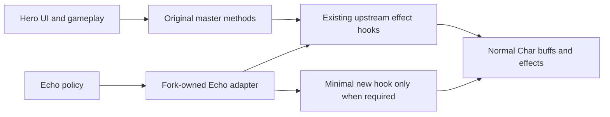

# Upstream-First Echo Action Adapters

## Decision

Do not introduce a universal action framework or rewrite master APIs. Use one fork strategy instead:

- The Hero path stays structurally equivalent to `master`, including public signatures, selection UI, logs, quickslots, resource use, and turn timing.
- [`EchoRoleExecutor.java`](core/src/main/java/com/shatteredpixel/shatteredpixeldungeon/heroechoes/policy/EchoRoleExecutor.java) remains the Echo entry point. Fork-owned helpers under [`heroechoes`](core/src/main/java/com/shatteredpixel/shatteredpixeldungeon/heroechoes/) adapt the Echo body plus phantom Hero kit to existing game effects.
- Prefer a new package bridge beside an upstream class when Java access rules require it. Modify the upstream class itself only when no existing protected/package/public effect hook is sufficient.
- Accept a small amount of Echo-only orchestration duplication when that avoids rewriting a large upstream method. Lock it down with parity tests so upstream changes are visible.

## What is not being built

- No common `ActionContext`, `ActionExecutor`, `ActionTarget`, or new action hierarchy across the game.
- No conversion of all items, spells, abilities, or buffs to template methods.
- No Echo overload in every item subclass.
- No replacement of the upstream Hero/Belongings or Buff models.

[`UseContext.java`](core/src/main/java/com/shatteredpixel/shatteredpixeldungeon/items/UseContext.java) and the `*As` methods are treated as migration sources, not the desired public architecture. Keep only a small Echo-owned context if the adapters still need to carry `body`, `kit`, and turn completion together.

## Responsibility boundary

- **Unchanged upstream Hero code:** item/spell/ability entry points, UI selection, `GLog`, quickslots, catalog/journal, badges/statistics, player knowledge, and normal Hero turn handling.
- **Fork-owned Echo code:** policy choice, inventory lookup, target selection, support declarations, body/kit mapping, Echo turn completion, refusal, and fallback to normal mob AI.
- **Reused mechanics:** existing low-level damage, healing, buff attachment, movement, projectile, charge, and terrain methods.
- **Minimal compatibility bridge:** scoped `Item.curUser`/`Item.curItem` setup and temporary phantom-kit position/sprite mapping where legacy callbacks require Hero-shaped state. [`AiItemActions.java`](core/src/main/java/com/shatteredpixel/shatteredpixeldungeon/items/AiItemActions.java) should evolve into this narrow bridge rather than affecting Hero execution.

## TDD migration

1. Inventory the semantic diff against `master` for base item classes, wands, potions, scrolls, artifacts, weapon/armor abilities, cleric spells, UI callers, and buffs. Separate required Echo changes from formatting/header churn.
2. Before moving production code, add characterization tests for:
   - Hero behavior changed by current `*As` methods, including consumption, charge, targeting, logging, quickslot state, and sync/deferred turns.
   - Every currently supported Echo action, including body/kit effects, attached/headless VFX, refusal, resource spending, and exactly-once turn completion.
3. Restore Hero-facing implementations from `master` family by family. Preserve only fixes that are independently required by the mod and covered by tests.
4. Move Echo behavior out of upstream methods and into fork-owned family adapters:
   - Throw and wand zap first.
   - Potion drink/throw and scroll read.
   - Artifacts and selected-inventory-item actions.
   - Duelist weapon/class-armor abilities and cleric spells.
5. For each adapter, reuse existing upstream hooks before adding code:
   - Use public/protected/package effect methods directly where possible.
   - Add a new fork-owned same-package bridge when access is the only blocker.
   - As a last resort, extract one narrow effect helper from the upstream method while leaving its Hero control flow otherwise unchanged.
6. Remove `heroFX`, generic `*As` entry points, and Echo turn flags from upstream action paths once equivalent adapter tests are green. Do not replace them with another game-wide abstraction.
7. Keep [`Buff.java`](core/src/main/java/com/shatteredpixel/shatteredpixeldungeon/actors/buffs/Buff.java) unchanged. Echo adapters explicitly attach world combat statuses to the Echo body and inventory/formula trackers to the phantom kit; UI status rendering remains upstream.
8. Add a support-matrix test listing each Echo-usable item/spell/ability family as supported or intentionally unsupported. This makes new upstream actions fail visibly instead of silently using fake/default behavior.
9. Run targeted tests after each family, then `:core:spotlessCheck :core:test`. Compare the final semantic diff to `master` and remove any upstream-file change not required by a tested mod behavior.

## Upstream release workflow

1. Fast-forward `master` to the new Shattered Pixel Dungeon release/tag without mod commits.
2. Merge it into an `upstream-sync/<version>` branch created from `main`.
3. Resolve upstream files by taking the new master version first.
4. Reapply only the few documented narrow hooks, then update fork-owned Echo adapters for upstream behavior changes.
5. Run Hero parity tests first, followed by Echo adapter and support-matrix tests.
6. Merge after the full core suite passes and record the upstream tag/commit.

## Constraints

- Prefer zero changes to an upstream file; one narrow hook is better than replacing its full method.
- Keep the phantom Hero kit because it preserves upstream belongings, formulas, talents, and charges.
- Never swap `Dungeon.hero` to the phantom kit.
- Fail closed for unsupported Echo actions; do not fabricate success-shaped defaults.
- Do not reformat, rename, or reorganize upstream code during this cleanup.
- Keep shared code RoboVM-safe.
