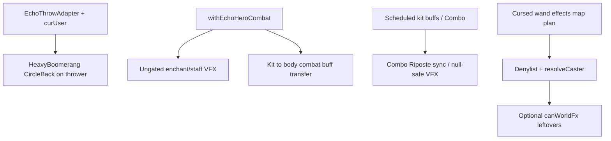

# Remaining Echo NPE and kit-ownership fixes

## Related plan (do not duplicate)

**[Cursed wand effects map](cursed_wand_effects_map_896135d0.plan.md)** owns EchoBoss cursed zaps:

- Denylist: `InterFloorTeleport`, `AbortRetryFail`, `Petrify`, `HeroShapeShift`
- `resolveCaster(user)` → EchoBoss **body** for self-effects; bolt/AOE via `Actor.findChar`
- `CurseEquipment` Hex path for Echo; self burn/heal/teleport/levitate/gravity on body
- TDD for denylist + body/target correctness

That plan is the root fix for cursed-wand **gameplay targeting**. This plan does **not** re-implement denylist or caster resolve. After that plan lands, add `canWorldFx` only on any cursed-wand VFX sites that can still see a headless kit (defense-in-depth). If cursed-wand work already runs VFX only through a resolved body with a live sprite, skip mass `CursedWand` gating here.

Contrast: combat kit→body buff transfer (§4) is for `withEchoHeroCombat` procs (e.g. AntiEntropy). Cursed-wand self-buffs belong to `resolveCaster` in the linked plan — different entry path ([`EchoWandAdapter`](core/src/main/java/com/shatteredpixel/shatteredpixeldungeon/heroechoes/action/EchoWandAdapter.java) + borrow pos/sprite only).

## Approach

Keep combat **sprite borrow** ([`EchoBoss.withEchoHeroCombat`](core/src/main/java/com/shatteredpixel/shatteredpixeldungeon/actors/mobs/EchoBoss.java) / [`EchoKitBorrow`](core/src/main/java/com/shatteredpixel/shatteredpixeldungeon/heroechoes/action/EchoKitBorrow.java)) as the root for sync combat. Do not add more scattershot curse gates unless a path bypasses borrow.

Fix the open NPE/ownership buckets with targeted roots + minimal defense-in-depth:



---

## 1. HeavyBoomerang thrower (ANDROID-P residual)

**Bug:** [`rangedHit` / `rangedMiss`](core/src/main/java/com/shatteredpixel/shatteredpixeldungeon/items/weapon/missiles/HeavyBoomerang.java) always `Buff.append(Dungeon.hero, CircleBack…)`. Echo throw sets `Item.curUser` to the kit via [`AiItemActions.withUser`](core/src/main/java/com/shatteredpixel/shatteredpixeldungeon/items/AiItemActions.java) in [`EchoThrowAdapter`](core/src/main/java/com/shatteredpixel/shatteredpixeldungeon/heroechoes/action/EchoThrowAdapter.java), but CircleBack still attaches to the player.

**Fix:**

- Append `CircleBack` to `curUser` when non-null, else `Dungeon.hero` (player path unchanged).
- Use that thrower’s `pos` for `returnPos`.
- In `CircleBack.act`, prefer `Char.canWorldFx(target)` parent, then `Dungeon.hero` (already partially done).
- Return/shoot branch already casts `target` to `Hero` — kit is a `Hero`, so Echo return stays valid; drop/pickup when target is kit should drop at body cell (`returnPos` = body pos at throw time via borrowed/synced kit pos during `EchoKitBorrow.run`).

**Tests (RED→GREEN):** Echo throws HeavyBoomerang → `CircleBack` on kit (or body if we append to body — prefer kit with `returnPos` = boss pos at throw); player throw still attaches to `Dungeon.hero`. No NPE on return with headless kit + body parent.

---

## 2. Leftover ungated combat VFX

Borrow covers normal Echo melee; gate sites that still dereference sprite without `canWorldFx` so bypass/deferred paths cannot crash.

| File                                                                                                                              | Change                                                               |
| --------------------------------------------------------------------------------------------------------------------------------- | -------------------------------------------------------------------- |
| [`Blazing.java`](core/src/main/java/com/shatteredpixel/shatteredpixeldungeon/items/weapon/enchantments/Blazing.java)              | Gate `defender.sprite.emitter()`                                     |
| [`Chilling.java`](core/src/main/java/com/shatteredpixel/shatteredpixeldungeon/items/weapon/enchantments/Chilling.java)            | Gate `Splash.at(defender.sprite.center(), …)`                        |
| [`WandOfTransfusion.onHit`](core/src/main/java/com/shatteredpixel/shatteredpixeldungeon/items/wands/WandOfTransfusion.java)       | Gate attacker status/emitter                                         |
| [`WandOfLivingEarth.onHit`](core/src/main/java/com/shatteredpixel/shatteredpixeldungeon/items/wands/WandOfLivingEarth.java)       | Gate attacker/guardian emitters                                      |
| [`WandOfWarding.onHit`](core/src/main/java/com/shatteredpixel/shatteredpixeldungeon/items/wands/WandOfWarding.java)               | Gate ward emitter                                                    |
| [`WandOfBlastWave.BlastWave.blast`](core/src/main/java/com/shatteredpixel/shatteredpixeldungeon/items/wands/WandOfBlastWave.java) | Resolve parent via `canWorldFx(Dungeon.hero)` else no-op (avoid NPE) |

**CursedWand VFX:** deferred to / coordinated with [cursed wand effects map](cursed_wand_effects_map_896135d0.plan.md). Prefer fixing caster to body (live sprite) there; only gate leftover `user.sprite` / `ch.sprite` sites afterward if a headless path remains.

**Tests:** Null-sprite proc/onHit does not throw; damage/buff still applies (extend [`NullSpriteVfxSafetyTest`](core/src/test/java/com/shatteredpixel/shatteredpixeldungeon/actors/NullSpriteVfxSafetyTest.java)).

---

## 3. Combo / scheduled kit buff act paths

**Combo:** [`EchoArmorHandlers`](core/src/main/java/com/shatteredpixel/shatteredpixeldungeon/heroechoes/action/EchoArmorHandlers.java) puts `Combo` on the **kit**. [`Combo.RiposteTracker`](core/src/main/java/com/shatteredpixel/shatteredpixeldungeon/actors/buffs/Combo.java) calls `target.sprite.attack(...)` — NPE on headless kit.

**Fix:** In `RiposteTracker.act` and other Combo paths that call `target.sprite.attack` / `jump`:

- If `Char.canWorldFx(target)` → existing VFX + callback.
- Else → call `doAttack` / finish synchronously (same idea as Echo duel sync-hit).

`Buff.attach` already skips `fx()` when sprite is null; no change needed for Chill/Burning state icons on kit.

**Tests:** RiposteTracker with null-sprite Gladiator kit hero runs `doAttack` without NPE.

---

## 4. Kit → body combat buff ownership

**Bug:** During borrowed `defenseProc`/`attackProc`, glyphs like AntiEntropy do `Buff.affect(defender, Burning.class)` on the **kit**. After restore, burn ticks damage kit HP, not the boss body.

**Fix (root, in EchoBoss only):** Extend `withEchoHeroCombat` to snapshot kit buff set before the action; in `finally` (after HP mirror), **move** newly attached combat-relevant buffs from kit → body:

- Transfer list (detach from kit, re-affect/copy onto body): `Burning`, `Chill`, `Frost`, `Ooze`, `Corrosion`, `Paralysis`, `Cripple`, `Roots`, `Charm`, `Bleeding`, `Poison`, `Hex`, `Weakness`, `Vulnerable`, `Degrade`, `Slow`, `Daze` — whatever already appears from armor/weapon procs in SPD. Prefer transferring the live buff instance when SPD allows, else re-apply with remaining duration via bundle or public setters.
- Do **not** move kit identity buffs (`Hunger`, `Regeneration`, `Wand.Charger`, `MeleeWeapon.Charger`, subclass trackers).

**Tests:** EchoBoss with AntiEntropy armor is hit → `Burning` on **body**, not kit; body takes burn damage on subsequent ticks.

---

## Verification

```bash
./gradlew --status
./gradlew :core:test -q -PerrorProneOff --tests "...NullSpriteVfxSafetyTest" --tests "...EchoBossHeadlessKitCombatTest" --tests "...HeavyBoomerang*" --tests "...Combo*"
```

Add new test classes under `actors/mobs` / `items/weapon/missiles` as needed; follow TDD (failing test first).

## Out of scope

- Mass-gating every upstream `sprite.` call
- Permanent kit↔body sprite link
- Network/Sentry non-sprite issues
- Full MissileWeapon `Dungeon.hero` talent/damage coupling (only HeavyBoomerang CircleBack thrower)
- CursedWand Echo denylist, `resolveCaster`, CurseEquipment Hex, SuperNova/SinkHole hosting — see [cursed wand effects map](cursed_wand_effects_map_896135d0.plan.md)
