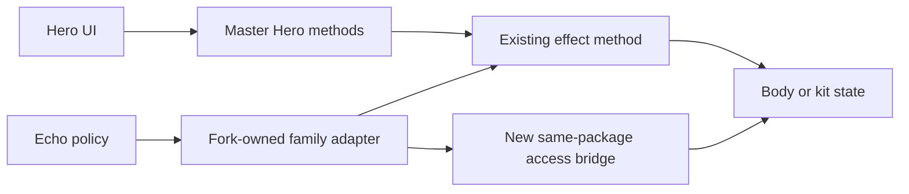

# Upstream-First Echo Adapter Migration

## Target state

- Hero item, wand, potion, scroll, artifact, armor-ability, Duelist-ability, and cleric-spell entry points retain the signatures, selection UI, logs, resource handling, and turn flow from `master`.
- [`EchoRoleExecutor.java`](core/src/main/java/com/shatteredpixel/shatteredpixeldungeon/heroechoes/policy/EchoRoleExecutor.java) calls fork-owned Echo adapters; upstream classes do not expose Echo overloads.
- No upstream production class imports `UseContext` or exposes `throwAs`, `zapAs`, `drinkAs`, `readAs`, `activateAs`, `abilityAs`, `castAs`, or `useAs`.
- Echo retains current target selection, body/kit split, resource consumption, status placement, VFX, refusal, and exactly-once turn completion.
- Unsupported actions return failure before inventory, charge, or turn mutation and fall back to normal mob AI.
- [`Buff.java`](core/src/main/java/com/shatteredpixel/shatteredpixeldungeon/actors/buffs/Buff.java), Hero UI, quickslots, information windows, and status presentation remain upstream-shaped.



## Fixed implementation rules

0. **Master-first restore.** For any upstream Hero hub (`cast`, `drink`, `zap` zapper, wandUsed, SpiritArrow.cast, etc.), open the `master` branch version first and paste that body. Only then add the smallest delta required for Echo / headless tests / allowed actor-general hooks. Do not rewrite master-shaped methods from memory. New game logic belongs in `heroechoes/` adapters or same-package bridges — not invented rewrites of upstream.
1. Preserve the upstream Hero method first; it never delegates into Echo code.
2. Reuse existing public/protected/package effect methods where possible.
3. If access is the only blocker, add a new same-package bridge instead of editing the upstream class.
4. If no reusable effect boundary exists, move the current Echo branch into a fork-owned handler and restore the upstream file from `master`.
5. Add one narrow actor-general hook only as a last resort; never replace the full upstream method.
6. Keep the phantom `Hero` kit for belongings, talents, formulas, charges, and trackers. Never assign it to `Dungeon.hero`.
7. Hero uses upstream selectors; Echo resolves cells/items through [`EchoTargetPicker.java`](core/src/main/java/com/shatteredpixel/shatteredpixeldungeon/heroechoes/policy/EchoTargetPicker.java) before execution.
8. Hero keeps upstream `busy/spendAndNext`; Echo adapters use the existing deferred primitives on [`EchoBoss.java`](core/src/main/java/com/shatteredpixel/shatteredpixeldungeon/actors/mobs/EchoBoss.java).
9. World VFX depends on the real body having an attached sprite, not on Hero/Echo identity.
10. Do not reformat, rename constants, change headers, or perform unrelated cleanup while restoring an upstream file.

## Allowed final upstream delta

Only these narrow changes may remain without further justification:

- `Potion.apply(Char)` and its existing overrides, allowing the unchanged effect body to target Hero or EchoBoss.
- `Invisibility.dispel(Char)`, allowing invisibility removal from the actual acting body.
- `Item.grantsPlayerKnowledge()` / `identify(boolean)`, preventing phantom-kit use from updating the living Hero's Catalog, statistics, potion/scroll/ring knowledge, or quickslots.
- Defensive world-VFX fixes that are independently useful without an attached sprite and have direct regression tests.
- Existing mod-only EchoBoss timing methods, all files under [`heroechoes`](core/src/main/java/com/shatteredpixel/shatteredpixeldungeon/heroechoes/), and new same-package bridge files.

`heroFX`, `UseContext.hero`, generic `TurnOwner`, widespread `GLog.*IfHero` call-site changes, and generic `*As` APIs are temporary migration code, not part of the target architecture.

## Scope

Preserve only actions currently routed by [`EchoRoleExecutor.java`](core/src/main/java/com/shatteredpixel/shatteredpixeldungeon/heroechoes/policy/EchoRoleExecutor.java):

- Missile weapons, runestones, bombs, Spirit Bow arrows.
- Wands and an imbued Mage's Staff.
- Potion drink/throw and Dragon's Breath, excluding the current Hero-only potion list.
- Scroll effects and inventory auto-selection currently implemented in `doReadAs`.
- Cloak of Shadows, Horn of Plenty, Ethereal Chains, Holy Tome.
- Armor abilities currently accepted by the policy executor.
- Equipped Duelist weapon abilities.
- Cleric spells that currently implement an Echo branch.

Do not add support for additional artifacts, UI-modal spells, meta items, or new consumables during this cleanup.

## Phase 0 — protect work and establish baseline

- Record `git status --short`, `git diff`, and `git diff master...main`; never use reset, bulk restore, or checkout over user work.
- Preserve the semantic WIP in [`WandOfLightning.java`](core/src/main/java/com/shatteredpixel/shatteredpixeldungeon/items/wands/WandOfLightning.java), its test, and [`EchoBossSurpriseAttackTest.java`](core/src/test/java/com/shatteredpixel/shatteredpixeldungeon/actors/mobs/EchoBossSurpriseAttackTest.java). Port overlapping hunks deliberately.
- Run `gradlew.bat --status` before every Gradle command and keep one build active in this checkout.
- Establish a green baseline for `EchoRoleExecutorTest`, `WandZapAsTest`, `ScrollReadAsTest`, `PotionThrowAsTest`, `ArmorAbilityActivateAsTest`, `ClericSpellCastAsTest`, and `MeleeWeaponAbilityAsTest`.

## Phase 1 — characterize real Hero entry points

Existing `*AsTest` tests mainly cover the temporary seam. Add tests that invoke the upstream-facing method or selector callback and pass on current `main` before production movement:

- Under [`items` tests](core/src/test/java/com/shatteredpixel/shatteredpixeldungeon/items/):
  - `Hero cast spends the throw delay and detaches one item`
  - `Hero cast targets the collision character in QuickSlot`
  - `Hero throw applies Improvised Projectiles only to hostile targets`
- Under [`wand` tests](core/src/test/java/com/shatteredpixel/shatteredpixeldungeon/items/wands/):
  - `Hero zap consumes the upstream charge count`
  - `Hero zap applies identification and talent riders`
  - `Hero zap spends TIME_TO_ZAP exactly once after the callback`
- Under [`potion` tests](core/src/test/java/com/shatteredpixel/shatteredpixeldungeon/items/potions/):
  - `Hero drink detaches the potion and applies it to the hero`
  - `Hero drink records Catalog and potion talent use`
- Under [`scroll` tests](core/src/test/java/com/shatteredpixel/shatteredpixeldungeon/items/scrolls/):
  - `Hero read consumes the scroll and runs doRead`
  - `Hero read preserves upstream animation and busy timing`
- Extend [`HeroArmorAbilityUsableTest.java`](core/src/test/java/com/shatteredpixel/shatteredpixeldungeon/actors/hero/abilities/HeroArmorAbilityUsableTest.java):
  - `Hero armor ability uses the master activate signature`
  - `Hero targeted armor ability keeps CellSelector ownership`
- Under [`melee weapon` tests](core/src/test/java/com/shatteredpixel/shatteredpixeldungeon/items/weapon/melee/):
  - `Hero Duelist ability keeps the master target selector flow`
  - `Hero Duelist ability spends weapon charge and hero time once`
- Under [`cleric spell` tests](core/src/test/java/com/shatteredpixel/shatteredpixeldungeon/actors/hero/spells/):
  - `Hero targeted cleric spell keeps the master CellSelector flow`
  - `Hero self cleric spell charges the Tome and spends hero time once`
- Under [`artifact` tests](core/src/test/java/com/shatteredpixel/shatteredpixeldungeon/items/artifacts/):
  - `Hero supported artifact keeps its master execute flow`

If a desired master-parity assertion fails against current code, first keep a passing characterization of current behavior, then add the desired assertion as RED and fix only that discrepancy.

## Phase 2 — add Echo-only infrastructure

Create fork-owned classes under [`heroechoes`](core/src/main/java/com/shatteredpixel/shatteredpixeldungeon/heroechoes/):

- `EchoActionContext`: immutable validated `EchoBoss body` and `Hero kit`; `canWorldFx`, `busy`, `complete(delay)`, `cancel`, and hostile iteration based on boss FOV. It has no Hero factory and no `heroFX` flag.
- `EchoKitBorrow`: save kit `pos/sprite`, map them to body, restore in `finally`, and wrap deferred callbacks so restoration happens after VFX completion.
- `EchoActionSupport`: common target/ownership/charge validation and refusal cleanup, with no family-specific effects.

Keep [`AiItemActions.java`](core/src/main/java/com/shatteredpixel/shatteredpixeldungeon/items/AiItemActions.java) temporarily as a tiny same-package access bridge for `Item.curUser`, `Item.curItem`, and protected `onThrow`; it owns no policy or turn logic.

RED tests:

- `EchoActionContext rejects a boss without a phantom kit`
- `EchoKitBorrow restores kit position and sprite after synchronous failure`
- `EchoKitBorrow restores kit position and sprite after deferred completion`
- `Echo action refusal clears boss busy state without spending a turn`

## Phase 3 — throws and wands

### Throws

Move [`Item.throwAs`](core/src/main/java/com/shatteredpixel/shatteredpixeldungeon/items/Item.java) behavior to an Echo throw adapter:

- Compute collision from `body.pos`; never target player QuickSlot.
- Mark the boss busy before VFX.
- Borrow body position/sprite for legacy item hooks.
- Scope `curUser=kit` and `curItem=item`.
- Detach exactly one kit item and call protected `onThrow` through the bridge.
- Preserve bomb fuse intent across deferred MissileSprite callbacks.
- Skip Hero talents, Catalog/statistics, and player knowledge.
- Spend the Echo delay exactly once.

Add a same-package bomb bridge if required for fuse and stack-split state. Rewire throwable policy branches, then restore:

- [`Item.java`](core/src/main/java/com/shatteredpixel/shatteredpixeldungeon/items/Item.java): master `cast(Hero,int)` callback flow; remove `throwAs`, `castVisual`, and context hooks.
- [`Bomb.java`](core/src/main/java/com/shatteredpixel/shatteredpixeldungeon/items/bombs/Bomb.java): master light-throw/throw behavior.
- [`SpiritBow.java`](core/src/main/java/com/shatteredpixel/shatteredpixeldungeon/items/weapon/SpiritBow.java): master Hero arrow cast; Echo arrows use the adapter.

Move Echo assertions from [`MissileWeaponThrowAsTest.java`](core/src/test/java/com/shatteredpixel/shatteredpixeldungeon/items/weapon/missiles/MissileWeaponThrowAsTest.java), [`BombThrowAsTest.java`](core/src/test/java/com/shatteredpixel/shatteredpixeldungeon/items/bombs/BombThrowAsTest.java), [`BombKindsLightThrowAsTest.java`](core/src/test/java/com/shatteredpixel/shatteredpixeldungeon/items/bombs/BombKindsLightThrowAsTest.java), [`RunestoneThrowAsTest.java`](core/src/test/java/com/shatteredpixel/shatteredpixeldungeon/items/stones/RunestoneThrowAsTest.java), and [`SpiritBowThrowAsTest.java`](core/src/test/java/com/shatteredpixel/shatteredpixeldungeon/items/weapon/SpiritBowThrowAsTest.java) to the adapter. Keep Hero assertions on master entry points.

### Wands

Move [`Wand.zapAs`](core/src/main/java/com/shatteredpixel/shatteredpixeldungeon/items/wands/Wand.java) behavior to an Echo wand adapter:

- Validate level/target and use `collisionProperties(target)`.
- Borrow body sprite/position through deferred callbacks.
- Call public `tryToZap`, `fx`, and `onZap`.
- Handle cursed and normal callbacks.
- Use a new same-package wand bridge to access protected `chargesPerCast` and decrement `curCharges`.
- Dispel invisibility from the boss body.
- Skip Hero backup barrier, identification, talents, QuickSlot, badges, and Staff/Tome Hero riders.
- Complete the Echo turn once after `onZap`.

Restore [`Wand.java`](core/src/main/java/com/shatteredpixel/shatteredpixeldungeon/items/wands/Wand.java) zapper and `wandUsed()` to `master`; remove `zapAs`, `wandUsed(UseContext)`, and `spendChargesForAi`. Restore [`MagesStaff.java`](core/src/main/java/com/shatteredpixel/shatteredpixeldungeon/items/weapon/melee/MagesStaff.java) Hero zap and use an Echo Staff adapter.

Retain tested headless fixes in individual wands only where needed after adapter VFX ownership. Preserve the current Lightning target-gathering fix.

Migrate every behavior title from [`WandZapAsTest.java`](core/src/test/java/com/shatteredpixel/shatteredpixeldungeon/items/wands/WandZapAsTest.java) to the adapter: charges, invisibility, Staff, linked-sprite hit, MagicMissile VFX, deferred Living Earth, cleared static user, refusal, headless Fireblast/Regrowth, and Disintegration callback.

## Phase 4 — potions, scrolls, and inventory stones

### Potions

Add an Echo potion adapter that rejects the existing Hero-only potion list before mutation, detaches from the kit, invokes retained `Potion.apply(Char)` on the boss body, runs attached-body VFX, skips Hero Catalog/talent/knowledge effects, routes thrown potions through the throw adapter, and keeps Dragon's Breath as a dedicated Echo handler.

Restore [`Potion.java`](core/src/main/java/com/shatteredpixel/shatteredpixeldungeon/items/potions/Potion.java) `drink(Hero)` and Hero Catalog/talent flow to `master`; remove `drinkAs`. Keep only `apply(Char)` and matching overrides.

### Scrolls

Add an Echo scroll dispatcher and handlers for current `doReadAs` support: Recharging, Teleportation, Lullaby, Retribution, Magic Mapping, Mirror Image, Rage, Terror, Upgrade, Psionic Blast, Dread, Anti-Magic, and InventoryScroll auto-selection.

Before restoring each upstream scroll, copy its current Echo branch into the handler. Each handler validates before detach, operates from body/FOV, attaches world statuses to body and inventory/recharge trackers to kit, suppresses UI/Journal/Catalog/discovery effects, consumes once, and completes once.

Restore [`Scroll.java`](core/src/main/java/com/shatteredpixel/shatteredpixeldungeon/items/scrolls/Scroll.java), the supported subclasses, and `InventoryScroll` to master `doRead()`/UI paths; remove `readAs`, `doReadAs`, and context animation overloads.

Move inventory-stone auto-selection to an Echo adapter and restore [`InventoryStone.java`](core/src/main/java/com/shatteredpixel/shatteredpixeldungeon/items/stones/InventoryStone.java) and supported stones to master bag selectors.

Contracts: [`PotionThrowAsTest.java`](core/src/test/java/com/shatteredpixel/shatteredpixeldungeon/items/potions/PotionThrowAsTest.java), [`PotionOfDragonsBreathBreatheAsTest.java`](core/src/test/java/com/shatteredpixel/shatteredpixeldungeon/items/potions/exotic/PotionOfDragonsBreathBreatheAsTest.java), [`ScrollReadAsTest.java`](core/src/test/java/com/shatteredpixel/shatteredpixeldungeon/items/scrolls/ScrollReadAsTest.java), [`EchoBossArsenalScrollKindsTest.java`](core/src/test/java/com/shatteredpixel/shatteredpixeldungeon/heroechoes/boss/EchoBossArsenalScrollKindsTest.java), and [`InventoryStoneUseAsTest.java`](core/src/test/java/com/shatteredpixel/shatteredpixeldungeon/items/stones/InventoryStoneUseAsTest.java).

## Phase 5 — artifacts

Create Echo handlers only for currently routed artifacts:

- Cloak: body stealth; charge/tracker state on the kit artifact.
- Horn: consume kit artifact/food state; apply eating/healing to body.
- Chains: validate from body and move body/target with existing VFX/defer behavior.
- Holy Tome: delegate to the cleric dispatcher from Phase 7.

Restore master Hero paths and remove `useAs`/`castAs` from [`CloakOfShadows.java`](core/src/main/java/com/shatteredpixel/shatteredpixeldungeon/items/artifacts/CloakOfShadows.java), [`HornOfPlenty.java`](core/src/main/java/com/shatteredpixel/shatteredpixeldungeon/items/artifacts/HornOfPlenty.java), [`EtherealChains.java`](core/src/main/java/com/shatteredpixel/shatteredpixeldungeon/items/artifacts/EtherealChains.java), and [`HolyTome.java`](core/src/main/java/com/shatteredpixel/shatteredpixeldungeon/items/artifacts/HolyTome.java).

Contracts: [`CloakOfShadowsUseAsTest.java`](core/src/test/java/com/shatteredpixel/shatteredpixeldungeon/items/artifacts/CloakOfShadowsUseAsTest.java), [`HornOfPlentyUseAsTest.java`](core/src/test/java/com/shatteredpixel/shatteredpixeldungeon/items/artifacts/HornOfPlentyUseAsTest.java), [`EtherealChainsUseAsTest.java`](core/src/test/java/com/shatteredpixel/shatteredpixeldungeon/items/artifacts/EtherealChainsUseAsTest.java), Holy Weapon/Ward tests, and executor integration.

## Phase 6 — armor abilities

Create an Echo armor dispatcher keyed by concrete ability class. Move the current `activate(ClassArmor, UseContext, Integer)` Echo logic into fork handlers in this order:

1. Self/simple: Endure, Nature's Power, Ascended Form, Feint.
2. Targeted: Shockwave, Death Mark, Spectral Blades, Challenge, Elemental Strike.
3. Movement/VFX: Heroic Leap, Smoke Bomb, Warp Beacon.
4. Summons: Shadow Clone, Spirit Hawk, Power of Many.
5. Complex: Elemental Blast, Wild Magic, Trinity, Ratmogrify.

For each ability: point its Echo test to the absent handler and verify RED; copy the current Echo body and verify GREEN; restore the ability class from `master`; rerun Hero and Echo tests.

After all handlers exist, restore [`ArmorAbility.java`](core/src/main/java/com/shatteredpixel/shatteredpixeldungeon/actors/hero/abilities/ArmorAbility.java) and all classes under [`abilities`](core/src/main/java/com/shatteredpixel/shatteredpixeldungeon/actors/hero/abilities/) as one compile-safe tranche. Remove `activateAs`, context imports, and context refusal; the Echo dispatcher owns refusal and busy cleanup.

Mandatory gates: [`ArmorAbilityActivateAsTest.java`](core/src/test/java/com/shatteredpixel/shatteredpixeldungeon/actors/hero/abilities/ArmorAbilityActivateAsTest.java), [`EchoArmorAbilityNextTurnTest.java`](core/src/test/java/com/shatteredpixel/shatteredpixeldungeon/actors/mobs/EchoArmorAbilityNextTurnTest.java), and all tests under [`heroechoes/boss/armor`](core/src/test/java/com/shatteredpixel/shatteredpixeldungeon/heroechoes/boss/armor/).

## Phase 7 — cleric spells

Create an Echo cleric dispatcher keyed by spell class. Move current supported branches:

- Targeted: Guiding Light, Sunray, Smite, Holy Lance, Hallowed Ground, Flash, Lay on Hands, Bless, Shield of Light, Mnemonic Prayer.
- Self/AoE: Holy Weapon, Holy Ward, Cleanse, Radiance, Divine Sense, Aura of Protection, Judgement.
- Inventory/selection support already present for Echo: Holy Intuition and Body Form.

The dispatcher validates Tome charge and target before mutation, invokes the handler, spends kit Tome charge, and completes/cancels the Echo turn. Unknown/unsupported classes return false without mutation.

Restore [`ClericSpell.java`](core/src/main/java/com/shatteredpixel/shatteredpixeldungeon/actors/hero/spells/ClericSpell.java), [`TargetedClericSpell.java`](core/src/main/java/com/shatteredpixel/shatteredpixeldungeon/actors/hero/spells/TargetedClericSpell.java), [`InventoryClericSpell.java`](core/src/main/java/com/shatteredpixel/shatteredpixeldungeon/actors/hero/spells/InventoryClericSpell.java), migrated spell classes, [`HolyTome.java`](core/src/main/java/com/shatteredpixel/shatteredpixeldungeon/items/artifacts/HolyTome.java), and [`WndClericSpells.java`](core/src/main/java/com/shatteredpixel/shatteredpixeldungeon/windows/WndClericSpells.java) to master Hero flow.

RED refusal tests:

- `Echo cleric dispatcher rejects unsupported Wall of Light without spending`
- `Echo cleric dispatcher rejects unsupported Stasis without spending`
- `Echo cleric dispatcher rejects unsupported Beaming Ray without spending`
- `Echo cleric dispatcher rejects a missing target before charging the Tome`

Contracts: [`ClericSpellCastAsTest.java`](core/src/test/java/com/shatteredpixel/shatteredpixeldungeon/actors/hero/spells/ClericSpellCastAsTest.java), [`EchoBossArsenalClericSpellKindsTest.java`](core/src/test/java/com/shatteredpixel/shatteredpixeldungeon/heroechoes/boss/EchoBossArsenalClericSpellKindsTest.java), [`HolyWeaponCastAsTest.java`](core/src/test/java/com/shatteredpixel/shatteredpixeldungeon/items/artifacts/HolyWeaponCastAsTest.java), and [`HolyWardCastAsTest.java`](core/src/test/java/com/shatteredpixel/shatteredpixeldungeon/items/artifacts/HolyWardCastAsTest.java).

## Phase 8 — Duelist weapons and Spirit Bow

Create an Echo Duelist dispatcher keyed by equipped weapon. Move every current `duelistAbility(UseContext,Integer)` body from [`melee`](core/src/main/java/com/shatteredpixel/shatteredpixeldungeon/items/weapon/melee/) into fork handlers. Preserve body position/attack/movement/reach/target/VFX; kit ownership/talents/combo/charge trackers; refusal before mutation; and exactly-once completion.

Restore [`MeleeWeapon.java`](core/src/main/java/com/shatteredpixel/shatteredpixeldungeon/items/weapon/melee/MeleeWeapon.java) and each affected subclass to master `duelistAbility(Hero,Integer)` and selector flow. Migrate in batches matching [`MeleeWeaponAbilityAsTest.java`](core/src/test/java/com/shatteredpixel/shatteredpixeldungeon/items/weapon/melee/MeleeWeaponAbilityAsTest.java) so the module compiles after every batch.

Spirit Bow uses the throw adapter; restore its Hero cast and keep [`SpiritBowHeroCastTest.java`](core/src/test/java/com/shatteredpixel/shatteredpixeldungeon/items/weapon/SpiritBowHeroCastTest.java) green.

## Phase 9 — statuses and presentation

Do not add a status framework. Apply this fixed rule in every handler:

- HP, poison, burning, blindness, invisibility, movement, barrier, marks, summons, and world combat state attach to the EchoBoss body or affected world character.
- Wand/armor/artifact charge, Duelist combo, Tome/Holy trackers, cooldown/formula trackers, and inventory ownership remain on the phantom kit.
- BuffIndicator, descriptions, `heroMessage`, icons, logs, and windows remain upstream presentation.

Keep `Buff.java` unchanged. Retain individual buff generalizations only when a test proves a non-Hero `Char` target is required; restore all others from `master`.

Add: `Echo action statuses affect body while resource trackers remain on kit`.

## Phase 10 — remove temporary APIs and enforce support

After policy routing uses adapters:

- Delete [`UseContext.java`](core/src/main/java/com/shatteredpixel/shatteredpixeldungeon/items/UseContext.java).
- Remove all production imports/Javadocs and all generic `*As` methods.
- Remove `heroFX` and generic `TurnOwner`.
- Replace `EchoBoss.vfxOwnsTurn` only after every deferred adapter completes through EchoActionContext; retain the minimum busy/deferred primitive.
- Shrink or delete `AiItemActions` after package bridges replace its responsibilities.
- Rename/relocate `*AsTest` files so names describe Echo adapters or Hero master entry points.
- Add a support-matrix test enumerating every type accepted by `EchoRoleExecutor` and asserting exactly one supported handler or explicit unsupported result with no mutation.

Source checks:

```powershell
rg "UseContext|heroFX|throwAs|zapAs|drinkAs|readAs|activateAs|abilityAs|castAs|useAs" core/src/main/java/com/shatteredpixel/shatteredpixeldungeon
rg "Dungeon\.hero" core/src/main/java/com/shatteredpixel/shatteredpixeldungeon/heroechoes
```

The first may only find intentional historical text, not production APIs. The second may contain comparisons but no phantom substitution or shared-effect dependency.

## Verification

Run targeted suites sequentially after their phases, then:

```powershell
.\gradlew.bat --status
.\gradlew.bat :core:test --tests "com.shatteredpixel.shatteredpixeldungeon.heroechoes.policy.EchoRoleExecutorTest"
.\gradlew.bat :core:test --tests "com.shatteredpixel.shatteredpixeldungeon.items.wands.*"
.\gradlew.bat :core:test --tests "com.shatteredpixel.shatteredpixeldungeon.items.scrolls.*"
.\gradlew.bat :core:test --tests "com.shatteredpixel.shatteredpixeldungeon.items.potions.*"
.\gradlew.bat :core:test --tests "com.shatteredpixel.shatteredpixeldungeon.items.artifacts.*"
.\gradlew.bat :core:test --tests "com.shatteredpixel.shatteredpixeldungeon.actors.hero.abilities.*"
.\gradlew.bat :core:test --tests "com.shatteredpixel.shatteredpixeldungeon.actors.hero.spells.*"
.\gradlew.bat :core:test --tests "com.shatteredpixel.shatteredpixeldungeon.items.weapon.melee.*"
.\gradlew.bat :core:test --tests "com.watabou.utils.RoboVMUnsupportedApisTest"
.\gradlew.bat :core:spotlessCheck :core:test
```

Final audit:

1. Compare every modified upstream-owned file against `master`.
2. Require a named test for every retained hunk outside the allowed delta.
3. Remove formatting/header/comment-only churn introduced by this cleanup.
4. Confirm unrelated working-tree changes remain intact.
5. Do not commit unless explicitly requested.

## Recurring upstream release procedure

1. Fast-forward `master` to the upstream tag.
2. Merge it into `upstream-sync/<version>` created from `main`.
3. Start conflicted upstream action files from the new upstream version.
4. Reapply only the allowed delta: `Potion.apply(Char)`, `Invisibility.dispel(Char)`, player-knowledge guard, and documented VFX safety fixes.
5. Update fork-owned adapters when upstream changes effect math/resources; never copy the old upstream body over the new implementation.
6. Run Hero characterization first, then Echo adapter/support matrix, then full core verification.
