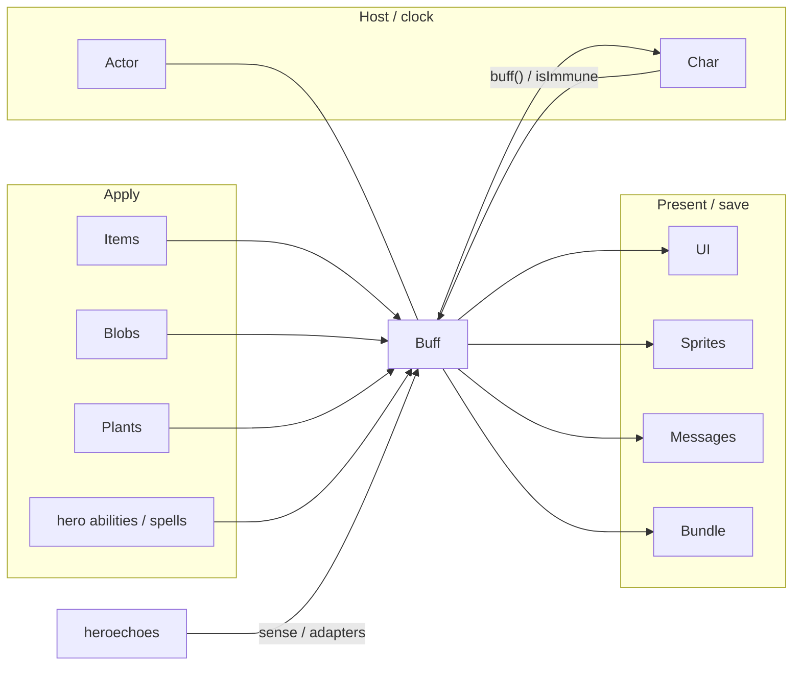

# Density sample — parent [`Buff`](core/src/main/java/com/shatteredpixel/shatteredpixeldungeon/actors/buffs/Buff.java)

Not a shippable doc. Shows how full a **parent** explainer should feel. Children are names in the kinds table only.

**Job:** A [`Buff`](core/src/main/java/com/shatteredpixel/shatteredpixeldungeon/actors/buffs/Buff.java) is a named status hung on a [`Char`](core/src/main/java/com/shatteredpixel/shatteredpixeldungeon/actors/Char.java). It is itself an [`Actor`](core/src/main/java/com/shatteredpixel/shatteredpixeldungeon/actors/Actor.java) (acts at `BUFF_PRIO`).

What this parent is, versus lookalikes in other modules:

| This                  | Not this                                                                                                                                                                                                 |
| --------------------- | -------------------------------------------------------------------------------------------------------------------------------------------------------------------------------------------------------- |
| Status on a character | Floor gas ([`Blob`](core/src/main/java/com/shatteredpixel/shatteredpixeldungeon/actors/blobs/Blob.java)), [`items`](core/src/main/java/com/shatteredpixel/shatteredpixeldungeon/items), talents, terrain |

## Lifecycle

How an instance starts, lives on the host clock, and ends:

```mermaid
sequenceDiagram
  participant Src as Item / blob / trap
  participant P as Buff
  participant Host as Char
  Src->>P: affect / prolong / append
  P->>Host: attachTo (fails if isImmune)
  Note over P,Host: spend / postpone; act last in the turn
  P->>Host: detach
```

## Verbs

How other code starts, extends, or strips this parent. From [`Buff.java`](core/src/main/java/com/shatteredpixel/shatteredpixeldungeon/actors/buffs/Buff.java), after `target.resist(class)`:

| Call      | If already present                                                                                               | Effect                                                                                                                             |
| --------- | ---------------------------------------------------------------------------------------------------------------- | ---------------------------------------------------------------------------------------------------------------------------------- |
| `append`  | always new                                                                                                       | can stack                                                                                                                          |
| `affect`  | reuse                                                                                                            | [`FlavourBuff`](core/src/main/java/com/shatteredpixel/shatteredpixeldungeon/actors/buffs/FlavourBuff.java) **adds** time (`spend`) |
| `prolong` | reuse                                                                                                            | time is a **max** (`postpone`)                                                                                                     |
| `count`   | reuse [`CounterBuff`](core/src/main/java/com/shatteredpixel/shatteredpixeldungeon/actors/buffs/CounterBuff.java) | increment                                                                                                                          |
| `detach`  | strip that class                                                                                                 | all matching instances                                                                                                             |

Polarity on the parent: `POSITIVE` / `NEGATIVE` / `NEUTRAL`. `announced` / `revivePersists` are parent fields.

## Kinds

How children specialize the parent (name one child; do not spec it):

| If it…                    | Kind                                                                                                       | e.g.                                                                                                     |
| ------------------------- | ---------------------------------------------------------------------------------------------------------- | -------------------------------------------------------------------------------------------------------- |
| Only waits, then `detach` | [`FlavourBuff`](core/src/main/java/com/shatteredpixel/shatteredpixeldungeon/actors/buffs/FlavourBuff.java) | [`Frost`](core/src/main/java/com/shatteredpixel/shatteredpixeldungeon/actors/buffs/Frost.java)           |
| Works each turn           | ticking [`Buff`](core/src/main/java/com/shatteredpixel/shatteredpixeldungeon/actors/buffs/Buff.java)       | [`Burning`](core/src/main/java/com/shatteredpixel/shatteredpixeldungeon/actors/buffs/Burning.java)       |
| Holds a number            | [`CounterBuff`](core/src/main/java/com/shatteredpixel/shatteredpixeldungeon/actors/buffs/CounterBuff.java) | —                                                                                                        |
| Absorbs HP                | [`ShieldBuff`](core/src/main/java/com/shatteredpixel/shatteredpixeldungeon/actors/buffs/ShieldBuff.java)   | [`Barrier`](core/src/main/java/com/shatteredpixel/shatteredpixeldungeon/actors/buffs/Barrier.java)       |
| Turns a mob friendly      | [`AllyBuff`](core/src/main/java/com/shatteredpixel/shatteredpixeldungeon/actors/buffs/AllyBuff.java)       | [`Corruption`](core/src/main/java/com/shatteredpixel/shatteredpixeldungeon/actors/buffs/Corruption.java) |

## Integrations

Which other modules talk to this parent, and in which direction:

| Module                                                                                          | Direction                       | Parent hook                                                                                                                                                                                                                                                                                                                                   |
| ----------------------------------------------------------------------------------------------- | ------------------------------- | --------------------------------------------------------------------------------------------------------------------------------------------------------------------------------------------------------------------------------------------------------------------------------------------------------------------------------------------- |
| [`actors.Actor`](core/src/main/java/com/shatteredpixel/shatteredpixeldungeon/actors/Actor.java) | is-a                            | [`Buff`](core/src/main/java/com/shatteredpixel/shatteredpixeldungeon/actors/buffs/Buff.java) `extends Actor`; acts at `BUFF_PRIO`                                                                                                                                                                                                             |
| [`actors.Char`](core/src/main/java/com/shatteredpixel/shatteredpixeldungeon/actors/Char.java)   | hosts + queries                 | `add` / `remove` / `buffs()` / `buff(Class)` / `isImmune` / `resist`                                                                                                                                                                                                                                                                          |
| [`actors.hero`](core/src/main/java/com/shatteredpixel/shatteredpixeldungeon/actors/hero)        | applies + queries               | [`Hero`](core/src/main/java/com/shatteredpixel/shatteredpixeldungeon/actors/hero/Hero.java) (and [armor abilities](core/src/main/java/com/shatteredpixel/shatteredpixeldungeon/actors/hero/abilities) / [cleric spells](core/src/main/java/com/shatteredpixel/shatteredpixeldungeon/actors/hero/spells)) call `affect`; combat reads `buff()` |
| [`actors.mobs`](core/src/main/java/com/shatteredpixel/shatteredpixeldungeon/actors/mobs)        | applies + queries               | [`Mob`](core/src/main/java/com/shatteredpixel/shatteredpixeldungeon/actors/mobs/Mob.java)s apply and branch on `buff()` / `paralysed`                                                                                                                                                                                                         |
| [`actors.blobs`](core/src/main/java/com/shatteredpixel/shatteredpixeldungeon/actors/blobs)      | applies                         | gas/clouds `affect`/`prolong` on cells’ chars                                                                                                                                                                                                                                                                                                 |
| [`items`](core/src/main/java/com/shatteredpixel/shatteredpixeldungeon/items)                    | applies                         | potions, wands, weapons, glyphs, artifacts                                                                                                                                                                                                                                                                                                    |
| [`plants`](core/src/main/java/com/shatteredpixel/shatteredpixeldungeon/plants)                  | applies                         | plant effects                                                                                                                                                                                                                                                                                                                                 |
| [`levels`](core/src/main/java/com/shatteredpixel/shatteredpixeldungeon/levels)                  | applies                         | terrain / features (e.g. [`HighGrass`](core/src/main/java/com/shatteredpixel/shatteredpixeldungeon/levels/features/HighGrass.java))                                                                                                                                                                                                           |
| [`ui`](core/src/main/java/com/shatteredpixel/shatteredpixeldungeon/ui)                          | renders                         | [`BuffIndicator`](core/src/main/java/com/shatteredpixel/shatteredpixeldungeon/ui/BuffIndicator.java) from `icon()`                                                                                                                                                                                                                            |
| [`sprites`](core/src/main/java/com/shatteredpixel/shatteredpixeldungeon/sprites)                | renders                         | `fx()` → [`CharSprite.State`](core/src/main/java/com/shatteredpixel/shatteredpixeldungeon/sprites/CharSprite.java)                                                                                                                                                                                                                            |
| [`messages`](core/src/main/java/com/shatteredpixel/shatteredpixeldungeon/messages)              | renders                         | `name()` / `desc()` / `heroMessage()` via [`Messages`](core/src/main/java/com/shatteredpixel/shatteredpixeldungeon/messages/Messages.java)                                                                                                                                                                                                    |
| [`watabou.utils.Bundle`](SPD-classes/src/main/java/com/watabou/utils/Bundle.java)               | persists                        | bundled on the [`Char`](core/src/main/java/com/shatteredpixel/shatteredpixeldungeon/actors/Char.java)                                                                                                                                                                                                                                         |
| [`heroechoes`](core/src/main/java/com/shatteredpixel/shatteredpixeldungeon/heroechoes)          | queries (+ applies in adapters) | [`EchoBoss`](core/src/main/java/com/shatteredpixel/shatteredpixeldungeon/actors/mobs/EchoBoss.java) / policy sense statuses; action adapters `affect`                                                                                                                                                                                         |

Same map as the table:



## Player vs code

What the player sees versus the parent method that produces it:

| Player                   | Parent API                                                                                                                                               |
| ------------------------ | -------------------------------------------------------------------------------------------------------------------------------------------------------- |
| Status icon + countdown  | [`icon()`](core/src/main/java/com/shatteredpixel/shatteredpixeldungeon/actors/buffs/Buff.java) / `tintIcon()` / `iconFadePercent()` / `visualcooldown()` |
| Pose / overlay           | [`fx(boolean)`](core/src/main/java/com/shatteredpixel/shatteredpixeldungeon/actors/buffs/Buff.java)                                                      |
| Name, description, log   | [`name()`](core/src/main/java/com/shatteredpixel/shatteredpixeldungeon/actors/buffs/Buff.java) / `desc()` / `heroMessage()`                              |
| Can’t act / stats change | host fields the buff mutates — not a parent method                                                                                                       |

## Change without surprises

- [ ] `affect` **adds** time; `prolong` is a max — a per-tick `affect` stacks
- [ ] `attachTo` no-ops when `target.isImmune(getClass())` — immunity is by **class**
- [ ] Save identity is the class name; renaming / moving a buff breaks loads
- [ ] `visualcooldown()` is `cooldown()+1` (buffs act after the hero)
- [ ] Default `act()` diactivates; [`FlavourBuff`](core/src/main/java/com/shatteredpixel/shatteredpixeldungeon/actors/buffs/FlavourBuff.java) `act()` detaches — don’t assume every buff ticks damage
