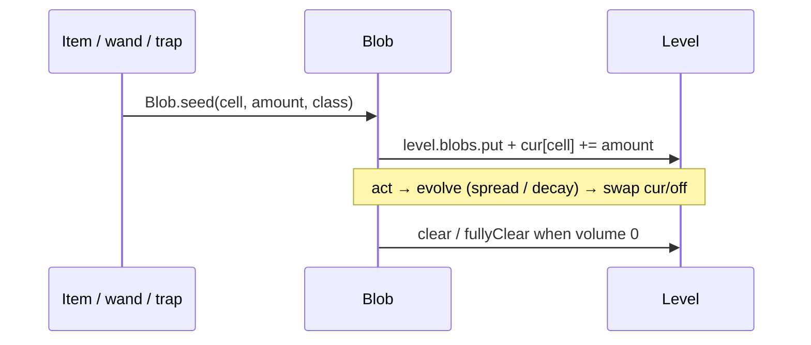
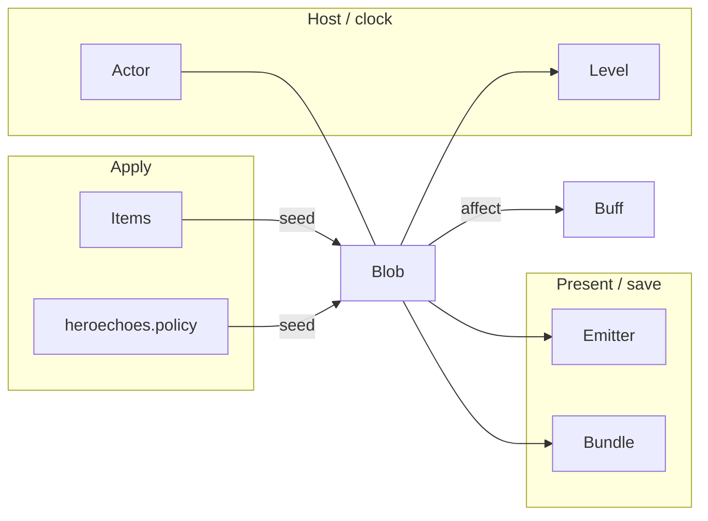

# [`actors/blobs`](..) — [`Blob`](../Blob.java) explainer

A [`Blob`](../Blob.java) is floor volume on a [`Level`](../../../levels/Level.java) (one instance per class). It is an [`Actor`](../../Actor.java) at `BLOB_PRIO` and spreads via `evolve()`.

What this parent is, versus lookalikes in other modules:

| This            | Not this                                                                        |
| --------------- | ------------------------------------------------------------------------------- |
| Volume on cells | Status on a character ([`Buff`](../../buffs/Buff.java)), an item, terrain flags |

## Lifecycle

How an instance starts, lives on the host clock, and ends:

## Verbs

How other code starts, extends, or strips this parent:

| Call                                       | If already present         | Effect                                                                                     |
| ------------------------------------------ | -------------------------- | ------------------------------------------------------------------------------------------ |
| [`seed(cell, amount, type)`](../Blob.java) | reuse the level’s instance | add volume at cell; first seed also [`Actor.add`](../../Actor.java)s                       |
| [`volumeAt(cell, type)`](../Blob.java)     | n/a                        | `cur[cell]` or 0                                                                           |
| [`clear(cell)`](../Blob.java)              | n/a                        | zero that cell                                                                             |
| [`fullyClear`](../Blob.java)               | n/a                        | wipe the map                                                                               |
| [`evolve`](../Blob.java)                   | n/a                        | default: average with neighbors − 1 (gases); children apply effects after `super.evolve()` |

Children that affect chars typically `Actor.findChar(cell)` then [`Buff.affect`](../../buffs/Buff.java) / `isImmune(blobClass)`.

## Kinds

How children specialize the parent (name one child; do not spec it):

| If it…                            | Kind (subtype of parent)         | e.g.                                     |
| --------------------------------- | -------------------------------- | ---------------------------------------- |
| Spreading gas that applies a buff | gas [`Blob`](../Blob.java)       | [`ParalyticGas`](../ParalyticGas.java)   |
| Cell hazard (freeze / burn)       | hazard [`Blob`](../Blob.java)    | [`Freezing`](../Freezing.java)           |
| Well / landmark                   | [`WellWater`](../WellWater.java) | [`WaterOfHealth`](../WaterOfHealth.java) |

## Integrations

Which other modules talk to this parent, and in which direction:

| Module                                            | Direction | Parent hook                                                                                                       |
| ------------------------------------------------- | --------- | ----------------------------------------------------------------------------------------------------------------- |
| [`actors.Actor`](../../Actor.java)                | is-a      | `extends Actor`; `BLOB_PRIO`; `findChar`                                                                          |
| [`levels`](../../../levels)                       | hosts     | [`Level.blobs`](../../../levels/Level.java) map; `solid` blocks spread                                            |
| [`actors.Char`](../../Char.java)                  | queries   | occupants via `findChar`; `isImmune`                                                                              |
| [`actors.buffs`](../../buffs)                     | applies   | children `affect` / `prolong`                                                                                     |
| [`items`](../../../items)                         | applies   | potions / wands `Blob.seed`                                                                                       |
| [`ui`](../../../ui) / emitters                    | renders   | [`BlobEmitter`](../../../effects/BlobEmitter.java), `tileDesc`                                                    |
| `Bundle`                                          | persists  | trimmed `cur` array                                                                                               |
| [`heroechoes.policy`](../../../heroechoes/policy) | applies   | `SETUP_CC` seeds gas / frost via item adapters                                                                    |
| [`heroechoes`](../../../heroechoes)               | queries   | [`EchoHardStun.isCombatant`](../../../heroechoes/EchoHardStun.java) for paralytic-gas duration on Hero / EchoBoss |

Same map as the table:

## Player vs code

What the player sees versus the parent method that produces it:

| Player                          | Parent API                                              |
| ------------------------------- | ------------------------------------------------------- |
| Cloud / frost on the floor      | `cur[cell]` volume + emitter                            |
| Walking in gas applies a status | child `evolve` → [`Buff.affect`](../../buffs/Buff.java) |
| Gas fades                       | default `evolve` decays by 1 after averaging            |
| Examined tile text              | [`tileDesc`](../Blob.java)                              |

## Change without surprises

- [ ] One blob **class** per level — `seed` reuses, it does not stack a second Actor
- [ ] Immunity is often to the **blob class** (`isImmune(ParalyticGas.class)`), not only the buff
- [ ] [`ParalyticGas`](../ParalyticGas.java) already special-cases Hero/EchoBoss duration (3); a global FlavourBuff cap must not double-shorten unless intended
- [ ] First seed may `spend(1)` so a blob added mid-turn does not get a bonus `evolve`
