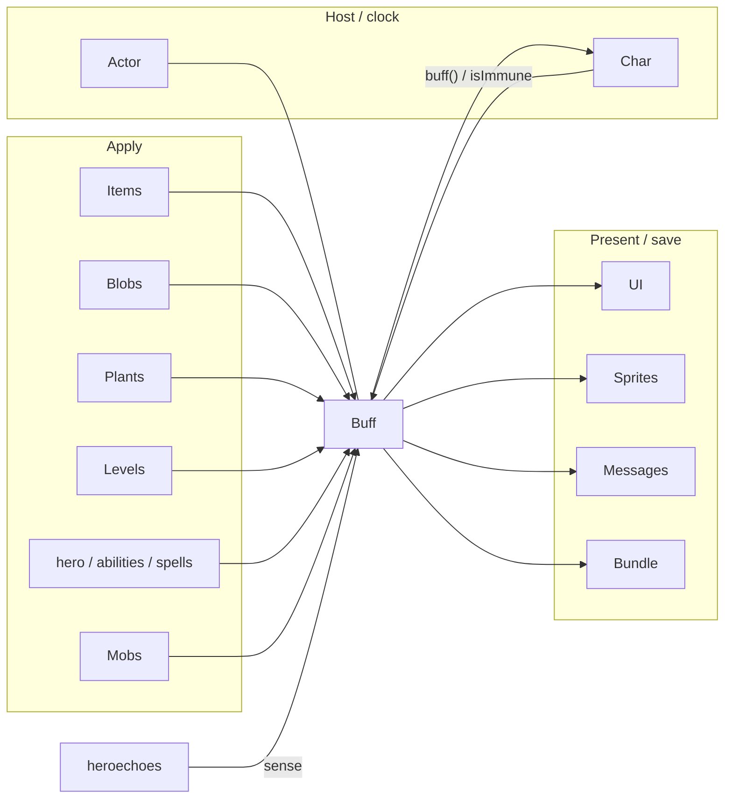

# [`actors/buffs`](..) — [`Buff`](../Buff.java) explainer

A [`Buff`](../Buff.java) is a named status hung on a [`Char`](../../Char.java). It is itself an [`Actor`](../../Actor.java) and acts last in the turn (`BUFF_PRIO`).

What this parent is, versus lookalikes in other modules:

| This                  | Not this                                                                                 |
| --------------------- | ---------------------------------------------------------------------------------------- |
| Status on a character | Floor gas ([`Blob`](../../blobs/Blob.java)), [`items`](../../../items), talents, terrain |

Catalogue of individual statuses: `combat-interactions.md`.

## Lifecycle

How an instance starts, lives on the host clock, and ends:

```mermaid
sequenceDiagram
  participant Src as Item / blob / trap / UI
  participant P as Buff
  participant Host as Char
  Src->>P: affect / prolong / append
  P->>Host: attachTo (no-op if isImmune or chained echo-fight hard stun)
  Host->>Host: Char.add (Actor.add if char is in play)
  Note over P,Host: spend / postpone; act at BUFF_PRIO
  P->>Host: detach → Char.remove + fx(false)
```

## Verbs

How other code starts, extends, or strips this parent. From [`Buff.java`](../Buff.java), duration is multiplied by `target.resist(class)` first. Echo-fight hard-stun [`FlavourBuff`](../FlavourBuff.java)s then cap at 3 via [`EchoHardStun`](../../../heroechoes/EchoHardStun.java). Spend / postpone is skipped if attach failed.

| Call                      | If already present                         | Effect                                                       |
| ------------------------- | ------------------------------------------ | ------------------------------------------------------------ |
| [`append`](../Buff.java)  | always new                                 | can stack                                                    |
| [`affect`](../Buff.java)  | reuse                                      | [`FlavourBuff`](../FlavourBuff.java) **adds** time (`spend`) |
| [`prolong`](../Buff.java) | reuse                                      | time is a **max** (`postpone`)                               |
| [`count`](../Buff.java)   | reuse [`CounterBuff`](../CounterBuff.java) | increment                                                    |
| [`detach`](../Buff.java)  | strip that class                           | all matching instances                                       |

Polarity on the parent: `POSITIVE` / `NEGATIVE` / `NEUTRAL` (`announced`, `revivePersists`). [`Char.add`](../../Char.java) can still refuse a `NEGATIVE` buff (e.g. cleanse).

## Kinds

How children specialize the parent (name one child; do not spec it):

| If it…                    | Kind                                 | e.g.                               |
| ------------------------- | ------------------------------------ | ---------------------------------- |
| Only waits, then `detach` | [`FlavourBuff`](../FlavourBuff.java) | [`Frost`](../Frost.java)           |
| Works each turn           | ticking [`Buff`](../Buff.java)       | [`Burning`](../Burning.java)       |
| Holds a number            | [`CounterBuff`](../CounterBuff.java) | —                                  |
| Absorbs HP                | [`ShieldBuff`](../ShieldBuff.java)   | [`Barrier`](../Barrier.java)       |
| Turns a mob friendly      | [`AllyBuff`](../AllyBuff.java)       | [`Corruption`](../Corruption.java) |

## Integrations

Which other modules talk to this parent, and in which direction:

| Module                              | Direction                       | Parent hook                                                                                                                                       |
| ----------------------------------- | ------------------------------- | ------------------------------------------------------------------------------------------------------------------------------------------------- |
| [`actors.Actor`](../../Actor.java)  | is-a                            | [`Buff`](../Buff.java) `extends Actor`; `BUFF_PRIO`                                                                                               |
| [`actors.Char`](../../Char.java)    | hosts + queries                 | `add` / `remove` / `buffs()` / `buff(Class)` / `isImmune` / `resist`                                                                              |
| [`actors.hero`](../../hero)         | applies + queries               | [`Hero`](../../hero/Hero.java); [armor abilities](../../hero/abilities) / [cleric spells](../../hero/spells) call `affect`; combat reads `buff()` |
| [`actors.mobs`](../../mobs)         | applies + queries               | [`Mob`](../../mobs/Mob.java) apply and branch on `buff()`                                                                                         |
| [`actors.blobs`](../../blobs)       | applies                         | gas/clouds `affect` / `prolong` on occupants                                                                                                      |
| [`items`](../../../items)           | applies                         | potions, wands, weapons, glyphs, artifacts                                                                                                        |
| [`plants`](../../../plants)         | applies                         | plant effects                                                                                                                                     |
| [`levels`](../../../levels)         | applies                         | terrain / features (e.g. [`HighGrass`](../../../levels/features/HighGrass.java))                                                                  |
| [`ui`](../../../ui)                 | renders                         | [`BuffIndicator`](../../../ui/BuffIndicator.java), [`StatusPane`](../../../ui/StatusPane.java)                                                    |
| [`sprites`](../../../sprites)       | renders                         | `fx()` → [`CharSprite`](../../../sprites/CharSprite.java); `announced` → `showStatus`                                                             |
| [`messages`](../../../messages)     | renders                         | `name()` / `desc()` / `heroMessage()` via [`Messages`](../../../messages/Messages.java)                                                           |
| [`windows`](../../../windows)       | applies                         | sparse shop / smith flows                                                                                                                         |
| [`scenes`](../../../scenes)         | applies                         | [`InterlevelScene`](../../../scenes/InterlevelScene.java)                                                                                         |
| `Bundle`                            | persists                        | bundled on the [`Char`](../../Char.java)                                                                                                          |
| [`heroechoes`](../../../heroechoes) | queries (+ applies in adapters) | [`EchoHardStun`](../../../heroechoes/EchoHardStun.java) caps / grants; [`EchoBoss`](../../mobs/EchoBoss.java) / policy sense statuses             |

Same map as the table:



## Player vs code

What the player sees versus the parent method that produces it:

| Player                   | Parent API                                                                                               |
| ------------------------ | -------------------------------------------------------------------------------------------------------- |
| Status icon + countdown  | [`icon()`](../Buff.java) / `tintIcon()` / `iconFadePercent()` / `iconTextDisplay()` / `visualcooldown()` |
| Pose / overlay           | [`fx(boolean)`](../Buff.java)                                                                            |
| Floating name on apply   | `announced` + `type` in [`Char.add`](../../Char.java)                                                    |
| Name, description, log   | [`name()`](../Buff.java) / `desc()` / `heroMessage()`                                                    |
| Can’t act / stats change | host fields the buff mutates — not a parent method                                                       |

## Change without surprises

- [ ] `affect` **adds** time; `prolong` is a max — a per-tick `affect` stacks
- [ ] Duration spend / postpone is skipped if attach failed (`buff.target != target`)
- [ ] Echo-fight hard-stun [`FlavourBuff`](../FlavourBuff.java)s cap at 3 after resist ([`EchoHardStun`](../../../heroechoes/EchoHardStun.java))
- [ ] `attachTo` no-ops when `target.isImmune(getClass())` — immunity is by **class**
- [ ] Echo-fight `attachTo` also no-ops a second hard stun while `paralysed > 0` ([`EchoHardStun.rejectChainedHardStun`](../../../heroechoes/EchoHardStun.java)); same-class `affect` / `prolong` still refreshes
- [ ] [`Char.add`](../../Char.java) can still refuse `NEGATIVE` (cleanse) even after `attachTo` started
- [ ] Save identity is the class name; renaming / moving a buff breaks loads
- [ ] `visualcooldown()` is `cooldown()+1` (buffs act after the hero)
- [ ] Default `act()` diactivates; [`FlavourBuff`](../FlavourBuff.java) `act()` detaches — don’t assume every buff ticks damage
