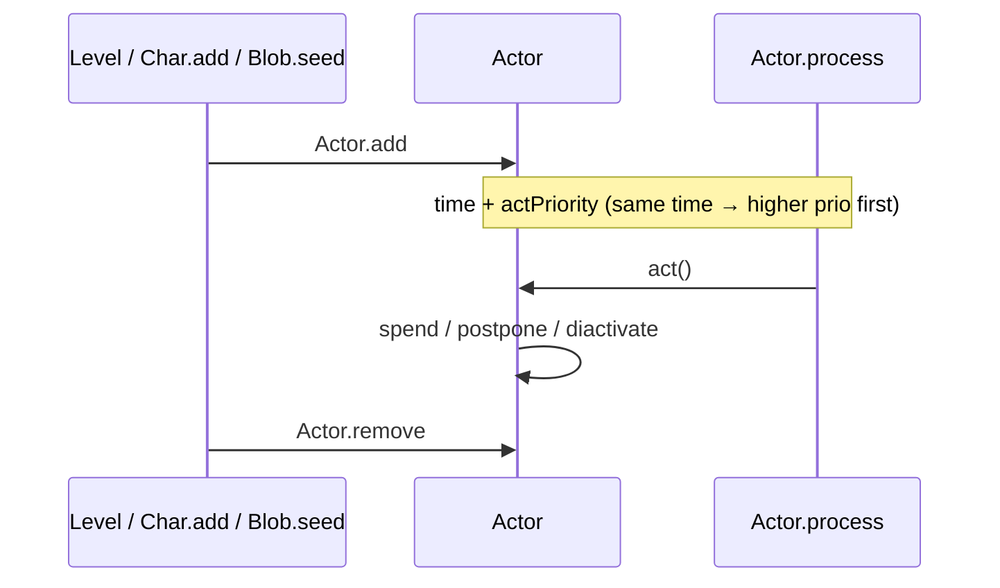
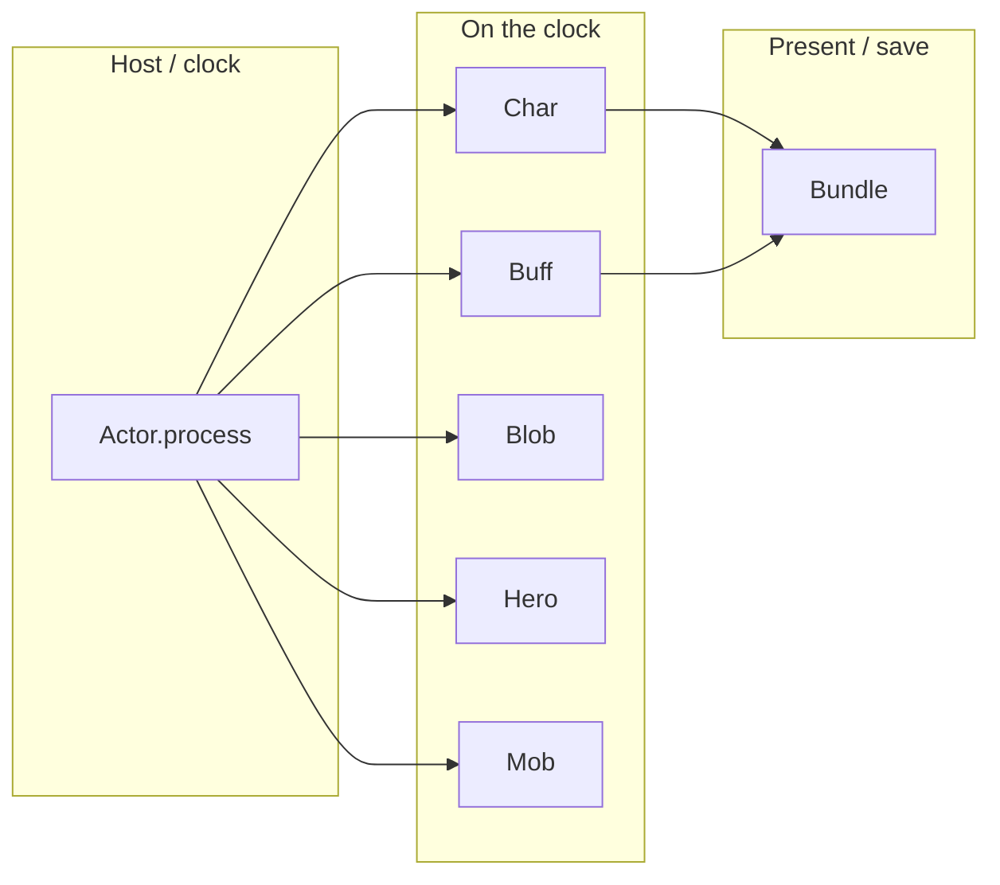

# [`actors`](..) — [`Actor`](../Actor.java) explainer

An [`Actor`](../Actor.java) is a named turn-clock participant. [`Actor.process`](../Actor.java) picks the soonest `time`, then `act()`.

What this parent is, versus lookalikes in other modules:

| This                  | Not this                                                                                                                                                                                                                                                                                                                                       |
| --------------------- | ---------------------------------------------------------------------------------------------------------------------------------------------------------------------------------------------------------------------------------------------------------------------------------------------------------------------------------------------- |
| Turn clock + registry | Status on a character ([`Buff`](../buffs/Buff.java)), floor volume ([`Blob`](../blobs/Blob.java)), the combatant host ([`Char`](../Char.java)) |

## Lifecycle

How an instance starts, lives on the global clock, and ends:

## Verbs

How other code starts, extends, or strips this parent:

| Call                                                                                             | If already present          | Effect                                                                                                                   |
| ------------------------------------------------------------------------------------------------ | --------------------------- | ------------------------------------------------------------------------------------------------------------------------ |
| [`add`](../Actor.java)           | ignored if already in `all` | on the clock; [`Char`](../Char.java)s also enter `chars` |
| [`spend`](../Actor.java)         | n/a                         | **adds** `time` (`TICK` = 1 turn)                                                                                        |
| [`postpone`](../Actor.java)      | n/a                         | time is a **max** (`now + duration` if later)                                                                            |
| [`cooldown`](../Actor.java)      | n/a                         | `time - now` remaining                                                                                                   |
| [`diactivate`](../Actor.java)    | n/a                         | `time = MAX` (sleeps until spent again)                                                                                  |
| [`remove`](../Actor.java)        | no-op if absent             | off the clock                                                                                                            |
| [`findChar(pos)`](../Actor.java) | n/a                         | occupant of a cell                                                                                                       |

Default priorities (higher acts earlier at equal time): `VFX_PRIO` 100, `HERO_PRIO` 0, `BLOB_PRIO` −10, `MOB_PRIO` −20, `BUFF_PRIO` −30.

## Kinds

How children specialize the parent (name one child; do not spec it):

| If it…                                                                                             | Kind (subtype of parent)                                                                     | e.g.                                                                                                         |
| -------------------------------------------------------------------------------------------------- | -------------------------------------------------------------------------------------------- | ------------------------------------------------------------------------------------------------------------ |
| Occupies a cell, fights, hosts buffs                                                               | [`Char`](../Char.java)       | [`Hero`](../hero/Hero.java)                  |
| Status on a [`Char`](../Char.java) | [`Buff`](../buffs/Buff.java) | [`Frost`](../buffs/Frost.java)               |
| Volume on the floor                                                                                | [`Blob`](../blobs/Blob.java) | [`ParalyticGas`](../blobs/ParalyticGas.java) |

## Integrations

Which other modules talk to this parent, and in which direction:

| Module                                                                                        | Direction | Parent hook                                                                                                                                                                                                    |
| --------------------------------------------------------------------------------------------- | --------- | -------------------------------------------------------------------------------------------------------------------------------------------------------------------------------------------------------------- |
| [`actors.Char`](../Char.java) | is-a      | `extends Actor`; `chars` registry                                                                                                                                                                              |
| [`actors.buffs`](../buffs)    | is-a      | [`Buff`](../buffs/Buff.java) at `BUFF_PRIO`; `spend` / `postpone` are the duration verbs                                                       |
| [`actors.blobs`](../blobs)    | is-a      | [`Blob`](../blobs/Blob.java) at `BLOB_PRIO`                                                                                                    |
| [`actors.hero`](../hero)      | is-a      | [`Hero`](../hero/Hero.java) at `HERO_PRIO`; may return `false` from `act` to wait for input                                                    |
| [`actors.mobs`](../mobs)      | is-a      | [`Mob`](../mobs/Mob.java) at `MOB_PRIO`                                                                                                        |
| [`levels`](../../levels)                | hosts     | [`Actor.clear`](../Actor.java) / restore when a [`Level`](../../levels/Level.java) loads |
| [`Dungeon`](../../Dungeon.java)         | hosts     | run loop calls `process`                                                                                                                                                                                       |
| `Bundle`             | persists  | `TIME` + `ID`                                                                                                                                                                                                  |

Same map as the table:

## Player vs code

What the player sees versus the parent method that produces it:

| Player                      | Parent API                                                                                                                                                                                   |
| --------------------------- | -------------------------------------------------------------------------------------------------------------------------------------------------------------------------------------------- |
| “Everyone took a turn”      | [`process`](../Actor.java) until the hero waits                                                                              |
| Stun / wait lasting N turns | [`spend(N)`](../Actor.java) / [`postpone(N)`](../Actor.java) |
| Two things same instant     | `actPriority` (hero before blobs before mobs before buffs)                                                                                                                                   |

## Change without surprises

- [ ] `spend` **adds**; `postpone` is a max — recapping a FlavourBuff uses `postpone`
- [ ] Buffs act **last** (`BUFF_PRIO` −30); displayed remaining time is often `cooldown()+1`
- [ ] `act()` must not throw — a thrown turn corrupts the run
- [ ] Save identity includes actor `id`; colliding ids on load get a new id
- [ ] Returning `false` from `act()` pauses the clock (hero input / echo missile wait)
