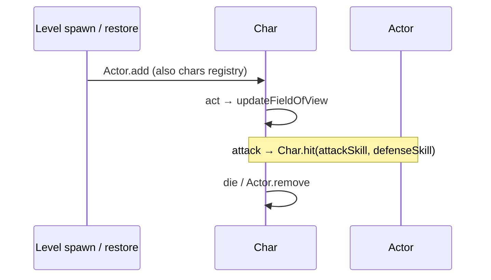
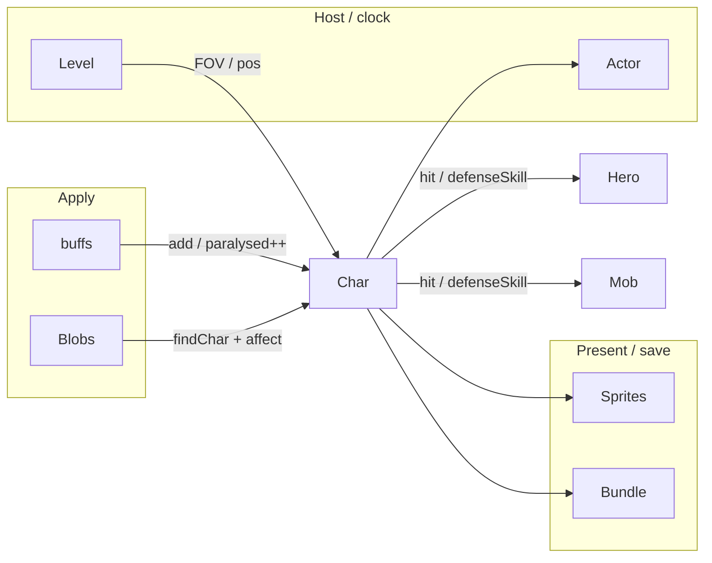

# [`actors`](..) — [`Char`](../Char.java) explainer

A [`Char`](../Char.java) is a cell-occupying combatant on the [`Actor`](../Actor.java) clock. It hosts [`Buff`](../buffs/Buff.java)s, owns `paralysed` / FOV / HP, and runs the hit roll.

What this parent is, versus lookalikes in other modules:

| This                             | Not this                                                                                                                                                                                                                                                                                                                |
| -------------------------------- | ----------------------------------------------------------------------------------------------------------------------------------------------------------------------------------------------------------------------------------------------------------------------------------------------------------------------- |
| Combatant + buff host + hit math | The clock ([`Actor`](../Actor.java)), a status ([`Buff`](../buffs/Buff.java)), floor gas ([`Blob`](../blobs/Blob.java)) |

## Lifecycle

How an instance starts, lives on the host clock, and ends:

## Verbs

How other code starts, extends, or strips this parent:

| Call                                                                                                                                                                                           | If already present  | Effect                                                                                                                                                                                                          |
| ---------------------------------------------------------------------------------------------------------------------------------------------------------------------------------------------- | ------------------- | --------------------------------------------------------------------------------------------------------------------------------------------------------------------------------------------------------------- |
| [`add(Buff)`](../Char.java)                                                                                                    | set can hold both   | refuse `NEGATIVE` under cleanse; else store + [`Actor.add`](../Actor.java)                                                                      |
| [`remove(Buff)`](../Char.java)                                                                                                 | strip that instance | also [`Actor.remove`](../Actor.java)                                                                                                            |
| [`buff(Class)`](../Char.java)                                                                                                  | exact class         | first match or null (**not** assignable)                                                                                                                                                                        |
| [`buffs(Class)`](../Char.java)                                                                                                 | assignable          | all matching instances                                                                                                                                                                                          |
| [`isImmune(Class)`](../Char.java)                                                                                              | n/a                 | properties + buff `immunities` + glyph; **assignable** (`isAssignableFrom`)                                                                                                                                     |
| [`resist(Class)`](../Char.java)                                                                                                | n/a                 | 0.5× per matching resist, then ring; [`Buff.affect`](../buffs/Buff.java) multiplies duration by this                                            |
| [`hit`](../Char.java)                                                                                                          | n/a                 | `attackSkill` vs `defenseSkill`; Focus forces `INFINITE_EVASION` **after** `defenseSkill`; infinite evasion beats infinite accuracy                                                                             |
| [`attackSkill`](../Char.java) / [`defenseSkill`](../Char.java) | n/a                 | default **0**; [`Hero`](../hero/Hero.java) / [`Mob`](../mobs/Mob.java) override |

`paralysed` is a **refcount** on the host (not a buff field). Hard-stun buffs increment on attach and decrement on detach. `paralysed > 0` skips the turn on [`Hero`](../hero/Hero.java) / [`Mob`](../mobs/Mob.java) and feeds evasion math.

`INFINITE_EVASION` / `INFINITE_ACCURACY` = 1_000_000.

## Kinds

How children specialize the parent (name one child; do not spec it):

| If it…                        | Kind (subtype of parent)                                                                    | e.g.                                                                                                |
| ----------------------------- | ------------------------------------------------------------------------------------------- | --------------------------------------------------------------------------------------------------- |
| Player-controlled kit + input | [`Hero`](../hero/Hero.java) | —                                                                                                   |
| AI combatant                  | [`Mob`](../mobs/Mob.java)   | [`EchoBoss`](../mobs/EchoBoss.java) |

## Integrations

Which other modules talk to this parent, and in which direction:

| Module                                                                                          | Direction       | Parent hook                                                                                                                                                                                                                                              |
| ----------------------------------------------------------------------------------------------- | --------------- | -------------------------------------------------------------------------------------------------------------------------------------------------------------------------------------------------------------------------------------------------------- |
| [`actors.Actor`](../Actor.java) | is-a            | `extends Actor`; `findChar(pos)`                                                                                                                                                                                                                         |
| [`actors.buffs`](../buffs)      | hosts + queries | `add` / `remove` / `buff` / `isImmune` / `resist`; buffs mutate `paralysed`                                                                                                                                                                              |
| [`actors.hero`](../hero)        | is-a            | [`Hero.defenseSkill`](../hero/Hero.java)                                                                                                                                                 |
| [`actors.mobs`](../mobs)        | is-a            | [`Mob.defenseSkill`](../mobs/Mob.java) / surprise                                                                                                                                        |
| [`actors.blobs`](../blobs)      | applies         | `Actor.findChar(cell)` then `Buff.affect` / `isImmune`                                                                                                                                                                                                   |
| [`levels`](../../levels)                  | hosts           | `pos`, [`updateFieldOfView`](../../levels/Level.java), `occupyCell`                                                                                                                                |
| [`sprites`](../../sprites)                | renders         | `sprite`; miss/hit floating text from `hit`                                                                                                                                                                                                              |
| `Bundle`               | persists        | HP / pos / buffs / `paralysed`                                                                                                                                                                                                                           |
| [`heroechoes`](../../heroechoes)          | queries         | [`EchoBoss`](../mobs/EchoBoss.java) copies `paralysed` onto a snapshot [`Hero`](../hero/Hero.java) before `defenseSkill` |

Same map as the table:

## Player vs code

What the player sees versus the parent method that produces it:

| Player                     | Parent API                                                                                                                                                                            |
| -------------------------- | ------------------------------------------------------------------------------------------------------------------------------------------------------------------------------------- |
| Can’t move / skip turn     | `paralysed > 0` (host field; buffs increment it)                                                                                                                                      |
| Miss / hit floating text   | [`hit`](../Char.java) (`acuRoll` vs `defRoll`)                                                                        |
| “Can’t be hit” (Focus)     | `defStat = INFINITE_EVASION` inside [`hit`](../Char.java), **after** `defenseSkill`                                   |
| Status resisted / blocked  | [`resist`](../Char.java) / [`isImmune`](../Char.java) |
| Damage wakes sleep / frost | `damage` detaches those buffs                                                                                                                                                         |

## Change without surprises

- [ ] `buff(Class)` is **exact class**; `buffs(Class)` / `isImmune` are **assignable**
- [ ] `isImmune` is how [`Buff.attachTo`](../buffs/Buff.java) no-ops — immunity class must match the buff being attached
- [ ] `paralysed` is a refcount; two hard stuns stack the skip-turn, one detach must not zero it
- [ ] Returning `0` from `defenseSkill` is a guaranteed hit **unless** [`hit`](../Char.java) later sets `INFINITE_EVASION` (Focus)
- [ ] Infinite evasion beats infinite accuracy
- [ ] `fieldOfView` is allocated in `act()` from [`Level.updateFieldOfView`](../../levels/Level.java)
- [ ] `sprite` is `@Nullable` and genuinely absent off stage — headless tests and mobs before [`GameScene.add`](../../scenes/GameScene.java). Gate on [`canWorldFx`](../Char.java) rather than assuming it exists; a non-null sprite may still have no `parent`, so a bare `sprite != null` check is not enough for anything that reaches through `sprite.parent`
- [ ] The Echo boss's phantom kit is the exception: it **mirrors** its body's sprite for its whole life ([`EchoBoss.mirrorKitSprite`](../mobs/EchoBoss.java)), cleared together with the body's own slot by [`EchoBossSprite.destroy`](../../sprites/EchoBossSprite.java). Only its `pos` is still borrowed per call, via [`EchoKitBorrow`](../../heroechoes/action/EchoKitBorrow.java). The kit is private on [`EchoActionContext`](../../heroechoes/action/EchoActionContext.java) — reach it via `gear()` or `stats()`, and draw through `showEnchant`/`attackFx`/`zapFx`, never on `stats()`
