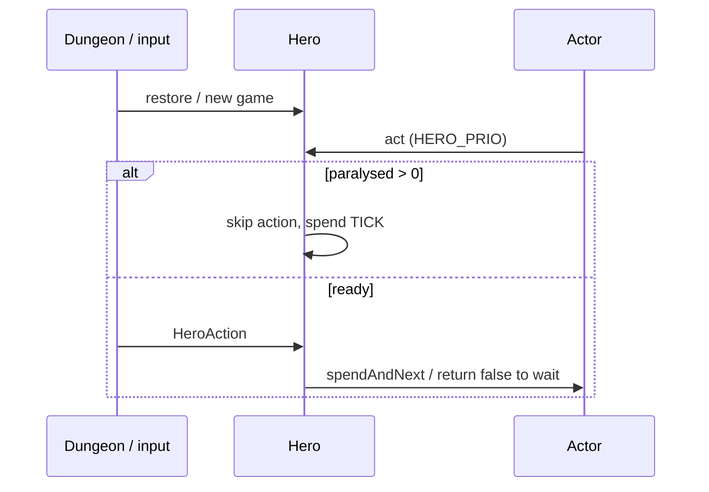
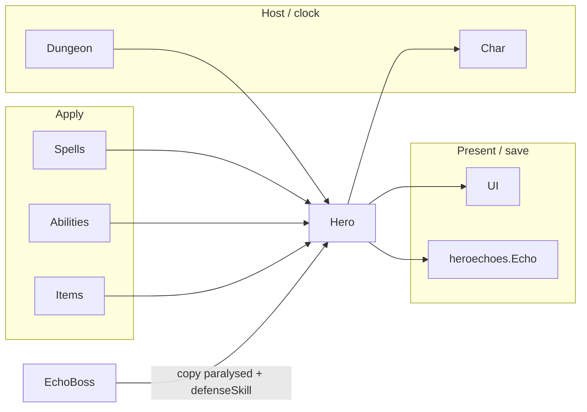

# [`actors/hero`](..) — [`Hero`](../Hero.java) explainer

A [`Hero`](../Hero.java) is the player [`Char`](../../Char.java): input, kit ([`Belongings`](../Belongings.java)), class/talents, and the evasion path both the player and [`EchoBoss`](../../mobs/EchoBoss.java) use.

What this parent is, versus lookalikes in other modules:

| This                       | Not this                                                                                                                                                                                                                                                                                                                                                                 |
| -------------------------- | ------------------------------------------------------------------------------------------------------------------------------------------------------------------------------------------------------------------------------------------------------------------------------------------------------------------------------------------------------------------------ |
| Player combatant + kit hub | AI enemy ([`Mob`](../../mobs/Mob.java)), armor ult ([`ArmorAbility`](../abilities/ArmorAbility.java)), cleric spell ([`ClericSpell`](../spells/ClericSpell.java)) |

## Lifecycle

How an instance starts, lives on the host clock, and ends:

## Verbs

How other code starts, extends, or strips this parent:

| Call                                                                                                       | If already present | Effect                                                                                                                  |
| ---------------------------------------------------------------------------------------------------------- | ------------------ | ----------------------------------------------------------------------------------------------------------------------- |
| [`defenseSkill(enemy)`](../Hero.java) | n/a                | evasion for [`Char.hit`](../../Char.java); see order below |
| [`attackSkill`](../Hero.java)         | n/a                | accuracy vs the defender                                                                                                |
| [`act`](../Hero.java)                 | n/a                | `paralysed > 0` clears `curAction` and spends a turn                                                                    |
| [`belongings`](../Belongings.java)    | n/a                | equipped kit; armor `evasionFactor` / Stone glyph → 0                                                                   |

[`defenseSkill`](../Hero.java) order (first return wins):

1. [`Combo.ParryTracker`](../../buffs/Combo.java) / [`RoundShield.GuardTracker`](../../../items/weapon/melee/RoundShield.java) → `INFINITE_EVASION`
2. Liquid Agility 2 tracker → `INFINITE_EVASION` (rank 1 is ×3, not infinite)
3. Ring + quarterstaff stance multipliers
4. [`GuidingLight.Illuminated`](../spells/GuidingLight.java) + `attackerIsCleric` → `evasion / 2`
5. `paralysed > 0` → `evasion / 2`
6. Armor factor; Stone glyph → **0**
7. `max(1, round(evasion))` — a live hero never returns 0 except Stone

`attackerIsCleric` is true for a [`Hero`](../Hero.java) or [`EchoBoss`](../../mobs/EchoBoss.java) whose kit class is [`CLERIC`](../HeroClass.java).

Focus infinite-evasion is **not** here — [`Char.hit`](../../Char.java) overwrites `defStat` after this method.

There is **no** door-surprise modifier on this path (unlike [`Mob.defenseSkill`](../../mobs/Mob.java)).

## Kinds

How children specialize the parent (name one child; do not spec it):

| If it…                       | Kind                                                                                                        | e.g.           |
| ---------------------------- | ----------------------------------------------------------------------------------------------------------- | -------------- |
| Picks starting kit / sprites | [`HeroClass`](../HeroClass.java)       | `CLERIC`       |
| Mid-run subclass             | [`HeroSubClass`](../HeroSubClass.java) | —              |
| Passive points               | [`Talent`](../Talent.java)             | Liquid Agility |
| Holds items                  | [`Belongings`](../Belongings.java)     | —              |

No `Hero` subclasses in this directory. [`EchoBoss`](../../mobs/EchoBoss.java) **borrows** a restored hero for combat queries; it is a [`Mob`](../../mobs/Mob.java).

## Integrations

Which other modules talk to this parent, and in which direction:

| Module                                                                                                       | Direction          | Parent hook                                                                                                                                                                                                              |
| ------------------------------------------------------------------------------------------------------------ | ------------------ | ------------------------------------------------------------------------------------------------------------------------------------------------------------------------------------------------------------------------ |
| [`actors.Char`](../../Char.java)                | is-a               | `extends Char`; [`hit`](../../Char.java) calls `defenseSkill`                                                                                               |
| [`actors.buffs`](../../buffs)                   | queries            | Parry / Guard / Illuminated / `paralysed`                                                                                                                                                                                |
| [`actors.hero.spells`](../spells)       | applies + queries  | [`ClericSpell.onCast`](../spells/ClericSpell.java); Illuminated is a nested buff                                                                    |
| [`actors.hero.abilities`](../abilities) | applies            | [`ArmorAbility.activate`](../abilities/ArmorAbility.java)                                                                                           |
| [`actors.mobs`](../../mobs)                     | queries            | [`EchoBoss.defenseSkill`](../../mobs/EchoBoss.java) delegates here after copying `pos` / `paralysed` / buffs                                                |
| [`items`](../../../items)                                 | hosts              | [`Belongings`](../Belongings.java)                                                                                                                  |
| [`Dungeon`](../../../Dungeon.java)                        | hosts              | `Dungeon.hero`                                                                                                                                                                                                           |
| [`ui`](../../../ui)                                       | renders            | [`BuffIndicator`](../../../ui/BuffIndicator.java), status pane                                                                                                        |
| [`heroechoes`](../../../heroechoes)                       | persists + queries | [`Echo.fromHero`](../../../heroechoes/Echo.java) / [`EchoHeroSnapshot`](../../../heroechoes/EchoHeroSnapshot.java) |

Same map as the table:

## Player vs code

What the player sees versus the parent method that produces it:

| Player                                          | Parent API                                                                                          |
| ----------------------------------------------- | --------------------------------------------------------------------------------------------------- |
| Dodge chance                                    | [`defenseSkill`](../Hero.java) |
| Stun: half dodge (every hit)                    | `paralysed > 0` → `evasion / 2`                                                                     |
| Guiding Light mark: half dodge vs Cleric        | `Illuminated` + `attackerIsCleric` → `evasion / 2`                                                  |
| Parry / Guard / Liquid Agility 2: cannot be hit | early `return INFINITE_EVASION`                                                                     |
| Stone glyph: always hit                         | armor glyph returns 0                                                                               |
| Skip turn while stunned                         | `act` when `paralysed > 0`                                                                          |

## Change without surprises

- [ ] [`EchoBoss`](../../mobs/EchoBoss.java) **shares this method** — a fight-scoped evasion change here also applies to the echo
- [ ] Infinite-evasion returns happen **before** Illuminated / paralysed halves; a later `return 0` must not be placed above them if those windows should still win
- [ ] Focus is in [`Char.hit`](../../Char.java), not here — `defenseSkill` 0 still loses to Focus
- [ ] Floor is `max(1, …)` except Stone — “guaranteed hit” on this path is 0 from Stone (or a new explicit 0)
- [ ] No door-surprise on Hero; [`Mob.surprisedBy`](../../mobs/Mob.java) is a different method
