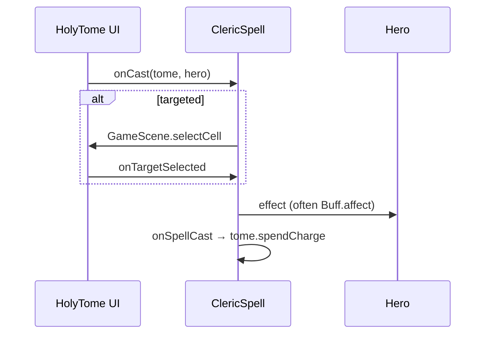
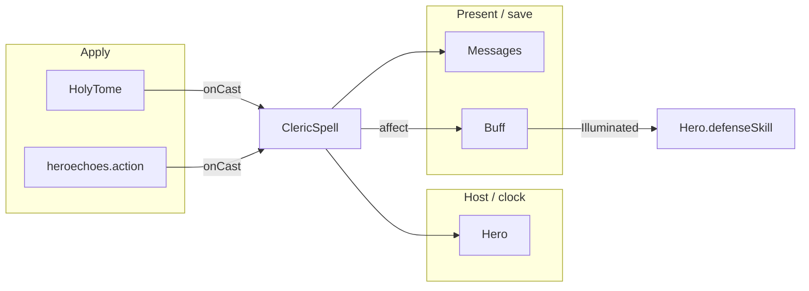

# [`actors/hero/spells`](..) — [`ClericSpell`](../ClericSpell.java) explainer

A [`ClericSpell`](../ClericSpell.java) is a Holy Tome charge action. Children implement `onCast`; `onSpellCast` spends charge and runs shared talent hooks.

What this parent is, versus lookalikes in other modules:

| This              | Not this                                                                                                                                                                          |
| ----------------- | --------------------------------------------------------------------------------------------------------------------------------------------------------------------------------- |
| Cleric tome spell | Armor ult ([`ArmorAbility`](../../abilities/ArmorAbility.java)), inventory [`Spell`](../../../../items/spells/Spell.java), a [`Buff`](../../../buffs/Buff.java) the spell applies |

## Lifecycle

How an instance starts, lives on the host clock, and ends:

Spells are singletons (`INSTANCE`). They are not Actors.

## Verbs

How other code starts, extends, or strips this parent:

| Call                                  | If already present | Effect                                                                                      |
| ------------------------------------- | ------------------ | ------------------------------------------------------------------------------------------- |
| [`onCast`](../ClericSpell.java)       | n/a                | child body (or cell/item selector)                                                          |
| [`onSpellCast`](../ClericSpell.java)  | n/a                | dispel invis, satiated-spells shield, **spend tome charge**, Paladin / Ascended Form riders |
| [`canCast`](../ClericSpell.java)      | n/a                | default true; children gate                                                                 |
| [`chargeUse`](../ClericSpell.java)    | n/a                | default 1                                                                                   |
| [`getSpellList`](../ClericSpell.java) | n/a                | talent-gated menu                                                                           |

## Kinds

How children specialize the parent (name one child; do not spec it):

| If it…                          | Kind (subtype of parent)                               | e.g.                                             |
| ------------------------------- | ------------------------------------------------------ | ------------------------------------------------ |
| Picks a cell                    | [`TargetedClericSpell`](../TargetedClericSpell.java)   | [`GuidingLight`](../GuidingLight.java)           |
| Picks an inventory item         | [`InventoryClericSpell`](../InventoryClericSpell.java) | [`RecallInscription`](../RecallInscription.java) |
| Fires immediately on the caster | self [`ClericSpell`](../ClericSpell.java)              | [`HolyWeapon`](../HolyWeapon.java)               |

[`GuidingLight`](../GuidingLight.java) applies nested `Illuminated` (a [`FlavourBuff`](../../../buffs/FlavourBuff.java)). [`Hero.defenseSkill`](../../Hero.java) and [`Mob.defenseSkill`](../../../mobs/Mob.java) both return 0 vs a Cleric attacker.

## Integrations

Which other modules talk to this parent, and in which direction:

| Module                                                                  | Direction | Parent hook                                                                                         |
| ----------------------------------------------------------------------- | --------- | --------------------------------------------------------------------------------------------------- |
| [`items.artifacts.HolyTome`](../../../../items/artifacts/HolyTome.java) | hosts     | charge + `onCast`                                                                                   |
| [`actors.hero`](../..)                                                  | applies   | caster [`Hero`](../../Hero.java); [`HeroClass.CLERIC`](../../HeroClass.java)                        |
| [`actors.buffs`](../../../buffs)                                        | applies   | `Buff.affect` from children                                                                         |
| [`actors.Char`](../../../Char.java)                                     | queries   | combat reads `Illuminated` in `defenseSkill` / `attack`                                             |
| [`scenes`](../../../../scenes)                                          | applies   | [`GameScene.selectCell`](../../../../scenes/GameScene.java) / `selectItem`                          |
| [`heroechoes.action`](../../../../heroechoes/action)                    | applies   | [`EchoClericAdapter`](../../../../heroechoes/action/EchoClericAdapter.java) casts from the echo kit |
| [`messages`](../../../../messages)                                      | renders   | `name` / `desc` / charge cost                                                                       |

Same map as the table:

## Player vs code

What the player sees versus the parent method that produces it:

| Player             | Parent API                                                        |
| ------------------ | ----------------------------------------------------------------- |
| Tome spell list    | [`getSpellList`](../ClericSpell.java)                             |
| Charge spent       | [`onSpellCast`](../ClericSpell.java) → `tome.spendCharge`         |
| Guiding Light mark | child applies `Illuminated`; evasion is **not** on this parent    |
| Aim prompt         | [`TargetedClericSpell`](../TargetedClericSpell.java) `selectCell` |

## Change without surprises

- [ ] Shared spend lives in `onSpellCast` — skipping it leaks charge
- [ ] Illuminated **combat** is [`Hero.defenseSkill`](../../Hero.java) / [`Mob.defenseSkill`](../../../mobs/Mob.java), not `onCast`
- [ ] Echo Cleric vs illuminated Hero uses the same guaranteed-hit path as Mob (`return 0`)
- [ ] Singletons — no per-cast instance state on the spell object (put duration on the buff)
