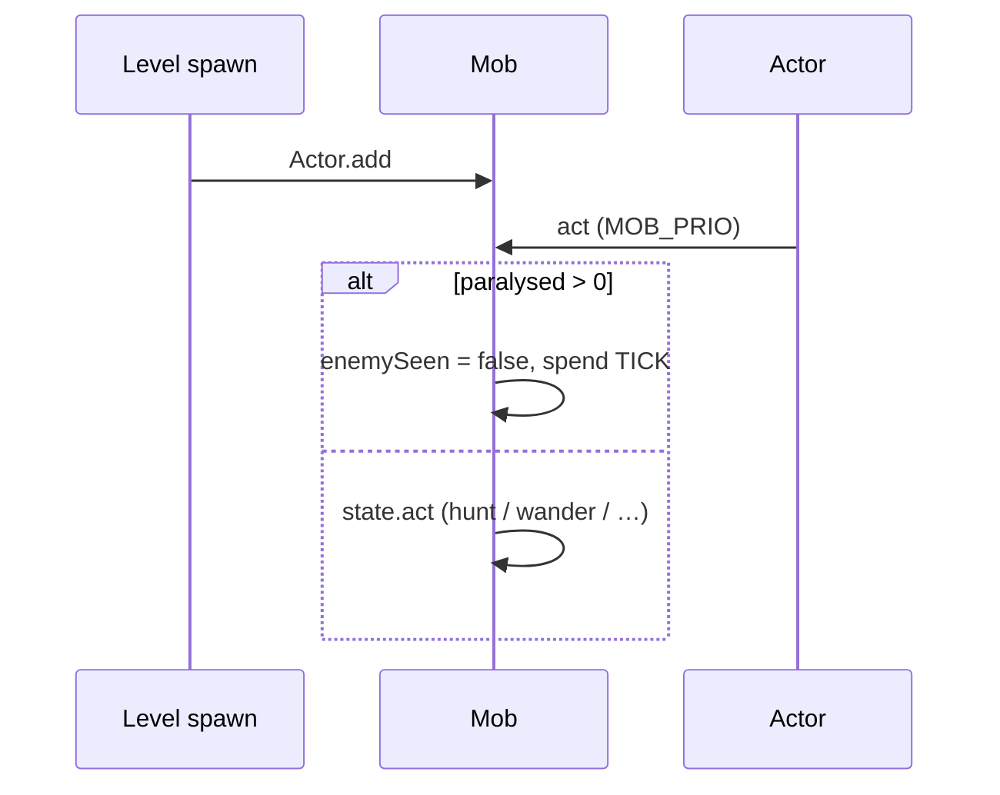
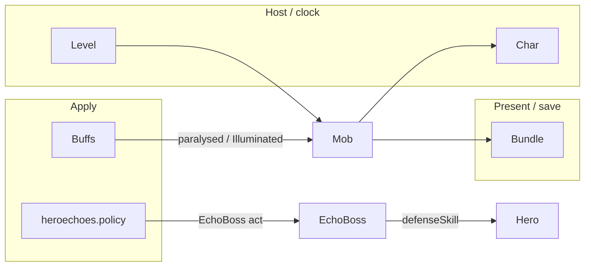

# [`actors/mobs`](..) — [`Mob`](../Mob.java) explainer

A [`Mob`](../Mob.java) is an AI [`Char`](../../Char.java) with a `state` (sleeping / wandering / hunting / fleeing). It acts at `MOB_PRIO` and owns the **surprise → 0 evasion** hit path.

What this parent is, versus lookalikes in other modules:

| This         | Not this                                                                                                                                                                                                                 |
| ------------ | ------------------------------------------------------------------------------------------------------------------------------------------------------------------------------------------------------------------------ |
| AI combatant | Player ([`Hero`](../../hero/Hero.java)), friendly shop NPC package ([`npcs`](../npcs)) |

## Lifecycle

How an instance starts, lives on the host clock, and ends:

## Verbs

How other code starts, extends, or strips this parent:

| Call                                                                                                      | If already present | Effect                                                                                                        |
| --------------------------------------------------------------------------------------------------------- | ------------------ | ------------------------------------------------------------------------------------------------------------- |
| [`defenseSkill(enemy)`](../Mob.java) | n/a                | `0` if Illuminated+Cleric, or surprised / `paralysed != 0` / ally-vs-hero; else the stored `defenseSkill` int |
| [`surprisedBy(enemy)`](../Mob.java)  | n/a                | hero attacker + (invisible / `!enemySeen` / not in FOV)                                                       |
| [`act`](../Mob.java)                 | n/a                | stunned → skip AI                                                                                             |
| [`aggro`](../Mob.java)               | n/a                | enter hunting                                                                                                 |

[`defenseSkill`](../Mob.java): Illuminated + `Dungeon.hero` is Cleric → **0** (guaranteed hit). Then if not surprised **and** `paralysed == 0` **and** not ally-vs-hero → stored evasion; **else 0**. Stunned mobs are always a guaranteed hit. There is no half-evasion branch.

## Kinds

How children specialize the parent (name one child; do not spec it):

| If it…                 | Kind (subtype of parent)                                                                            | e.g.                                                                                          |
| ---------------------- | --------------------------------------------------------------------------------------------------- | --------------------------------------------------------------------------------------------- |
| Standard enemy         | [`Mob`](../Mob.java)           | [`Rat`](../Rat.java)     |
| Region boss            | [`Mob`](../Mob.java)           | [`Tengu`](../Tengu.java) |
| Echo kit on a mob body | [`EchoBoss`](../EchoBoss.java) | —                                                                                             |

[`EchoBoss`](../EchoBoss.java) **overrides** `defenseSkill` and never uses this surprise→0 path. It copies `paralysed` onto [`getEchoHero()`](../EchoBoss.java) and calls [`Hero.defenseSkill`](../../hero/Hero.java).

## Integrations

Which other modules talk to this parent, and in which direction:

| Module                                                                                                 | Direction | Parent hook                                                                                                                                                                                                                                    |
| ------------------------------------------------------------------------------------------------------ | --------- | ---------------------------------------------------------------------------------------------------------------------------------------------------------------------------------------------------------------------------------------------- |
| [`actors.Char`](../../Char.java)          | is-a      | `extends Char`; [`hit`](../../Char.java)                                                                                                                                          |
| [`actors.buffs`](../../buffs)             | queries   | `paralysed`, Illuminated, AI buffs (Terror / Amok)                                                                                                                                                                                             |
| [`actors.hero`](../../hero)               | queries   | surprise only vs [`Dungeon.hero`](../../../Dungeon.java); [`EchoBoss`](../EchoBoss.java) delegates evasion to Hero     |
| [`actors.hero.spells`](../../hero/spells) | queries   | [`GuidingLight.Illuminated`](../../hero/spells/GuidingLight.java) → 0 vs Cleric                                                                                                   |
| [`levels`](../../../levels)                         | hosts     | spawn, FOV for `surprisedBy`                                                                                                                                                                                                                   |
| [`heroechoes.policy`](../../../heroechoes/policy)   | applies   | [`EchoRoleExecutor`](../../../heroechoes/policy/EchoRoleExecutor.java) on [`EchoBoss`](../EchoBoss.java) hunting turns |
| `Bundle`                      | persists  | state, enemy, `defenseSkill` int                                                                                                                                                                                                               |

Same map as the table:

## Player vs code

What the player sees versus the parent method that produces it:

| Player                              | Parent API                                                                                                                                                                                                                  |
| ----------------------------------- | --------------------------------------------------------------------------------------------------------------------------------------------------------------------------------------------------------------------------- |
| Surprise hit (door / invis)         | [`surprisedBy`](../Mob.java) → `defenseSkill` 0                                                                                                        |
| Stunned enemy always hit            | `paralysed != 0` → 0                                                                                                                                                                                                        |
| Guiding Light vs Cleric: always hit | Illuminated branch → 0                                                                                                                                                                                                      |
| Echo dodge like a hero              | [`EchoBoss.defenseSkill`](../EchoBoss.java) → [`Hero.defenseSkill`](../../hero/Hero.java) |
| Enemy skips a turn                  | `act` when `paralysed > 0`                                                                                                                                                                                                  |

## Change without surprises

- [ ] Do **not** put echo-fight evasion on [`Mob.defenseSkill`](../Mob.java) — rats/bosses stay surprise-0 / stunned-0; [`EchoBoss`](../EchoBoss.java) already left this method
- [ ] [`EchoBoss`](../EchoBoss.java) copies `paralysed` **and** the guaranteed-hit tracker onto the kit, then moves a new tracker back to the body
- [ ] `surprisedBy` is **hero-only** (`enemy == Dungeon.hero`) — an EchoBoss attacking a mob does not get this surprise
- [ ] Illuminated here keys off `Dungeon.hero.heroClass`, not the attacker’s kit class
- [ ] `paralysed == 0` is the only non-zero evasion gate besides surprise / ally
