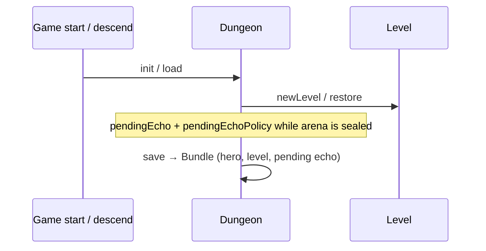
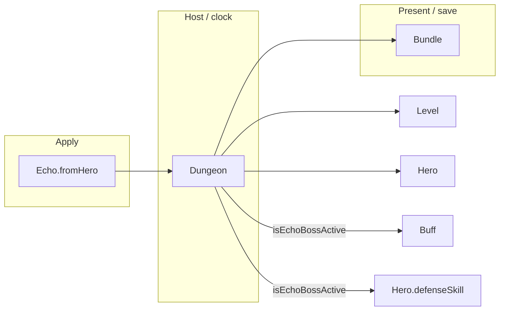

# [`shatteredpixeldungeon`](..) — [`Dungeon`](../Dungeon.java) explainer

[`Dungeon`](../Dungeon.java) is the static run hub: `hero`, `level`, depth, gold, and whether an echo fight is pending. It is not an Actor.

What this parent is, versus lookalikes in other modules:

| This                     | Not this                                                                                     |
| ------------------------ | -------------------------------------------------------------------------------------------- |
| Run state + floor loader | The floor ([`Level`](../levels/Level.java)), the player ([`Hero`](../actors/hero/Hero.java)) |

## Lifecycle

How an instance starts, lives on the host clock, and ends:

## Verbs

How other code starts, extends, or strips this parent:

| Call                                        | If already present | Effect                                                                                            |
| ------------------------------------------- | ------------------ | ------------------------------------------------------------------------------------------------- |
| [`isEchoBossActive`](../Dungeon.java)       | n/a                | `pendingEcho != null && pendingEchoPolicy != null` — **whole sealed arena**, not only hunting     |
| `pendingEcho` / `pendingEchoPolicy` getters | n/a                | captured [`Echo`](../heroechoes/Echo.java) + [`EchoPolicy`](../heroechoes/policy/EchoPolicy.java) |
| set / clear pending                         | n/a                | arm or tear down the echo fight                                                                   |
| `hero` / `level` / `depth`                  | n/a                | current run pointers                                                                              |
| save / restore                              | n/a                | bundles pending echo + policy with the run                                                        |

Fight-scoped stun/evasion should gate on [`isEchoBossActive`](../Dungeon.java) plus defender type — not a new `Dungeon` flag.

## Kinds

How children specialize the parent (name one child; do not spec it):

| If it…                     | Kind | e.g. |
| -------------------------- | ---- | ---- |
| No subclasses — static hub | —    | —    |

Collaborators in this package: [`Statistics`](../Statistics.java), [`SPDSettings`](../SPDSettings.java), [`Challenges`](../Challenges.java). Nested packages are other modules.

## Integrations

Which other modules talk to this parent, and in which direction:

| Module                                                 | Direction | Parent hook                        |
| ------------------------------------------------------ | --------- | ---------------------------------- |
| [`levels`](../levels)                                  | hosts     | `Dungeon.level`                    |
| [`actors.hero`](../actors/hero)                        | hosts     | `Dungeon.hero`                     |
| [`actors.Actor`](../actors/Actor.java)                 | hosts     | process loop while a level is live |
| [`heroechoes`](../heroechoes)                          | hosts     | `pendingEcho`                      |
| [`heroechoes.policy`](../heroechoes/policy)            | hosts     | `pendingEchoPolicy`                |
| [`actors.mobs.EchoBoss`](../actors/mobs/EchoBoss.java) | queries   | spawn / act while pending is set   |
| `Bundle`                                               | persists  | run + pending echo keys            |

Same map as the table:

## Player vs code

What the player sees versus the parent method that produces it:

| Player                              | Parent API                                                   |
| ----------------------------------- | ------------------------------------------------------------ |
| This floor of the run               | `depth` + `level`                                            |
| Echo arena instead of a normal boss | pending echo + policy; [`isEchoBossActive`](../Dungeon.java) |
| Save / continue                     | `storeInBundle` / restore including pending echo             |

## Change without surprises

- [ ] [`isEchoBossActive`](../Dungeon.java) is true for the **entire** sealed arena — do not also require `EchoBoss` hunting
- [ ] Both echo **and** policy must be present; a lone pending echo is not “active”
- [ ] Restore that finds echo without a supported policy clears / recovers — do not fight on a hollow playbook
- [ ] Static hub — tests must reset pending echo or they leak into later cases
