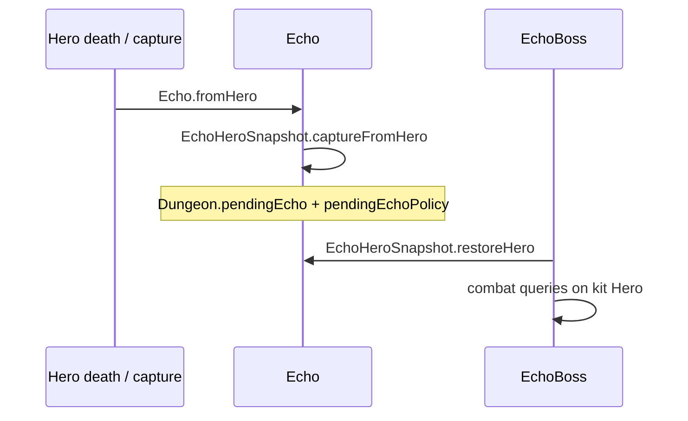
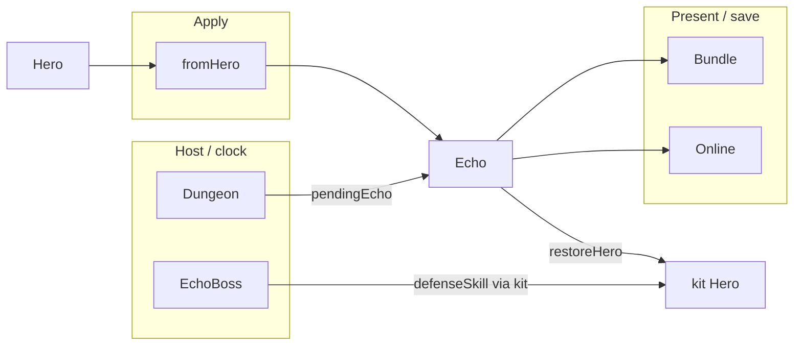

# [`heroechoes`](..) — [`Echo`](../Echo.java) explainer

An [`Echo`](../Echo.java) is the captured-hero DTO (class, depth, bundled kit). [`EchoHeroSnapshot`](../EchoHeroSnapshot.java) restores a kit [`Hero`](../../actors/hero/Hero.java) for [`EchoBoss`](../../actors/mobs/EchoBoss.java).

What this parent is, versus lookalikes in other modules:

| This                                | Not this                                                                                                                       |
| ----------------------------------- | ------------------------------------------------------------------------------------------------------------------------------ |
| Snapshot of a run’s hero at a depth | The on-stage fighter ([`EchoBoss`](../../actors/mobs/EchoBoss.java)), the playbook ([`EchoPolicy`](../policy/EchoPolicy.java)) |

## Lifecycle

How an instance starts, lives on the host clock, and ends:

## Verbs

How other code starts, extends, or strips this parent:

| Call                                                           | If already present | Effect                                                                                                      |
| -------------------------------------------------------------- | ------------------ | ----------------------------------------------------------------------------------------------------------- |
| [`create`](../Echo.java)                                       | n/a                | requires `hero_class`; throws if missing                                                                    |
| [`fromHero`](../Echo.java)                                     | n/a                | capture kit; fight HP starts at HT                                                                          |
| [`fromBundle`](../Echo.java) / `toBundle`                      | n/a                | persist                                                                                                     |
| [`EchoHeroSnapshot.restoreHero`](../EchoHeroSnapshot.java)     | n/a                | kit [`Hero`](../../actors/hero/Hero.java) or fail                                                           |
| [`EchoHeroSnapshot.captureFromHero`](../EchoHeroSnapshot.java) | n/a                | equipment bundle                                                                                            |
| [`EchoHardStun.appliesTo`](../EchoHardStun.java)               | n/a                | Hero / EchoBoss **and** [`isEchoBossActive`](../../Dungeon.java); stun cap, immunity, chain reject, evasion |

Fight-scoped helpers that must not scatter `instanceof Hero \|\| EchoBoss` through SPD belong **next to this hub** ([`EchoHardStun`](../EchoHardStun.java) from [`Buff`](../../actors/buffs/Buff.java) / [`Hero.defenseSkill`](../../actors/hero/Hero.java)).

## Kinds

How children specialize the parent (name one child; do not spec it):

| If it…                | Kind                                               | e.g. |
| --------------------- | -------------------------------------------------- | ---- |
| Equipment restore     | [`EchoHeroSnapshot`](../EchoHeroSnapshot.java)     | —    |
| When to capture       | [`EchoCaptureTrigger`](../EchoCaptureTrigger.java) | —    |
| Ranked vs local paths | [`EchoPlayModePaths`](../EchoPlayModePaths.java)   | —    |

No `Echo` subclasses. Nested packages (`policy`, `action`, `boss`, `online`) are other modules.

## Integrations

Which other modules talk to this parent, and in which direction:

| Module                                                    | Direction         | Parent hook                                                                                                                       |
| --------------------------------------------------------- | ----------------- | --------------------------------------------------------------------------------------------------------------------------------- |
| [`actors.hero`](../../actors/hero)                        | applies + queries | capture from / restore to [`Hero`](../../actors/hero/Hero.java)                                                                   |
| [`actors.mobs.EchoBoss`](../../actors/mobs/EchoBoss.java) | hosts             | `restoreHero`; copies `paralysed` + guaranteed-hit tracker onto the kit before [`Hero.defenseSkill`](../../actors/hero/Hero.java) |
| [`Dungeon`](../../Dungeon.java)                           | hosts             | `pendingEcho`; [`isEchoBossActive`](../../Dungeon.java)                                                                           |
| [`heroechoes.policy`](../policy)                          | hosts             | playbook travels with the pending echo                                                                                            |
| [`heroechoes.online`](../online)                          | persists          | upload / fetch wire                                                                                                               |
| `Bundle`                                                  | persists          | `echo_data` kit                                                                                                                   |

Same map as the table:

## Player vs code

What the player sees versus the parent method that produces it:

| Player                    | Parent API                                                             |
| ------------------------- | ---------------------------------------------------------------------- |
| “An echo of that hero”    | [`fromHero`](../Echo.java) + class / name / depth                      |
| Echo fights with that kit | [`restoreHero`](../EchoHeroSnapshot.java)                              |
| Arena uses hero evasion   | [`EchoBoss`](../../actors/mobs/EchoBoss.java) kit borrow, not this DTO |

## Change without surprises

- [ ] Missing `hero_class` / hero **throws** — no `"UNKNOWN"` echo
- [ ] Restore failure is unavailable, not a hollow kit ([`EchoBoss`](../../actors/mobs/EchoBoss.java) must not fight with a fake hero)
- [ ] Kit `paralysed` is overwritten from the **body** each combat query — stun state lives on [`EchoBoss`](../../actors/mobs/EchoBoss.java), not the DTO
- [ ] Guaranteed-hit tracker is copied onto the kit then moved back to the body — do not leave it only on the phantom kit
- [ ] [`isEchoBossActive`](../../Dungeon.java) is true for the whole sealed arena (`pendingEcho` + policy), not only while the mob is hunting
