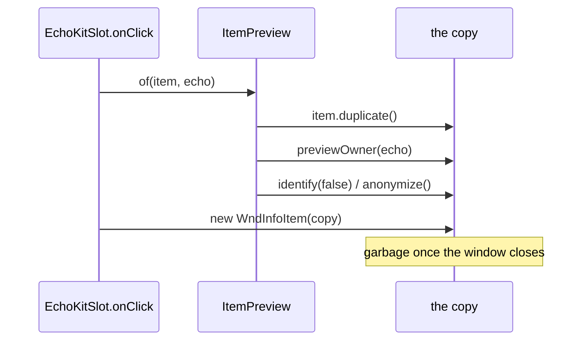
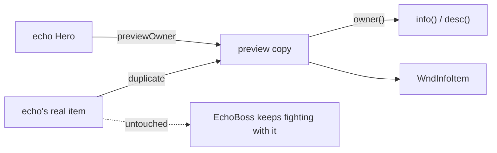

# [`heroechoes.inspect`](..) — [`ItemPreview`](../ItemPreview.java) explainer

[`ItemPreview`](../ItemPreview.java) makes a throwaway copy of somebody else's item, stamped
with the hero it belongs to and identified, so the player can look at it. **Foreign hero data
is view-only:** it never becomes player state, and player state never colours its display.

What this parent is, versus lookalikes in other modules:

| This                                                | Not this                                                                                                                                                                                              |
| ---------------------------------------------------- | ------------------------------------------------------------------------------------------------------------------------------------------------------------------------------------------------------ |
| A copy of one item, made to be read                 | The echo's real kit ([`EchoHeroSnapshot`](../../EchoHeroSnapshot.java)), the write-guard around restoring it ([`ForeignRestore`](../../ForeignRestore.java)), or the window ([`WndInfoItem`](../../../windows/WndInfoItem.java)) |

## Lifecycle

The original is never touched — it may be a live
[`EchoBoss`](../../../actors/mobs/EchoBoss.java)'s fighting kit.

## Verbs

| Call                              | If already present | Effect                                                                                                            |
| --------------------------------- | ------------------ | ------------------------------------------------------------------------------------------------------------------- |
| [`of`](../ItemPreview.java)       | n/a                | copy, stamped and identified. **Null** when the item cannot be copied — show nothing rather than the original       |
| [`Item.previewOwner`](../../../items/Item.java) | overwrites | stamps the copy; never called on an item in play                                                        |
| [`Item.owner()`](../../../items/Item.java)      | n/a        | the stamp, else [`Dungeon.hero`](../../../Dungeon.java) — what description code reads instead of the player |

## Kinds

No subclasses. A preview is an ordinary `Item` of the original's own concrete class, which is
the point: a previewed `Greatsword` runs `Greatsword`'s real `info()`, so the text can never
drift from the item it describes.

## Integrations

| Module                                            | Direction | Parent hook                                                                                                    |
| ------------------------------------------------- | --------- | ---------------------------------------------------------------------------------------------------------------- |
| [`items`](../../../items)                         | queries   | `owner()` / `isEquippedByOwner()` in `info`/`desc`/`statsInfo`/`abilityInfo` bodies; `duplicate()` makes the copy |
| [`EchoKitSlot`](../../../ui/EchoKitSlot.java)     | calls     | one preview per clicked kit slot                                                                                |
| [`Ring`](../../../items/rings/Ring.java)          | applies   | `anonymize()` — a true name without touching the player's gem table                                             |
| [`ForeignRestore`](../../ForeignRestore.java)     | sibling   | the other half: previews answer *whose item is this*, that answers *may this write to the player*                |
| [`Dungeon`](../../../Dungeon.java)                | reads     | `owner()` falls through to `Dungeon.hero`; **never writes it**                                                  |

## Player vs code

| Player                                              | Parent API                                             |
| ---------------------------------------------------- | -------------------------------------------------------- |
| An echo's sword reads for *its* class, not yours    | `previewOwner` + `owner()` in the description bodies    |
| An echo's gear reads as identified                  | `identify(false)`, and `anonymize()` for rings          |
| Your own gear still describes itself normally       | no stamp → `owner()` is `Dungeon.hero`                  |

## Change without surprises

- [ ] Previews are **copies**. Never stamp an item that is in play, and never fall back to showing the original when `of` returns null — that is the leak this class closes
- [ ] `identify(false)` is deliberate: the `false` skips the catalog entry and the discovered-item statistic. `identify()` with no argument would teach the player
- [ ] Rings are anonymized rather than identified, because a ring's identity lives in a table shared with the player rather than on the item
- [ ] The stamp does **not** reach nested items on its own. [`MagesStaff`](../../../items/weapon/melee/MagesStaff.java) quotes its wand's stats, so `stamp` reaches into it by hand; a new nesting among the kit slots needs the same
- [ ] Description code reads `owner()`; **gameplay code keeps reading `Dungeon.hero`**. Swapping a gameplay site makes an echo fight against the wrong hero
- [ ] Regressions under `items/weapon`, `items/armor`, `items/artifacts`, `items/rings` are caught by the source scan in [`ItemOwnerEnforcementTest`](../../../../../../../../test/java/com/shatteredpixel/shatteredpixeldungeon/items/ItemOwnerEnforcementTest.java) — extend its package list when the inspect window grows new slots
