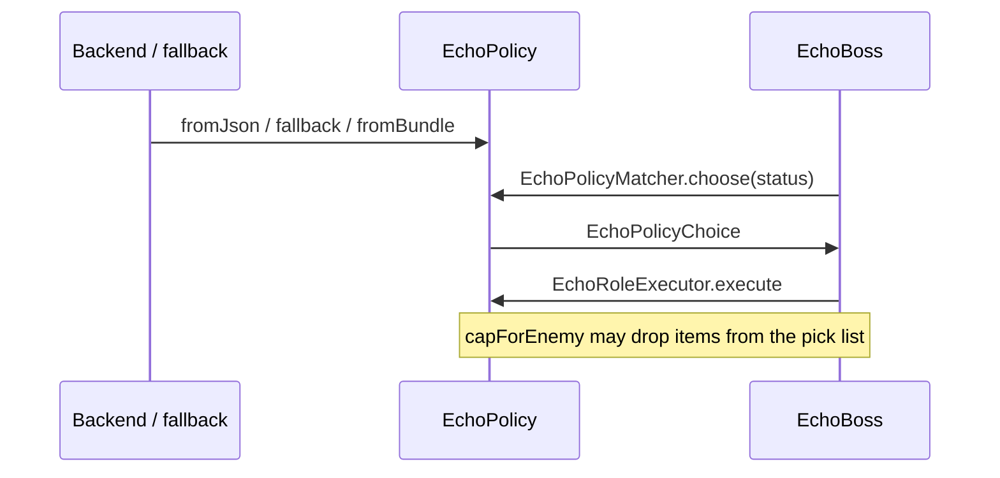
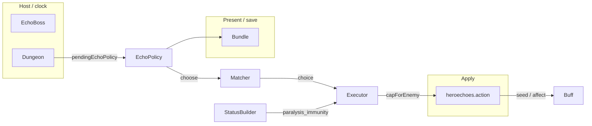

# [`heroechoes/policy`](..) — [`EchoPolicy`](../EchoPolicy.java) explainer

An [`EchoPolicy`](../EchoPolicy.java) is the persisted playbook JSON ([`EchoBoss`](../../../actors/mobs/EchoBoss.java) matches and executes roles each hunting turn). It is a hub, not an Actor.

What this parent is, versus lookalikes in other modules:

| This                                                     | Not this                                                                                                                                                                                                                            |
| -------------------------------------------------------- | ----------------------------------------------------------------------------------------------------------------------------------------------------------------------------------------------------------------------------------- |
| Offline fight brain (capabilities / reactions / recipes) | The echo kit DTO ([`Echo`](../../Echo.java)), item adapters ([`heroechoes/action`](../../action)) |

## Lifecycle

How an instance starts, lives on the host clock, and ends:

## Verbs

How other code starts, extends, or strips this parent:

| Call                                                                                                                                                                                                                        | If already present | Effect                                                                                                                                             |
| --------------------------------------------------------------------------------------------------------------------------------------------------------------------------------------------------------------------------- | ------------------ | -------------------------------------------------------------------------------------------------------------------------------------------------- |
| [`fromJson`](../EchoPolicy.java) / [`fromBundle`](../EchoPolicy.java) | n/a                | wrap JSON; missing bundle key **throws**                                                                                                           |
| [`fallback`](../EchoPolicy.java)                                                                                                                 | n/a                | documented local playbook (MELEE + INVIS escape)                                                                                                   |
| [`isSupported`](../EchoPolicy.java)                                                                                                              | n/a                | `root` has `capabilities`                                                                                                                          |
| [`EchoPolicyMatcher.choose`](../EchoPolicyMatcher.java)                                                                                          | n/a                | walk `selection.order` → [`EchoPolicyChoice`](../EchoPolicyChoice.java) |
| [`EchoRoleExecutor.execute`](../EchoRoleExecutor.java)                                                                                           | n/a                | resolve item, run adapter / virtual tag                                                                                                            |
| [`capForEnemy`](../EchoRoleExecutor.java)                                                                                                        | n/a                | `SETUP_CC` + sensed `paralysis_immunity` → drop Paralytic Gas only                                                                                 |
| [`EchoPolicyStatusBuilder`](../EchoPolicyStatusBuilder.java)                                                                                     | n/a                | per-turn sense; `Paralysis.Immunity` → alias `paralysis_immunity`                                                                                  |

## Kinds

How children specialize the parent (name one child; do not spec it):

| If it…                | Kind                                                                                                                      | e.g.            |
| --------------------- | ------------------------------------------------------------------------------------------------------------------------- | --------------- |
| Named playbook action | [`EchoRole`](../EchoRole.java)                 | `SETUP_CC`      |
| Per-turn facts        | [`EchoPolicyStatus`](../EchoPolicyStatus.java) | `enemyStatuses` |
| This turn’s pick      | [`EchoPolicyChoice`](../EchoPolicyChoice.java) | `use_role`      |

Role kinds on [`EchoRole.Kind`](../EchoRole.java): damage, blob (`SETUP_CC`), self-drink, throw, disengage.

## Integrations

Which other modules talk to this parent, and in which direction:

| Module                                                                                                          | Direction | Parent hook                                                                                                                                                                                |
| --------------------------------------------------------------------------------------------------------------- | --------- | ------------------------------------------------------------------------------------------------------------------------------------------------------------------------------------------ |
| [`actors.mobs.EchoBoss`](../../../actors/mobs/EchoBoss.java) | hosts     | hunting `act` → match → execute                                                                                                                                                            |
| [`actors.buffs`](../../../actors/buffs)                      | queries   | [`EchoPolicyStatusBuilder`](../EchoPolicyStatusBuilder.java) reads `Paralysis` / `Frost` / `Paralysis.Immunity` |
| [`actors.blobs`](../../../actors/blobs)                      | applies   | `SETUP_CC` items seed gas / freezing                                                                                                                                                       |
| [`heroechoes.action`](../../action)            | applies   | potion / wand / throw adapters                                                                                                                                                             |
| [`Dungeon`](../../../Dungeon.java)                           | persists  | `pendingEchoPolicy`; [`isEchoBossActive`](../../../Dungeon.java)                                                                        |
| `Bundle`                               | persists  | `policy_json` + schema version                                                                                                                                                             |

Same map as the table:

## Player vs code

What the player sees versus the parent method that produces it:

| Player                                     | Parent API                                                                                                                                     |
| ------------------------------------------ | ---------------------------------------------------------------------------------------------------------------------------------------------- |
| Echo drinks / throws / swings              | [`EchoRoleExecutor.execute`](../EchoRoleExecutor.java)              |
| Echo skips gas while “immune to paralysis” | [`capForEnemy`](../EchoRoleExecutor.java) (Frost still legal today) |
| Echo fights at all                         | [`Dungeon.isEchoBossActive`](../../../Dungeon.java) (`pendingEcho` + this policy)           |

## Change without surprises

- [ ] Wire alias stays `paralysis_immunity` even if the buff later blocks Frost / Magical Sleep
- [ ] [`capForEnemy`](../EchoRoleExecutor.java) currently strips **gas only** — expanding shared immunity without updating this still throws frost/flashbang into a blocked target
- [ ] [`fromBundle`](../EchoPolicy.java) throws if `policy_json` is missing — do not invent a hollow playbook
- [ ] Status names are aliases in [`EchoPolicyHazards`](../EchoPolicyHazards.java); `Paralysis.Immunity` must not be sensed as `"immunity"`
