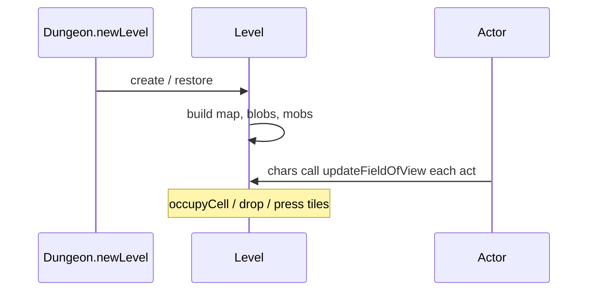
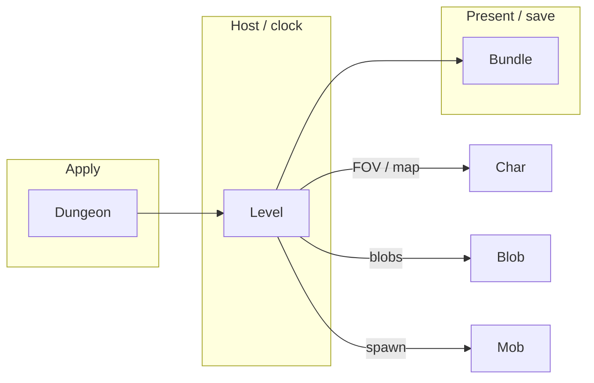

# [`levels`](..) — [`Level`](../Level.java) explainer

A [`Level`](../Level.java) is the floor: `map` of [`Terrain`](../Terrain.java), FOV, heaps, and [`blobs`](../../actors/blobs). [`Char.act`](../../actors/Char.java) rebuilds `fieldOfView` from here.

What this parent is, versus lookalikes in other modules:

| This                       | Not this                                                                                                                                                                                              |
| -------------------------- | ----------------------------------------------------------------------------------------------------------------------------------------------------------------------------------------------------- |
| Floor geometry + occupancy | Run hub ([`Dungeon`](../../Dungeon.java)), a combatant ([`Char`](../../actors/Char.java)) |

## Lifecycle

How an instance starts, lives on the host clock, and ends:

## Verbs

How other code starts, extends, or strips this parent:

| Call                                                                                                          | If already present | Effect                                                                                                                                         |
| ------------------------------------------------------------------------------------------------------------- | ------------------ | ---------------------------------------------------------------------------------------------------------------------------------------------- |
| [`updateFieldOfView(ch, fov)`](../Level.java) | overwrite array    | LOS into `ch.fieldOfView` / `heroFOV`                                                                                                          |
| [`adjacent`](../Level.java) / `distance`      | n/a                | grid neighborhood                                                                                                                              |
| `map[cell]`                                                                                                   | n/a                | [`Terrain`](../Terrain.java) id (`DOOR` 5, `OPEN_DOOR` 6, `LOCKED_DOOR` 10, …) |
| [`occupyCell`](../Level.java)                 | n/a                | traps / plants / door leave                                                                                                                    |
| `blobs`                                                                                                       | one per class      | host for [`Blob.seed`](../../actors/blobs/Blob.java)                                     |

Closed `DOOR` is `LOS_BLOCKING | SOLID`. `OPEN_DOOR` is passable and does **not** block LOS.

## Kinds

How children specialize the parent (name one child; do not spec it):

| If it…               | Kind (subtype of parent)                                                                               | e.g.                                                                                                         |
| -------------------- | ------------------------------------------------------------------------------------------------------ | ------------------------------------------------------------------------------------------------------------ |
| Room-generated floor | [`RegularLevel`](../RegularLevel.java) | [`SewerLevel`](../SewerLevel.java)           |
| Region boss arena    | boss [`Level`](../Level.java)          | [`SewerBossLevel`](../SewerBossLevel.java)   |
| Debug / special      | [`Level`](../Level.java)               | [`DebugArenaLevel`](../DebugArenaLevel.java) |

[`EchoBossLevel`](../EchoBossLevel.java) is a save-compat stub of [`SewerBossLevel`](../SewerBossLevel.java). The echo fight gate is [`Dungeon.isEchoBossActive`](../../Dungeon.java), not this class.

## Integrations

Which other modules talk to this parent, and in which direction:

| Module                                                                                        | Direction | Parent hook                                                                            |
| --------------------------------------------------------------------------------------------- | --------- | -------------------------------------------------------------------------------------- |
| [`Dungeon`](../../Dungeon.java)         | hosts     | `Dungeon.level`                                                                        |
| [`actors.Char`](../../actors/Char.java) | queries   | `pos`, FOV, `adjacent`                                                                 |
| [`actors.blobs`](../../actors/blobs)    | hosts     | `blobs` map                                                                            |
| [`actors.mobs`](../../actors/mobs)      | hosts     | spawn / `surprisedBy` uses FOV                                                         |
| [`actors.hero`](../../actors/hero)      | queries   | door tiles for a fight-scoped surprise helper would read `map` + `adjacent` + FOV here |
| `Bundle`             | persists  | map, blobs, heaps                                                                      |

Same map as the table:

## Player vs code

What the player sees versus the parent method that produces it:

| Player                   | Parent API                                                                                                       |
| ------------------------ | ---------------------------------------------------------------------------------------------------------------- |
| Fog / seen tiles         | [`updateFieldOfView`](../Level.java) / `heroFOV` |
| Closed door blocks sight | [`Terrain.DOOR`](../Terrain.java) `LOS_BLOCKING` |
| Open doorway             | `OPEN_DOOR` — passable, does not block LOS                                                                       |
| Standing on a tile       | `map[pos]`, `occupyCell`                                                                                         |

## Change without surprises

- [ ] Door surprise needs **map + adjacency + FOV**, not [`Mob.surprisedBy`](../../actors/mobs/Mob.java) (hero-only, guaranteed hit)
- [ ] `OPEN_DOOR` vs `DOOR` are different flags — “cell or the door between” must name which ids
- [ ] FOV arrays are length `level.length()`; a stale array vs a new floor NPEs or silently lies
- [ ] [`EchoBossLevel`](../EchoBossLevel.java) is not the live arena type
