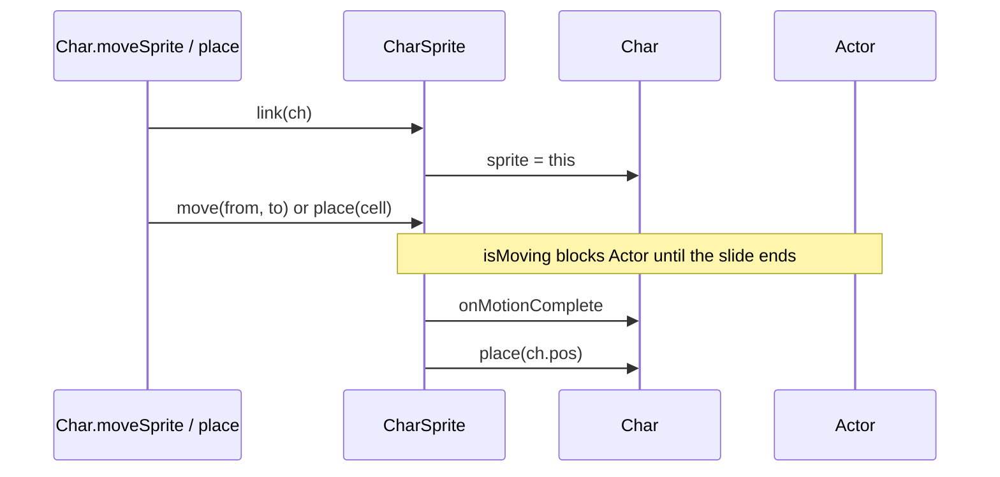
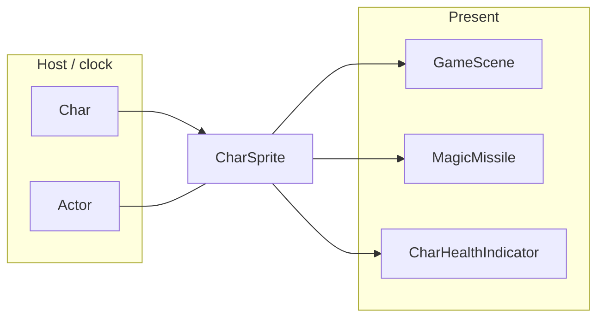

# Sprites — CharSprite explainer

[`CharSprite`](../CharSprite.java) is the on-screen body of a [`Char`](../../actors/Char.java). It plays on the render loop; the actor clock waits while a walk slide is in progress.

What this parent is, versus lookalikes in other modules:

| This | Not this |
| ---- | -------- |
| Pixels, animations, and slides for one [`Char`](../../actors/Char.java) | The cell [`Char.pos`](../../actors/Char.java) melee, pathing, and AI use |
| Walk [`PosTweener`](../../../../../../../../../SPD-classes/src/main/java/com/watabou/noosa/tweeners/PosTweener.java) (`motion`) | The separate jump tweener (leaps, lunges) |
| [`MovieClip`](../../../../../../../../../SPD-classes/src/main/java/com/watabou/noosa/MovieClip.java) frames (idle, run, attack, zap, die) | Projectiles and bolts, which read `center()` only to pick a start pixel |

## Lifecycle

How a body is linked, slid, and unlinked:

## Verbs

How other code starts, replaces, or stops a slide:

| Call | If already present | Effect |
| ---- | ------------------ | ------ |
| `link` | replaces `ch.sprite` | Binds this body to the char and places it |
| `move` | drops the current walk slide | Starts a new slide; `isMoving` until it ends |
| `place` | drops the current walk slide | Snaps pixels to that cell |
| `interruptMotion` | drops the current walk slide | Stops the slide without `onMotionComplete` |
| `jump` | leaves the walk slide alone | Arc tweener; callback fires on its own completion |
| `attack` / `zap` / `idle` / `die` | plays that clip | Attack and operate call `ch.onAttackComplete` / `onOperateComplete` |

## Kinds

How children specialize the parent (name one child; do not spec it):

| If it… | Kind (subtype of parent) | e.g. |
| ------ | ------------------------ | ---- |
| Draws a mob, including an echo boss | [`MobSprite`](../MobSprite.java) | [`EchoBossSprite`](../EchoBossSprite.java) |
| Draws the local hero, including sprint | [`HeroSprite`](../HeroSprite.java) | the player |

## Integrations

Which other modules talk to this parent, and in which direction:

| Module | Direction | Parent hook |
| ------ | --------- | ----------- |
| [`actors`](../../actors) | hosts | [`Char.sprite`](../../actors/Char.java), `moveSprite`, `onMotionComplete` |
| [`Actor`](../../actors/Actor.java) | queries | `isMoving` — the clock waits out a walk slide |
| [`scenes`](../../scenes) | applies | [`GameScene`](../../scenes/GameScene.java) parents the sprite; ripples and sort run from motion callbacks |
| [`effects`](../../effects) | renders | [`MagicMissile`](../../effects/MagicMissile.java) starts a bolt at `sprite.center()` |
| [`ui`](../../ui) | renders | [`CharHealthIndicator`](../../ui/CharHealthIndicator.java) follows the body |

Same map as the table:

## Player vs code

What the player sees versus the parent method that produces it:

| Player | Parent API |
| ------ | ---------- |
| Body walks from one tile to the next | `move` |
| Body is already standing on its tile | `place` |
| Melee and the attack indicator | [`Char.pos`](../../actors/Char.java), not the slide pixels |
| A wand bolt leaves the drawn body | `center()` at zap time |
| Leap / lunge arc | `jump` (not the walk slide) |

## Change without surprises

- [ ] A finished walk slide lands on `ch.pos`. Melee, AI, and the picture share that tile.
- [ ] `place`, `move`, and `interruptMotion` drop the in-flight walk slide so an older tweener cannot paint a tile the char has left.
- [ ] `jump` is a different tweener. `place` must not kill it; lunge callbacks still apply the hit.
- [ ] `isMoving` is what [`Actor`](../../actors/Actor.java) waits on. Clearing it has to `notifyAll`.
