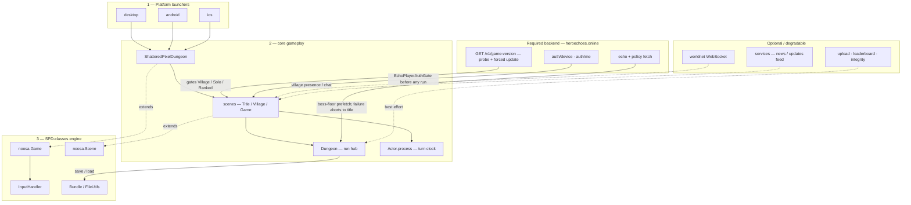
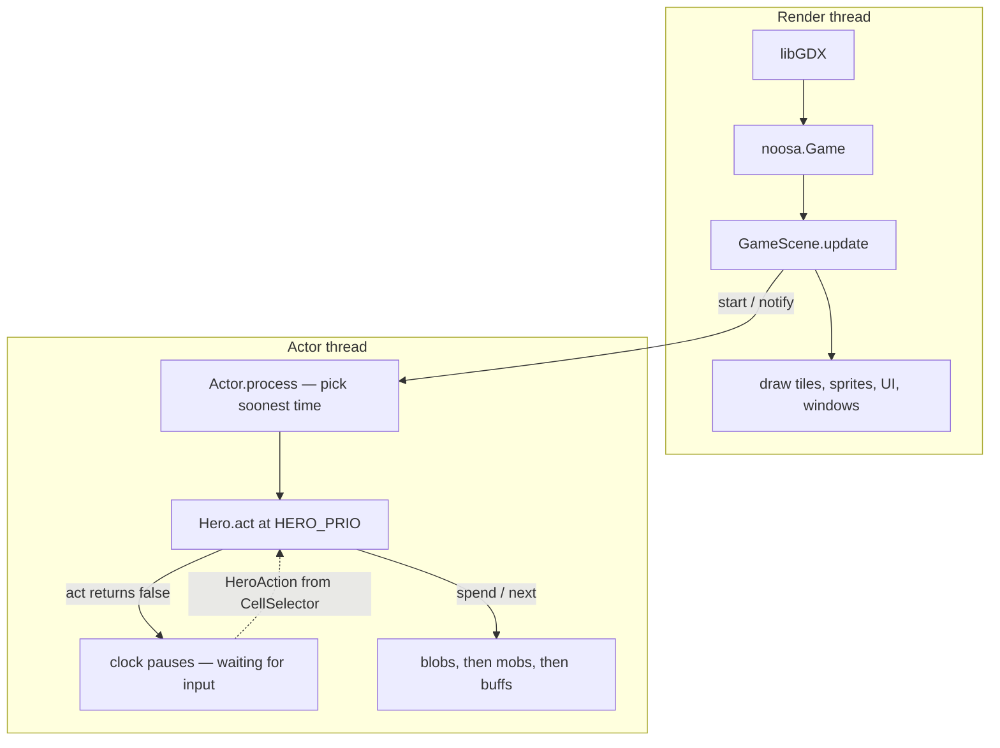
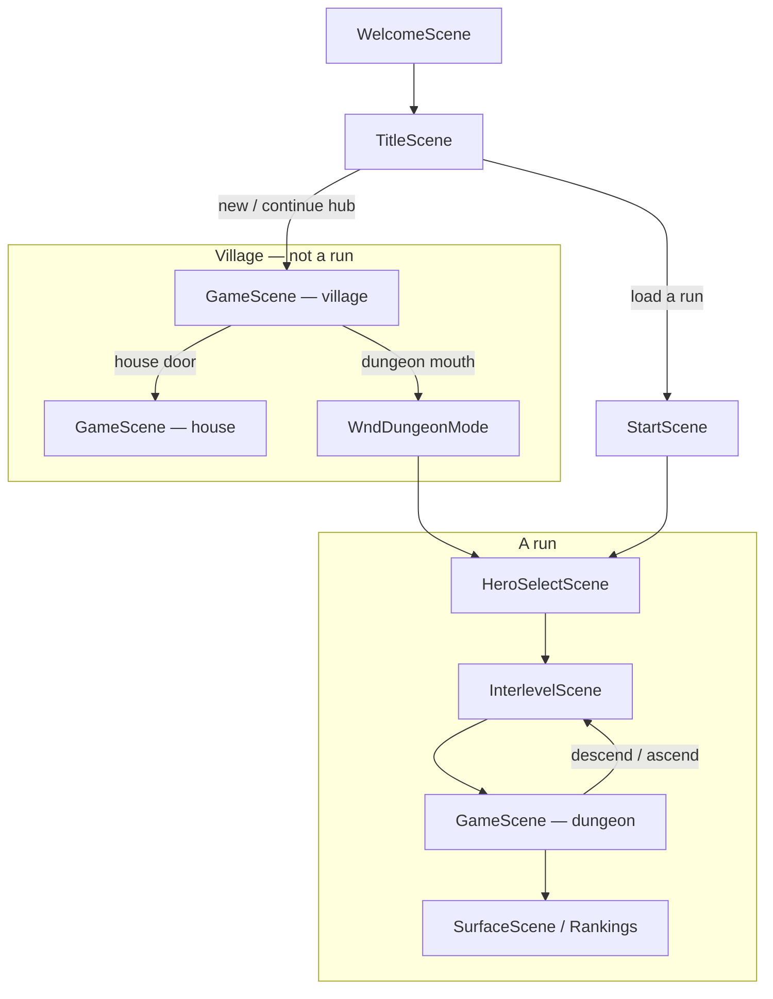
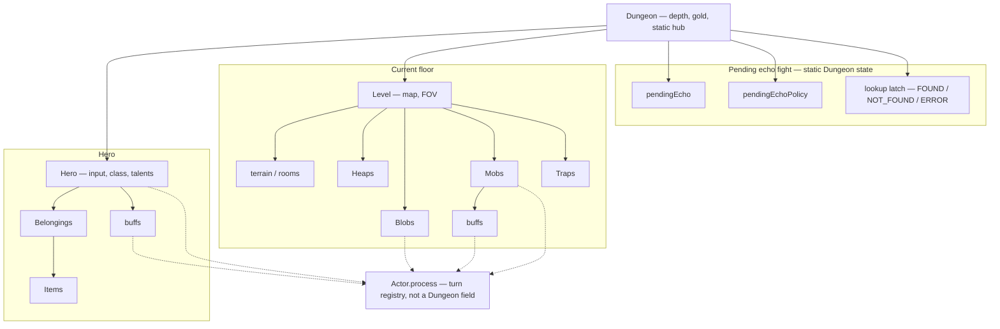
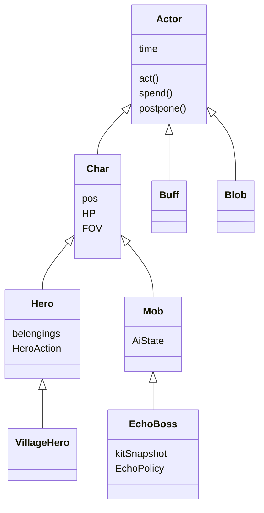
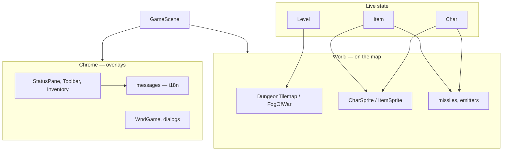
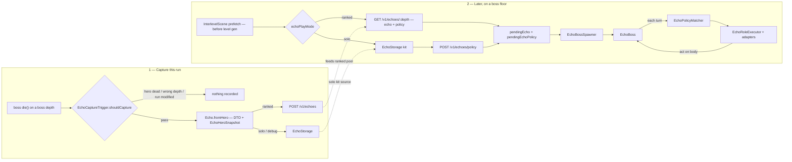
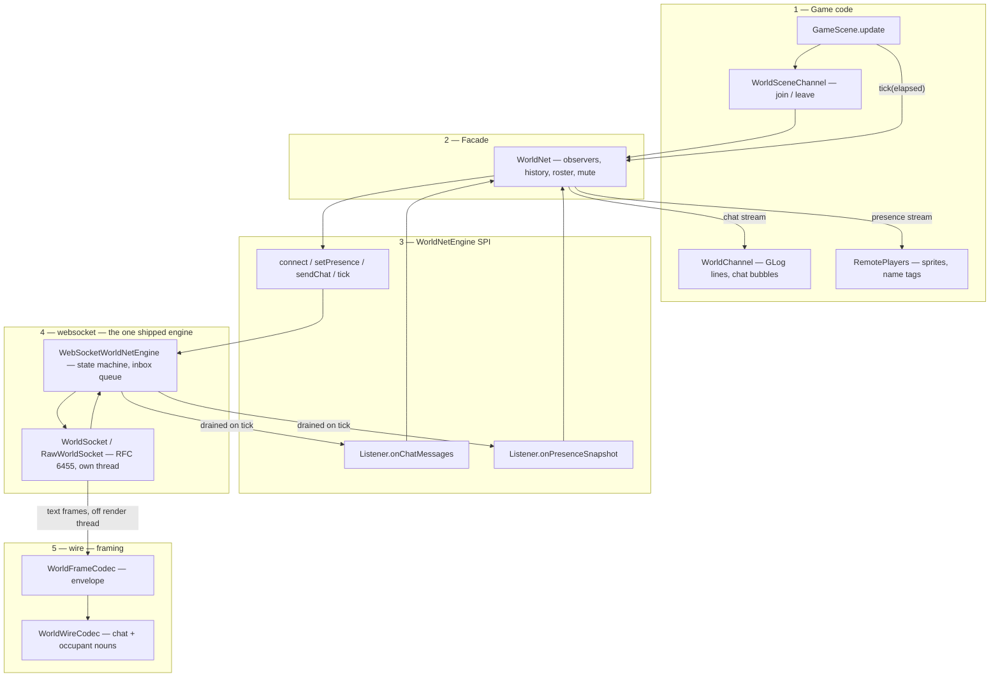
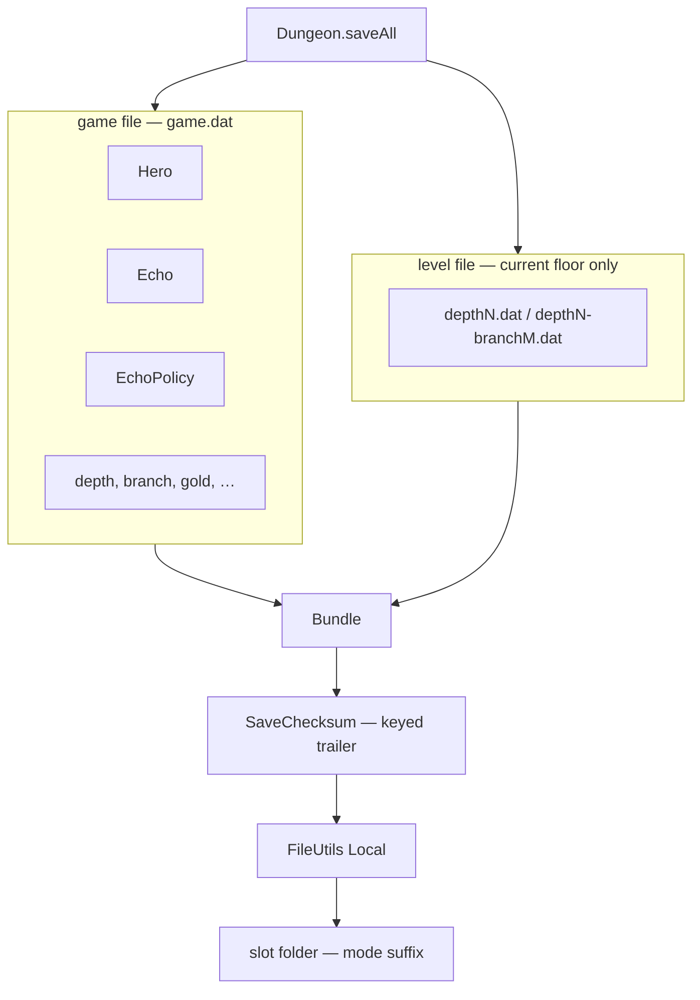

# Game architecture

IATDB is a libGDX game: thin platform launchers, a Noosa engine in [`SPD-classes`](../SPD-classes), and all shared gameplay in [`core`](../core). Parent-type explainers live next to the Java they describe (see [Module explainers](#module-explainers)).

## Layers

How a process is assembled. Launchers start the game; they do not contain gameplay. Solid arrows are “starts / owns”; dotted arrows are “extends” or optional I/O.

| Gradle module                                                       | Role                                                                                                                                 |
| ------------------------------------------------------------------- | ------------------------------------------------------------------------------------------------------------------------------------ |
| [`desktop`](../desktop) / [`android`](../android) / [`ios`](../ios) | Native window, `PlatformSupport`, `FileUtils` Local sandbox                                                                          |
| [`SPD-classes`](../SPD-classes)                                     | Render loop, scene graph, audio, `Bundle`, `Random`, `PathFinder`                                                                    |
| [`core`](../core)                                                   | Actors, items, levels, UI, Hero Echoes, village                                                                                      |
| [`services`](../services)                                           | Update / news SPI + flavor impls (`updates:{debug,github,echo}`, `news:{debug,shattered}`); launchers bind `UpdateImpl` / `NewsImpl` |

Compile target is Java 11, but iOS `robovm-rt` is older, so **every** production source tree — `core`, `SPD-classes`, `desktop`, `android`, `ios`, no exclusions — stays on the RoboVM-safe JDK subset: no `java.util.function`, `Optional`, `Base64`, `List.of` / `Map.of` / `Set.of`, `String.join`, `String.isBlank`, `Comparator.comparing*`, `list.sort(…)`, `Map.getOrDefault`, `Collection.removeIf`, `Integer::sum`. Enforced by [`RoboVMUnsupportedApisTest`](../core/src/test/java/com/watabou/utils/RoboVMUnsupportedApisTest.java); replacements are tabulated in [`cross-platform.mdc`](../.cursor/rules/cross-platform.mdc).

This build is always-online: the title screen probes `/v1/game-version` on every visit and leaves Village / Solo / Ranked disabled until it answers, and `EchoPlayerAuthGate` demands a session before any run starts. Solo is **not** an offline mode — its policy comes from the service per boss floor. The only offline path is the debug arena.

## Frame loop

Two threads while a floor is live, plus short-lived workers for network calls. One rule: scene graph, sprites, and `GLog` are render-thread only. Off-thread results cross back two different ways — echo HTTP posts via `Game.runOnRenderThread` ([`EchoBackendProbe`](../core/src/main/java/com/shatteredpixel/shatteredpixeldungeon/heroechoes/online/EchoBackendProbe.java), [`EchoPlayerAuthGate`](../core/src/main/java/com/shatteredpixel/shatteredpixeldungeon/heroechoes/online/EchoPlayerAuthGate.java)), while the world channel queues socket frames and hands them over on [`WorldNet.tick`](../core/src/main/java/com/shatteredpixel/shatteredpixeldungeon/worldnet/WorldNet.java), which `GameScene.update` already calls on the render thread — so `WorldNetEngine` implementations never need `runOnRenderThread`.

[`GameScene`](../core/src/main/java/com/shatteredpixel/shatteredpixeldungeon/scenes/GameScene.java) *statically* owns the actor thread: `private static Thread actorThread` is created lazily in `update()` and reused, so it outlives any one scene — on a floor change the old scene's `destroy()` interrupts and waits (`waitForActorThread`), then the new scene's `update()` finds it alive and only `notify()`s it. Only `endActorThread()`, called from `ShatteredPixelDungeon.destroy()` at shutdown, clears `Actor.keepActorThreadAlive`. [`Actor`](../core/src/main/java/com/shatteredpixel/shatteredpixeldungeon/actors/Actor.java) priorities at equal time: VFX 100, Hero 0, Blob −10, Mob −20, Buff −30.

## Player journey

Village is a [`Level`](../core/src/main/java/com/shatteredpixel/shatteredpixeldungeon/levels/Level.java) played in [`GameScene`](../core/src/main/java/com/shatteredpixel/shatteredpixeldungeon/scenes/GameScene.java), but it is **not** a run. A run starts only after Solo / Ranked at the dungeon entrance.

[`VillageHero`](../core/src/main/java/com/shatteredpixel/shatteredpixeldungeon/village/VillageHero.java) is a presentation [`Hero`](../core/src/main/java/com/shatteredpixel/shatteredpixeldungeon/actors/hero/Hero.java) with no run underneath it. Village save slot is past every run slot and always uses the solo namespace.

## Run object graph

[`Dungeon`](../core/src/main/java/com/shatteredpixel/shatteredpixeldungeon/Dungeon.java) is a static hub, not an Actor. It holds the live hero, floor, depth, and any pending echo fight. Hero, mobs, blobs, and buffs also sit on [`Actor.process`](../core/src/main/java/com/shatteredpixel/shatteredpixeldungeon/actors/Actor.java) — that registry is not a `Dungeon` field.

Same map as code: [`Dungeon.hero`](../core/src/main/java/com/shatteredpixel/shatteredpixeldungeon/Dungeon.java) / [`Dungeon.level`](../core/src/main/java/com/shatteredpixel/shatteredpixeldungeon/Dungeon.java). Floor generation is [`RegularLevel`](../core/src/main/java/com/shatteredpixel/shatteredpixeldungeon/levels/RegularLevel.java) + rooms / painters / builders; LOS is [`ShadowCaster`](../core/src/main/java/com/shatteredpixel/shatteredpixeldungeon/mechanics/ShadowCaster.java) / [`Ballistica`](../core/src/main/java/com/shatteredpixel/shatteredpixeldungeon/mechanics/Ballistica.java).

## Actor family

Everything that takes a turn extends [`Actor`](../core/src/main/java/com/shatteredpixel/shatteredpixeldungeon/actors/Actor.java). Combatants occupy a cell; statuses hang on a [`Char`](../core/src/main/java/com/shatteredpixel/shatteredpixeldungeon/actors/Char.java); gases live on the floor.

[`EchoBoss`](../core/src/main/java/com/shatteredpixel/shatteredpixeldungeon/actors/mobs/EchoBoss.java) stays a [`Mob`](../core/src/main/java/com/shatteredpixel/shatteredpixeldungeon/actors/mobs/Mob.java) on the clock. It restores a kit [`Hero`](../core/src/main/java/com/shatteredpixel/shatteredpixeldungeon/actors/hero/Hero.java) for combat queries and item use; it is not a second player.

Items apply effects; they are not Actors. Typical path: [`Item`](../core/src/main/java/com/shatteredpixel/shatteredpixeldungeon/items/Item.java) → `Buff.affect` / `Blob.seed` / damage on a `Char`.

## Presentation

Render thread draws the live [`Level`](../core/src/main/java/com/shatteredpixel/shatteredpixeldungeon/levels/Level.java) and overlays chrome. Windows sit on the scene, not on the turn clock.

World VFX for Hero **and** on-stage Echo gates on [`Char.canWorldFx`](../core/src/main/java/com/shatteredpixel/shatteredpixeldungeon/actors/Char.java) (sprite has a parent). Echo adapters go through [`EchoActionContext.canWorldFx`](../core/src/main/java/com/shatteredpixel/shatteredpixeldungeon/heroechoes/action/EchoActionContext.java). There is no `UseContext` / `heroFX` flag.

## Hero Echoes

Capture a hero kit at a depth; later spawn it as the region boss. Ranked fetches the kit **and** its [`EchoPolicy`](../core/src/main/java/com/shatteredpixel/shatteredpixeldungeon/heroechoes/policy/EchoPolicy.java) in one response; solo pairs a locally stored kit with a policy the service generates on request. The client interprets policy; it does not generate it.

| Piece                                                                                                    | Job                                                             |
| -------------------------------------------------------------------------------------------------------- | --------------------------------------------------------------- |
| [`heroechoes.Echo`](../core/src/main/java/com/shatteredpixel/shatteredpixeldungeon/heroechoes/Echo.java) | Kit DTO (class, depth, bundled belongings)                      |
| [`heroechoes.policy`](../core/src/main/java/com/shatteredpixel/shatteredpixeldungeon/heroechoes/policy)  | Match capabilities / reactions / recipes; execute roles         |
| [`heroechoes.action`](../core/src/main/java/com/shatteredpixel/shatteredpixeldungeon/heroechoes/action)  | Borrow kit items (wand, potion, armor ult, …) onto the mob body |
| [`heroechoes.boss`](../core/src/main/java/com/shatteredpixel/shatteredpixeldungeon/heroechoes/boss)      | Spawn, regional death, fight recorder, leaderboard              |
| [`heroechoes.online`](../core/src/main/java/com/shatteredpixel/shatteredpixeldungeon/heroechoes/online)  | HTTP client, auth, lookup, sync, wire codec                     |

`Dungeon.isEchoBossActive()` is derived (`pendingEcho != null && pendingEchoPolicy != null`), not a latch, and its window is wider than the fight: armed by `InterlevelScene.prefetchEchoBossIfNeeded` *before* level generation, still armed after the boss dies — `EchoCaptureTrigger` leans on that tail to suppress the default-boss leaderboard entry — and cleared only when the player leaves the depth or `abandonSealedEchoBossFloor` runs. (`Dungeon.armPendingEchoBoss` is the debug-arena mirror path, not the normal one.)

A separate **lookup latch** picks the fallback: [`EchoBossSpawner`](../core/src/main/java/com/shatteredpixel/shatteredpixeldungeon/heroechoes/boss/EchoBossSpawner.java)`.shouldSpawnDefault()` spawns the regional default boss only on a `NOT_FOUND` latch for this depth; `ERROR` or unset runs `EchoBossFetchRecovery` instead. That is why `clearPendingEcho()` deliberately leaves the latch alone.

The arena is not a bespoke level type — echo bosses spawn into the ordinary region boss floors under the stock `Level.seal()` lock. [`EchoReplacementDecider`](../core/src/main/java/com/shatteredpixel/shatteredpixeldungeon/levels/EchoReplacementDecider.java) is only the boss-depth table (5, 10, 15, 20, 25) plus the `EchoLookup` SPI; the replace-or-default decision lives in `EchoBossSpawner.readyChoice`. [`EchoBossLevel`](../core/src/main/java/com/shatteredpixel/shatteredpixeldungeon/levels/EchoBossLevel.java) is a dead save-compatibility stub — depth 5 always uses `SewerBossLevel`. Quitting mid-fight forfeits rather than resumes: `Dungeon.shouldRetreatEchoBossOnContinue` makes `InterlevelScene.restore` abandon the floor (delete the depth file, clear pending **and** latch, detach `LockedFloor`) and drop the player one floor up, so the next descend regenerates a fresh encounter.

Capture is gated, not automatic: [`EchoCaptureTrigger`](../core/src/main/java/com/shatteredpixel/shatteredpixeldungeon/heroechoes/EchoCaptureTrigger.java)`.shouldCapture` needs a surviving hero, a boss depth, **and** `!Dungeon.currentRunModified()` — see [Integrity](#integrity). Ranked uploads; solo and debug write to `EchoStorage`; never both.

[`EchoPlayMode`](../core/src/main/java/com/shatteredpixel/shatteredpixeldungeon/heroechoes/EchoPlayMode.java)`.sanitize()` coerces `null`, legacy `NONE`, and `DEBUG` outside a debug build down to `SOLO` on load. The gate is runtime, not build-time: `heroechoes/debug` ships in release binaries, and `EchoSnapshotDebug.applyIfEnabled` sits on the normal capture path — inert only because `DebugSettings.weakEchoSnapshots()` is false there.

Client docs: [`docs/hero-echoes`](hero-echoes/README.md) — [naming](hero-echoes/NAMING.md) (code, API fields, UI strings) and [gap analysis](hero-echoes/echo-boss-gap-analysis.md).

### Endpoint surface

All paths hang off `ECHO_BACKEND_URL` ([`EchoOnlineSettings`](../core/src/main/java/com/shatteredpixel/shatteredpixeldungeon/heroechoes/online/EchoOnlineSettings.java)); every echo path is built in [`EchoClient`](../core/src/main/java/com/shatteredpixel/shatteredpixeldungeon/heroechoes/online/EchoClient.java).

| Method  | Path                                          | Purpose                                            | Class                                            |
| ------- | --------------------------------------------- | -------------------------------------------------- | ------------------------------------------------ |
| `GET`   | `/v1/game-version`                            | Reachability probe + forced-update gate            | **Mandatory** — title and every boss floor       |
| `POST`  | `/v1/auth/device`                             | Register / refresh device session                  | **Mandatory** — before any run                   |
| `GET`   | `/v1/auth/me`                                 | Validate JWT, refresh profile and `muted_until`    | **Mandatory** on launch with a session           |
| `PATCH` | `/v1/auth/username`                           | Rename player                                      | No production caller in `core` yet               |
| `PUT`   | `/v1/auth/credentials`                        | Link email + password                              | No production caller in `core` yet               |
| `GET`   | `/v1/echoes/{depth}?easy_mode=…`              | Ranked lookup — returns echo **and** `echo_policy` | **Mandatory** on ranked boss floors              |
| `POST`  | `/v1/echoes/policy`                           | Generate a policy for a local solo echo            | **Mandatory** on solo boss floors                |
| `POST`  | `/v1/echoes`                                  | Upload a captured echo (ranked)                    | Optional — async, best effort                    |
| `POST`  | `/v1/leaderboard/results`                     | Report a fight result                              | Optional — async, best effort                    |
| `GET`   | `/v1/leaderboard/{depth}?limit=N&easy_mode=…` | Online rankings overlay                            | Degradable — local entries render first          |
| `POST`  | `/v1/integrity/report`                        | Deliver queued modified-save reports               | Optional — silent, retried                       |
| `GET`   | `/v1/world/socket?instance=N`                 | WebSocket upgrade for village presence / chat      | Degradable — see [World channel](#world-channel) |

`X-API-Key` is attached only when `includeApiKey` is set and `Authorization: Bearer` only when `includeBearer` is; `game-version`, `echoes/{depth}` and `leaderboard/{depth}` are sent with neither.

## World channel

The village is shared: other players appear as avatars and chat scrolls through `GLog`. [`WorldNet`](../core/src/main/java/com/shatteredpixel/shatteredpixeldungeon/worldnet/WorldNet.java) is the only surface game code touches. Everything below it hides behind [`WorldNetEngine`](../core/src/main/java/com/shatteredpixel/shatteredpixeldungeon/worldnet/WorldNetEngine.java), the swap point — `WorldNet.engine()` is the single place in the game that names a transport, so replacing the shipped WebSocket engine is a change to that one method. **Chat and presence are independent streams**: `Listener.onChatMessages` (new lines only) and `Listener.onPresenceSnapshot` (full roster, not a delta) must be consumed separately, so an engine sourcing them from different places drops in unchanged. The socket carrying both over one connection is an implementation detail that must not leak upward. `GameScene.update` drives it with one `WorldNet.tick(Game.elapsed)` per frame.

Nothing outside `WorldNet.java` imports `websocket/` or `wire/`. The socket is hand-rolled RFC 6455 because RoboVM cannot AOT-compile any mainstream WebSocket library.

## Persistence

Saves are `Bundle` files in the libGDX Local sandbox, not cwd-relative `File` I/O. Play mode picks the slot folder (`game<slot>-solo` / `-ranked` / `-debug`); renaming a `Bundlable` class needs `Bundle.addAlias`.

`Dungeon.saveAll` writes exactly two files: the **game file** and **one level file** — only the floor currently in memory. Level files are keyed by depth *and* [`Dungeon.branch`](../core/src/main/java/com/shatteredpixel/shatteredpixeldungeon/Dungeon.java) (`0` = main path, `1` = quest sub-floors), so a slot accumulates a `depthN.dat` or `depthN-branchM.dat` per floor visited. Both pass through [`SaveChecksum`](../core/src/main/java/com/shatteredpixel/shatteredpixeldungeon/utils/SaveChecksum.java), which appends a keyed trailer after the gzip stream; the run's seed / depth / branch ride in the key, so a floor file cannot be moved between runs.

[`GamesInProgress`](../core/src/main/java/com/shatteredpixel/shatteredpixeldungeon/GamesInProgress.java) lists run slots `1…MAX_SLOTS`, and `MAX_SLOTS` is `HeroClass.values().length` — one slot per hero class, so adding a class adds a slot. The village sits on [`VillageGateway.VILLAGE_SLOT`](../core/src/main/java/com/shatteredpixel/shatteredpixeldungeon/village/VillageGateway.java) (`MAX_SLOTS + 1`), past the range `firstEmpty` scans, so it can never collide with a run.

Echo and leaderboard storage use a *second* axis: [`EchoPlayModePaths`](../core/src/main/java/com/shatteredpixel/shatteredpixeldungeon/heroechoes/EchoPlayModePaths.java) appends an easy-mode suffix to `echoes-<mode>[-easy]/` and `leaderboard-<mode>[-easy].json`. Save-slot folders carry the mode suffix only.

## Integrity

Save files carry a keyed checksum, and a run loaded from bytes the game did not write is marked for its whole life. The mark costs the run nothing playable — it simply stops producing anything the rest of the world is asked to believe: no echo capture, no upload, no leaderboard entry, local or online. Detection is **silent by design**; nothing logs, throws, or opens a window, and every failure in the reporting path is swallowed, so a flagged player sees an ordinary game. Detections queue locally and post on the next load once a session exists — the only traffic a modified run ever sends.

| Piece                                                                                                                                               | Job                                                                                                   |
| --------------------------------------------------------------------------------------------------------------------------------------------------- | ----------------------------------------------------------------------------------------------------- |
| [`utils.SaveChecksum`](../core/src/main/java/com/shatteredpixel/shatteredpixeldungeon/utils/SaveChecksum.java)                                      | Signs / verifies one file → `OK` / `FLAGGED` / `TAMPERED` / `UNSIGNED`                                |
| [`utils.SaveFiles`](../core/src/main/java/com/shatteredpixel/shatteredpixeldungeon/utils/SaveFiles.java)                                            | Per-slot read/write, and which slots this install has written (kept in settings, not the save folder) |
| [`utils.SaveIntegrity`](../core/src/main/java/com/shatteredpixel/shatteredpixeldungeon/utils/SaveIntegrity.java)                                    | Policy: adopt, mark, report once per session                                                          |
| [`Dungeon.currentRunModified`](../core/src/main/java/com/shatteredpixel/shatteredpixeldungeon/Dungeon.java)                                         | The gate — `hero != null && SaveIntegrity.isModified()`, not the raw static                           |
| [`online.IntegrityReport`](../core/src/main/java/com/shatteredpixel/shatteredpixeldungeon/heroechoes/online/IntegrityReport.java)                   | One detection: reason, hero class/level, depth, seed, version, mode, slot                             |
| [`online.IntegrityReportQueue`](../core/src/main/java/com/shatteredpixel/shatteredpixeldungeon/heroechoes/online/IntegrityReportQueue.java)         | Holds up to 20 detections on disk until acknowledged                                                  |
| [`EchoOnlineSync.flushIntegrityReportsAsync`](../core/src/main/java/com/shatteredpixel/shatteredpixeldungeon/heroechoes/online/EchoOnlineSync.java) | Drains the queue to `POST /v1/integrity/report` on every `loadGame`                                   |

Gated consumers: `EchoCaptureTrigger.shouldCapture`, [`EchoFightRecorder.persist`](../core/src/main/java/com/shatteredpixel/shatteredpixeldungeon/heroechoes/boss/EchoFightRecorder.java), and both upload paths in `EchoOnlineSync`. Once modified, saving re-writes the poisoned tag, so the mark survives reload. Title-screen slot previews read saves without acting on the verdict; only loading a run does.

## Core packages

| Package                                                                                                                                                                                                                                                     | Job                                                                                                                                              | Parent explainer                                                                                                                                                                         |
| ----------------------------------------------------------------------------------------------------------------------------------------------------------------------------------------------------------------------------------------------------------- | ------------------------------------------------------------------------------------------------------------------------------------------------ | ---------------------------------------------------------------------------------------------------------------------------------------------------------------------------------------- |
| [`actors`](../core/src/main/java/com/shatteredpixel/shatteredpixeldungeon/actors)                                                                                                                                                                           | Turn clock                                                                                                                                       | [Actor](../core/src/main/java/com/shatteredpixel/shatteredpixeldungeon/actors/docs/Actor.md), [Char](../core/src/main/java/com/shatteredpixel/shatteredpixeldungeon/actors/docs/Char.md) |
| [`actors/hero`](../core/src/main/java/com/shatteredpixel/shatteredpixeldungeon/actors/hero)                                                                                                                                                                 | Player combatant, kit, talents                                                                                                                   | [Hero](../core/src/main/java/com/shatteredpixel/shatteredpixeldungeon/actors/hero/docs/Hero.md)                                                                                          |
| [`actors/hero/abilities`](../core/src/main/java/com/shatteredpixel/shatteredpixeldungeon/actors/hero/abilities)                                                                                                                                             | Armor ults                                                                                                                                       | —                                                                                                                                                                                        |
| [`actors/hero/spells`](../core/src/main/java/com/shatteredpixel/shatteredpixeldungeon/actors/hero/spells)                                                                                                                                                   | Cleric spells                                                                                                                                    | [ClericSpell](../core/src/main/java/com/shatteredpixel/shatteredpixeldungeon/actors/hero/spells/docs/ClericSpell.md)                                                                     |
| [`actors/mobs`](../core/src/main/java/com/shatteredpixel/shatteredpixeldungeon/actors/mobs)                                                                                                                                                                 | AI combatants, `EchoBoss`                                                                                                                        | [Mob](../core/src/main/java/com/shatteredpixel/shatteredpixeldungeon/actors/mobs/docs/Mob.md)                                                                                            |
| [`actors/buffs`](../core/src/main/java/com/shatteredpixel/shatteredpixeldungeon/actors/buffs)                                                                                                                                                               | Status on a Char                                                                                                                                 | [Buff](../core/src/main/java/com/shatteredpixel/shatteredpixeldungeon/actors/buffs/docs/Buff.md)                                                                                         |
| [`actors/blobs`](../core/src/main/java/com/shatteredpixel/shatteredpixeldungeon/actors/blobs)                                                                                                                                                               | Floor volume                                                                                                                                     | [Blob](../core/src/main/java/com/shatteredpixel/shatteredpixeldungeon/actors/blobs/docs/Blob.md)                                                                                         |
| [`items`](../core/src/main/java/com/shatteredpixel/shatteredpixeldungeon/items)                                                                                                                                                                             | Weapons, potions, wands, armor, …                                                                                                                | —                                                                                                                                                                                        |
| [`levels`](../core/src/main/java/com/shatteredpixel/shatteredpixeldungeon/levels)                                                                                                                                                                           | Floor geometry, generation, traps                                                                                                                | [Level](../core/src/main/java/com/shatteredpixel/shatteredpixeldungeon/levels/docs/Level.md)                                                                                             |
| _(root)_ [`Dungeon`](../core/src/main/java/com/shatteredpixel/shatteredpixeldungeon/Dungeon.java)                                                                                                                                                           | Run hub                                                                                                                                          | [Dungeon](../core/src/main/java/com/shatteredpixel/shatteredpixeldungeon/docs/Dungeon.md)                                                                                                |
| [`heroechoes`](../core/src/main/java/com/shatteredpixel/shatteredpixeldungeon/heroechoes)                                                                                                                                                                   | Echo DTO, capture, storage                                                                                                                       | [Echo](../core/src/main/java/com/shatteredpixel/shatteredpixeldungeon/heroechoes/docs/Echo.md)                                                                                           |
| [`heroechoes/policy`](../core/src/main/java/com/shatteredpixel/shatteredpixeldungeon/heroechoes/policy)                                                                                                                                                     | Offline fight brain                                                                                                                              | [EchoPolicy](../core/src/main/java/com/shatteredpixel/shatteredpixeldungeon/heroechoes/policy/docs/EchoPolicy.md)                                                                        |
| [`heroechoes/debug`](../core/src/main/java/com/shatteredpixel/shatteredpixeldungeon/heroechoes/debug)                                                                                                                                                       | Sandbox arena kits, weakened snapshots (runtime-gated, ships in release)                                                                         | —                                                                                                                                                                                        |
| [`scenes`](../core/src/main/java/com/shatteredpixel/shatteredpixeldungeon/scenes) / [`ui`](../core/src/main/java/com/shatteredpixel/shatteredpixeldungeon/ui) / [`windows`](../core/src/main/java/com/shatteredpixel/shatteredpixeldungeon/windows)         | Screens, chrome, dialogs                                                                                                                         | —                                                                                                                                                                                        |
| [`sprites`](../core/src/main/java/com/shatteredpixel/shatteredpixeldungeon/sprites) / [`effects`](../core/src/main/java/com/shatteredpixel/shatteredpixeldungeon/effects) / [`tiles`](../core/src/main/java/com/shatteredpixel/shatteredpixeldungeon/tiles) | Visuals                                                                                                                                          | —                                                                                                                                                                                        |
| [`messages`](../core/src/main/java/com/shatteredpixel/shatteredpixeldungeon/messages)                                                                                                                                                                       | i18n (`Messages.get`)                                                                                                                            | —                                                                                                                                                                                        |
| [`plants`](../core/src/main/java/com/shatteredpixel/shatteredpixeldungeon/plants)                                                                                                                                                                           | Seed / plant tiles                                                                                                                               | —                                                                                                                                                                                        |
| [`journal`](../core/src/main/java/com/shatteredpixel/shatteredpixeldungeon/journal)                                                                                                                                                                         | Catalog, bestiary, notes                                                                                                                         | —                                                                                                                                                                                        |
| [`mechanics`](../core/src/main/java/com/shatteredpixel/shatteredpixeldungeon/mechanics)                                                                                                                                                                     | Ballistica, FOV cone                                                                                                                             | —                                                                                                                                                                                        |
| [`village`](../core/src/main/java/com/shatteredpixel/shatteredpixeldungeon/village)                                                                                                                                                                         | Ground-level hub                                                                                                                                 | —                                                                                                                                                                                        |
| [`worldnet`](../core/src/main/java/com/shatteredpixel/shatteredpixeldungeon/worldnet)                                                                                                                                                                       | Village presence + chat behind a swappable engine SPI                                                                                            | [World channel](#world-channel)                                                                                                                                                          |
| [`utils`](../core/src/main/java/com/shatteredpixel/shatteredpixeldungeon/utils)                                                                                                                                                                             | Save files, checksum, integrity policy                                                                                                           | [Integrity](#integrity)                                                                                                                                                                  |
| [`services`](../core/src/main/java/com/shatteredpixel/shatteredpixeldungeon/services)                                                                                                                                                                       | Static binding point for the `:services` SPI (`News.service`, `Updates.service`) plus `billing` — core-only interface, Android Play Billing impl | —                                                                                                                                                                                        |

## Module explainers

Per-directory parent docs (not this file): [Actor](../core/src/main/java/com/shatteredpixel/shatteredpixeldungeon/actors/docs/Actor.md), [Char](../core/src/main/java/com/shatteredpixel/shatteredpixeldungeon/actors/docs/Char.md), [Hero](../core/src/main/java/com/shatteredpixel/shatteredpixeldungeon/actors/hero/docs/Hero.md), [Mob](../core/src/main/java/com/shatteredpixel/shatteredpixeldungeon/actors/mobs/docs/Mob.md), [Buff](../core/src/main/java/com/shatteredpixel/shatteredpixeldungeon/actors/buffs/docs/Buff.md), [Blob](../core/src/main/java/com/shatteredpixel/shatteredpixeldungeon/actors/blobs/docs/Blob.md), [Level](../core/src/main/java/com/shatteredpixel/shatteredpixeldungeon/levels/docs/Level.md), [Dungeon](../core/src/main/java/com/shatteredpixel/shatteredpixeldungeon/docs/Dungeon.md), [Echo](../core/src/main/java/com/shatteredpixel/shatteredpixeldungeon/heroechoes/docs/Echo.md), [EchoPolicy](../core/src/main/java/com/shatteredpixel/shatteredpixeldungeon/heroechoes/policy/docs/EchoPolicy.md), [ClericSpell](../core/src/main/java/com/shatteredpixel/shatteredpixeldungeon/actors/hero/spells/docs/ClericSpell.md).
