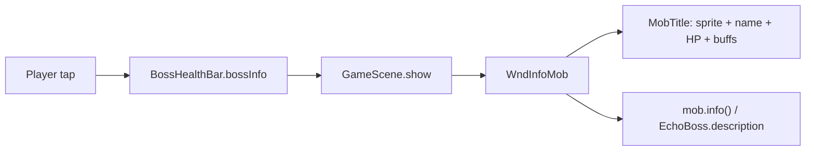

# EchoBoss health-bar inspect — pattern dump

Tap the boss-bar icon (or bar) to see the echo’s **equipped kit**. This file is the existing plumbing and the UIs to copy — not a design.

Related: [NAMING.md](NAMING.md) · [echo-boss-gap-analysis.md](echo-boss-gap-analysis.md) · [echo-boss-health-bar-inspect-implementation-plan.md](echo-boss-health-bar-inspect-implementation-plan.md)

---

## What exists today

Tap on the boss bar already opens a **mob info** window. It does **not** show equipped items.



Examine-cell on the EchoBoss body uses the same `WndInfoMob` path.

---

## 1. Boss bar tap (entry point)

[`BossHealthBar`](../../core/src/main/java/com/shatteredpixel/shatteredpixeldungeon/ui/BossHealthBar.java) is created in [`GameScene`](../../core/src/main/java/com/shatteredpixel/shatteredpixeldungeon/scenes/GameScene.java) and assigned from [`EchoBoss.notice`](../../core/src/main/java/com/shatteredpixel/shatteredpixeldungeon/actors/mobs/EchoBoss.java) / restore / [`EchoBossSpawner.present`](../../core/src/main/java/com/shatteredpixel/shatteredpixeldungeon/heroechoes/boss/EchoBossSpawner.java).

**Invisible overlay button covers the whole bar**, not just the skull/icon:

```java
bossInfo = new Button() {
    @Override
    protected void onClick() {
        super.onClick();
        if (boss != null) {
            GameScene.show(new WndInfoMob(boss));
        }
    }

    @Override
    protected String hoverText() {
        if (boss != null) {
            return boss.name();
        }
        return super.hoverText();
    }
};
add(bossInfo);
// ...
bossInfo.setRect(x, y, bar.width, bar.height);
```

Large UI uses a live sprite as the “skull”; small UI uses a 6×6 skull chip:

```java
if (boss != null && large) {
    skull = boss.sprite();
} else {
    skull = new Image(barAsset, 64, 0, 6, 6);
}
```

Echo-only name above the bar:

```java
public static String nameLabelFor(Mob boss) {
    if (!(boss instanceof EchoBoss)) {
        return null;
    }
    String name = boss.name();
    if (Strings.isBlank(name)) {
        return null;
    }
    return Messages.titleCase(name);
}
```

Assign / bleed / layout also live in `BossHealthBar`. `assignBoss` hops to the render thread and rebuilds skull + [`BuffIndicator`](../../core/src/main/java/com/shatteredpixel/shatteredpixeldungeon/ui/BuffIndicator.java).

[`Button`](../../core/src/main/java/com/shatteredpixel/shatteredpixeldungeon/ui/Button.java): left click → `onClick()`, hover → `hoverText()`, long-click supported.

---

## 2. Parallel: hero portrait / HP tap

[`StatusPane`](../../core/src/main/java/com/shatteredpixel/shatteredpixeldungeon/ui/StatusPane.java) splits **avatar** vs **bar** into two buttons; both open [`WndHero`](../../core/src/main/java/com/shatteredpixel/shatteredpixeldungeon/windows/WndHero.java):

```java
heroInfo = new Button() {
    @Override
    protected void onClick() {
        Camera.main.panTo(Dungeon.hero.sprite.center(), 5f);
        GameScene.show(new WndHero());
    }
};
// ...
heroInfoOnBar = new Button() {
    @Override
    protected void onClick() {
        Camera.main.panTo(Dungeon.hero.sprite.center(), 5f);
        GameScene.show(new WndHero());
    }
};
```

Layout: avatar hitbox is the portrait pane; `heroInfoOnBar` is only the HP/exp strip.

`WndHero` already accepts a **non-player** hero:

```java
public WndHero(Hero hero) { /* stats / talents / buffs for this hero */ }
public WndHero() { this(Dungeon.hero); }
```

**Do not reuse `WndHero` as-is for EchoBoss.** Stats tab mixes kit fields with **player** `Statistics` (gold, deepest floor, seed). Talents tab uses `TalentButton.Mode.UPGRADE`. Buffs tab lists `hero.buffs()` — kit buffs, not body buffs.

---

## 3. Parallel: examine cell

[`GameScene.examineObject`](../../core/src/main/java/com/shatteredpixel/shatteredpixeldungeon/scenes/GameScene.java):

```java
public static void examineObject(Object o) {
    if (o == Dungeon.hero) {
        GameScene.show(new WndHero());
    } else if (o instanceof Mob && ((Mob) o).isActive()) {
        GameScene.show(new WndInfoMob((Mob) o));
        // ...
    } else if (o instanceof Heap && !((Heap) o).isEmpty()) {
        GameScene.show(new WndInfoItem((Heap) o));
    }
    // plants, traps, ...
}
```

Window attach:

```java
public static void show(Window wnd) {
    if (scene != null) {
        cancel();
        // inherit inventory-pane offset if a window is already up
        scene.addToFront(wnd);
    }
}
```

---

## 4. Current inspect window (no gear)

[`WndInfoMob`](../../core/src/main/java/com/shatteredpixel/shatteredpixeldungeon/windows/WndInfoMob.java) extends [`WndTitledMessage`](../../core/src/main/java/com/shatteredpixel/shatteredpixeldungeon/windows/WndTitledMessage.java):

```java
public WndInfoMob(Mob mob) {
    super(new MobTitle(mob), mob.info());
}
```

`MobTitle` builds `mob.sprite()`, name, [`HealthBar`](../../core/src/main/java/com/shatteredpixel/shatteredpixeldungeon/ui/HealthBar.java), `BuffIndicator`. Echo sprite must `linkVisuals` even without `link()` — see §8.

[`EchoBoss.name`](../../core/src/main/java/com/shatteredpixel/shatteredpixeldungeon/actors/mobs/EchoBoss.java) / description:

```java
@Override
public String name() {
    if (echo == null) {
        return Messages.get(this, "name");
    }
    return Echo.resolveUserName(echo.userName, echo.heroClass);
}

@Override
public String description() {
    return Messages.get(this, "desc", echoHero.heroClass.title());
}
```

---

## 5. Closest copy: stored-echo kit viewer

[`WndEchoDetail`](../../core/src/main/java/com/shatteredpixel/shatteredpixeldungeon/windows/WndEchoDetail.java) is the UI that **already shows echo equipped items**. Opened from debug [`WndEchoes`](../../core/src/main/java/com/shatteredpixel/shatteredpixeldungeon/windows/WndEchoes.java) list tap.

### Hero restore for UI

Constructor loads a **view** hero via [`EchoHeroLoader`](../../core/src/main/java/com/shatteredpixel/shatteredpixeldungeon/windows/EchoHeroLoader.java) and **temporarily swaps** `Dungeon.hero` so [`InventorySlot`](../../core/src/main/java/com/shatteredpixel/shatteredpixeldungeon/ui/InventorySlot.java) equipped-highlight works:

```java
this.previousHero = Dungeon.hero;
this.viewHero = EchoHeroLoader.load(echo);
if (viewHero != null) {
    Dungeon.hero = viewHero;
}
// hide() restores previousHero
```

**Live fight: do not swap `Dungeon.hero`.** Combat, inventory pane, and `isEquipped(Dungeon.hero)` all assume the player. For EchoBoss, use `boss.getEchoHero()` (already restored) and inspect with [`WndInfoItem`](../../core/src/main/java/com/shatteredpixel/shatteredpixeldungeon/windows/WndInfoItem.java) / [`ItemSlot`](../../core/src/main/java/com/shatteredpixel/shatteredpixeldungeon/ui/ItemSlot.java) / ranking-style `ItemButton` — not `WndUseItem`.

`EchoHeroLoader.load`:

```java
if (snapshot.echoData != null) {
    try {
        return EchoHeroSnapshot.restoreHero(snapshot);
    } catch (Throwable ignored) {
    }
}
return fallbackHero(snapshot); // hollow kit for list UI only
```

Live EchoBoss already failed construction if restore failed (`initFromEcho` throws).

### Inventory tab (copy this layout)

Five equipped slots + optional `secondWep` + backpack, placeholders for empty slots, tap → **info only**:

```java
Belongings stuff = viewHero.belongings;
placeItem(stuff.weapon != null ? stuff.weapon : placeholder(ItemSpriteSheet.WEAPON_HOLDER));
placeItem(stuff.armor != null ? stuff.armor : placeholder(ItemSpriteSheet.ARMOR_HOLDER));
placeItem(stuff.artifact != null ? stuff.artifact : placeholder(ItemSpriteSheet.ARTIFACT_HOLDER));
placeItem(stuff.misc != null ? stuff.misc : placeholder(ItemSpriteSheet.SOMETHING));
placeItem(stuff.ring != null ? stuff.ring : placeholder(ItemSpriteSheet.RING_HOLDER));
if (stuff.secondWep != null) {
    placeItem(stuff.secondWep);
}
```

Slot click (inspect, no use/equip):

```java
InventorySlot slot = new InventorySlot(item) {
    @Override
    protected void onClick() {
        if (item != null && !(item instanceof WndBag.Placeholder)) {
            GameScene.show(new WndInfoItem(item));
        }
    }

    @Override
    protected boolean onLongClick() {
        onClick();
        return true;
    }
};
if (item == null || item instanceof WndBag.Placeholder) {
    slot.enable(false);
}
```

Empty-slot image: [`WndBag.Placeholder`](../../core/src/main/java/com/shatteredpixel/shatteredpixeldungeon/windows/WndBag.java) (`WEAPON_HOLDER`, `ARMOR_HOLDER`, `ARTIFACT_HOLDER`, `SOMETHING`, `RING_HOLDER`). `name()` is null so slots disable.

Grid sizing: `WndEchoDetail.fittingInventorySlotSize(slotCount)` — 5 columns, shrink 28→16 to fit 120×120. Tests in `EchoViewerTest`.

Stats tab in the same window mirrors `WndHero.StatsTab` (STR / HP / exp / depth / seed) **without** player `Statistics`.

---

## 6. Other equipped-item UIs

### Player inventory pane

[`InventoryPane.updateInventory`](../../core/src/main/java/com/shatteredpixel/shatteredpixeldungeon/ui/InventoryPane.java) — same five slots, **always `Dungeon.hero.belongings`**:

```java
Belongings stuff = Dungeon.hero.belongings;
equipped.get(0).item(stuff.weapon == null ? new WndBag.Placeholder(ItemSpriteSheet.WEAPON_HOLDER) : stuff.weapon);
equipped.get(1).item(stuff.armor == null ? new WndBag.Placeholder(ItemSpriteSheet.ARMOR_HOLDER) : stuff.armor);
equipped.get(2).item(stuff.artifact == null ? new WndBag.Placeholder(ItemSpriteSheet.ARTIFACT_HOLDER) : stuff.artifact);
equipped.get(3).item(stuff.misc == null ? new WndBag.Placeholder(ItemSpriteSheet.SOMETHING) : stuff.misc);
equipped.get(4).item(stuff.ring == null ? new WndBag.Placeholder(ItemSpriteSheet.RING_HOLDER) : stuff.ring);
```

Click → [`WndUseItem`](../../core/src/main/java/com/shatteredpixel/shatteredpixeldungeon/windows/WndUseItem.java) (actions on **player**). Long-click in selector mode → `WndInfoItem`.

### Player bag window

[`WndBag.placeItems`](../../core/src/main/java/com/shatteredpixel/shatteredpixeldungeon/windows/WndBag.java) — same five placeholders, then backpack. Also hardcoded to `Dungeon.hero.belongings`. Click → `WndUseItem`.

### Rankings (another run’s gear)

[`WndRanking.ItemsTab`](../../core/src/main/java/com/shatteredpixel/shatteredpixeldungeon/windows/WndRanking.java) loads that run into `Dungeon.hero` via `Rankings.loadGameData`, then lists equipped items as named rows:

```java
Belongings stuff = Dungeon.hero.belongings;
if (stuff.weapon != null) addItem(stuff.weapon);
if (stuff.armor != null) addItem(stuff.armor);
if (stuff.artifact != null) addItem(stuff.artifact);
if (stuff.misc != null) addItem(stuff.misc);
if (stuff.ring != null) addItem(stuff.ring);
```

Row widget (copy if you want name + icon, not a bag grid):

```java
private class ItemButton extends Button {
    // ItemSlot + ColorBlock + item.name()
    @Override
    protected void onClick() {
        Game.scene().add(new WndInfoItem(item));
    }
}
```

Uses `Game.scene().add`, not `GameScene.show` (rankings is not always `GameScene`). In-fight UI should use `GameScene.show`.

### Shared chrome

- [`ItemSlot`](../../core/src/main/java/com/shatteredpixel/shatteredpixeldungeon/ui/ItemSlot.java) — item sprite + upgrade/STR text; extends `Button`.
- [`InventorySlot`](../../core/src/main/java/com/shatteredpixel/shatteredpixeldungeon/ui/InventorySlot.java) — `ItemSlot` + equipped/cursed tint. **`item()` compares against `Dungeon.hero.belongings`.**
- [`ItemButton`](../../core/src/main/java/com/shatteredpixel/shatteredpixeldungeon/ui/ItemButton.java) (ui package) — red-chrome slot; forwards click.
- [`IconTitle`](../../core/src/main/java/com/shatteredpixel/shatteredpixeldungeon/windows/IconTitle.java) — icon + title for windows (`new IconTitle(item)`).

---

## 7. Item inspect vs use

[`WndInfoItem`](../../core/src/main/java/com/shatteredpixel/shatteredpixeldungeon/windows/WndInfoItem.java) — title + `item.info()`. Singleton: opening a second hides the first.

[`WndUseItem`](../../core/src/main/java/com/shatteredpixel/shatteredpixeldungeon/windows/WndUseItem.java) extends it and adds **player actions** only if:

```java
if (Dungeon.hero.isAlive() && Dungeon.hero.belongings.contains(item)) {
    for (final String action : item.actions(Dungeon.hero)) {
        // execute(Dungeon.hero, action)
    }
}
```

Echo kit items are not in the player belongings → `WndUseItem` would show info with **no buttons**. Prefer `WndInfoItem` so it is obviously inspect-only.

Buff icons on the boss bar already inspect on tap ([`BuffIndicator`](../../core/src/main/java/com/shatteredpixel/shatteredpixeldungeon/ui/BuffIndicator.java) → `WndInfoBuff`). Nested windows stack via `GameScene.show`.

---

## 8. Kit data (what to show)

Live EchoBoss kit:

```java
Hero kit = boss.getEchoHero();
Belongings stuff = kit.belongings;
// raw fields for UI (comment in Belongings: use raw when showing an interface)
stuff.weapon; stuff.armor; stuff.artifact; stuff.misc; stuff.ring; stuff.secondWep;
```

[`Belongings`](../../core/src/main/java/com/shatteredpixel/shatteredpixeldungeon/actors/hero/Belongings.java): `weapon()` / `armor()` / … gate on `LostInventory`. Raw fields are what inventory UIs use.

Snapshot helpers in [`EchoHeroSnapshot`](../../core/src/main/java/com/shatteredpixel/shatteredpixeldungeon/heroechoes/EchoHeroSnapshot.java):

```java
EchoHeroSnapshot.hasEquippedItems(echo.echoData);
EchoHeroSnapshot.heroHasEquippedItems(hero);
EchoHeroSnapshot.recordEquippedItems(hero, echoData);
```

Text-only dump (no sprites): [`EchoDetailsFormatter`](../../core/src/main/java/com/shatteredpixel/shatteredpixeldungeon/windows/EchoDetailsFormatter.java) (`weapon` / `armor` titles) + [`EchoBackpackFormatter`](../../core/src/main/java/com/shatteredpixel/shatteredpixeldungeon/windows/EchoBackpackFormatter.java).

---

## 9. Health-bar icon = echo sprite

[`EchoBoss.sprite()`](../../core/src/main/java/com/shatteredpixel/shatteredpixeldungeon/actors/mobs/EchoBoss.java) — bar / `WndInfoMob` / examine call this **without** `CharSprite.link`:

```java
@Override
public CharSprite sprite() {
    CharSprite s = super.sprite();
    s.linkVisuals(this);
    return s;
}
```

[`EchoBossSprite.linkVisuals`](../../core/src/main/java/com/shatteredpixel/shatteredpixeldungeon/sprites/EchoBossSprite.java) applies class + armor tier from kit:

```java
Hero echoHero = boss.getEchoHero();
HeroClass cls = echoHero != null ? echoHero.heroClass : /* echo.heroClass or WARRIOR */;
setup(cls, armorTierFor(echoHero, echo));
```

Avatar (static, not a `CharSprite`): [`HeroSprite.avatar(Hero)`](../../core/src/main/java/com/shatteredpixel/shatteredpixeldungeon/sprites/HeroSprite.java) / `avatar(HeroClass, int armorTier)` — used by `WndHero`, `WndEchoDetail`, `WndEchoes` list.

---

## 10. Copy / don’t copy

| Want              | Copy                                                 | Avoid                                                   |
| ----------------- | ---------------------------------------------------- | ------------------------------------------------------- |
| Tap target        | `BossHealthBar.bossInfo` `Button` + `GameScene.show` | New overlay framework                                   |
| Icon-only hitbox  | `StatusPane.heroInfo` vs `heroInfoOnBar` split       | —                                                       |
| Equipped grid     | `WndEchoDetail.InventoryTab`                         | `WndBag` / `InventoryPane` (player-owned, `WndUseItem`) |
| Named item rows   | `WndRanking.ItemsTab` + inner `ItemButton`           | Swapping `Dungeon.hero` during a fight                  |
| Item details      | `WndInfoItem`                                        | `WndUseItem` (player execute)                           |
| Live kit          | `EchoBoss.getEchoHero().belongings`                  | `EchoHeroLoader.load` / `fallbackHero`                  |
| Window chrome     | `WndTabbed` / `WndTitledMessage` / `IconTitle`       | —                                                       |
| Hero stats window | `WndEchoDetail.StatsTab` (echo fields only)          | `WndHero` (player `Statistics` + talent upgrade)        |

`InventorySlot.item()` equipped tint is tied to `Dungeon.hero`. For a live echo either use `ItemSlot` / ranking `ItemButton`, or accept un-tinted slots.

---

## Tests already nearby

- `UiUxAndPolishTest` — bar label username; `EchoBossSprite` armor tier from kit
- `EchoBossSpriteTest` — `Mob.sprite()` without `link()` (bar / `WndInfoMob`)
- `EchoViewerTest` — `WndEchoDetail` 5-col grid fit; backpack formatter
- `EchoHeroSnapshotTest` — equipped items restore for sprite/combat
- `EchoBossSpawnerTest` — `BossHealthBar.assignBoss`
