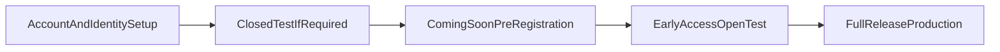

# Google Play Release Roadmap

High-level checklist for launching **I am the Dungeon Boss** on Google Play in three stages. Each stage has its own file with non-code tasks, code tasks, and exit criteria. Drill into individual items later as needed.

## Stages

| Stage           | Play track       | Monetization                            | Checklist                                |
| --------------- | ---------------- | --------------------------------------- | ---------------------------------------- |
| 1. Coming soon  | Pre-registration | None                                    | [01-coming-soon.md](01-coming-soon.md)   |
| 2. Early access | Open testing     | Optional supporter tiers (Play Billing) | [02-early-access.md](02-early-access.md) |
| 3. Full release | Production       | Gameplay/content IAP (Play Billing)     | [03-full-release.md](03-full-release.md) |

## Stage flow

**Dependencies**

- **Production access** — Personal developer accounts created after 13 Nov 2023 must run a closed test with at least 12 opted-in testers for 14 continuous days before applying for production access. Pre-registration and open testing require production access.
- **Pre-registration limit** — Campaigns run up to 90 days; plan the early-access transition before starting.
- **Package ID is permanent** — Choose the final `applicationId` before the first public Play upload; it cannot change later.
- **Monetization progression** — Supporter tiers in early access; gameplay/content products at full release. Both use Google Play Billing for digital goods.

## How to use these checklists

- Work through stages in order unless a dependency explicitly allows parallel prep.
- Check off items (`- [ ]` → `- [x]`) as they are completed.
- Keep tasks at workstream level here; create child docs under `docs/release/` when an item needs a detailed breakdown.
- Do not duplicate tasks across stages — each item lives in the earliest stage where it becomes necessary.

## Cross-cutting references

These existing docs cover risks and fork-specific work that span multiple stages:

| Doc                                                         | Relevance                                                 |
| ----------------------------------------------------------- | --------------------------------------------------------- |
| [PENDING-LINKS.md](../PENDING-LINKS.md)                     | Upstream URLs still pointing at Shattered Pixel Dungeon   |
| [recommended-changes.md](../recommended-changes.md)         | Package ID, icons, credits, Patreon, update/news services |
| [getting-started-android.md](../getting-started-android.md) | Build, signing, AAB, Play distribution warnings           |
| [android-signing.md](android-signing.md)                     | Release keystore setup and backup for IATDB               |
| [prepare-release.md](prepare-release.md)                     | One-command APK + JAR packaging into `dist/`                |
| [hero-echoes/NAMING.md](../hero-echoes/NAMING.md)           | Product naming: game vs Hero Echoes service               |

## Status

| Stage        | Status                                                                                                                                         | Target date |
| ------------ | ---------------------------------------------------------------------------------------------------------------------------------------------- | ----------- |
| Coming soon  | In progress — code/config first; **assets deferred until before Play upload** (see [01-coming-soon.md](01-coming-soon.md#decisions-this-pass)) |             |
| Early access | Not started                                                                                                                                    |             |
| Full release | Not started                                                                                                                                    |             |
