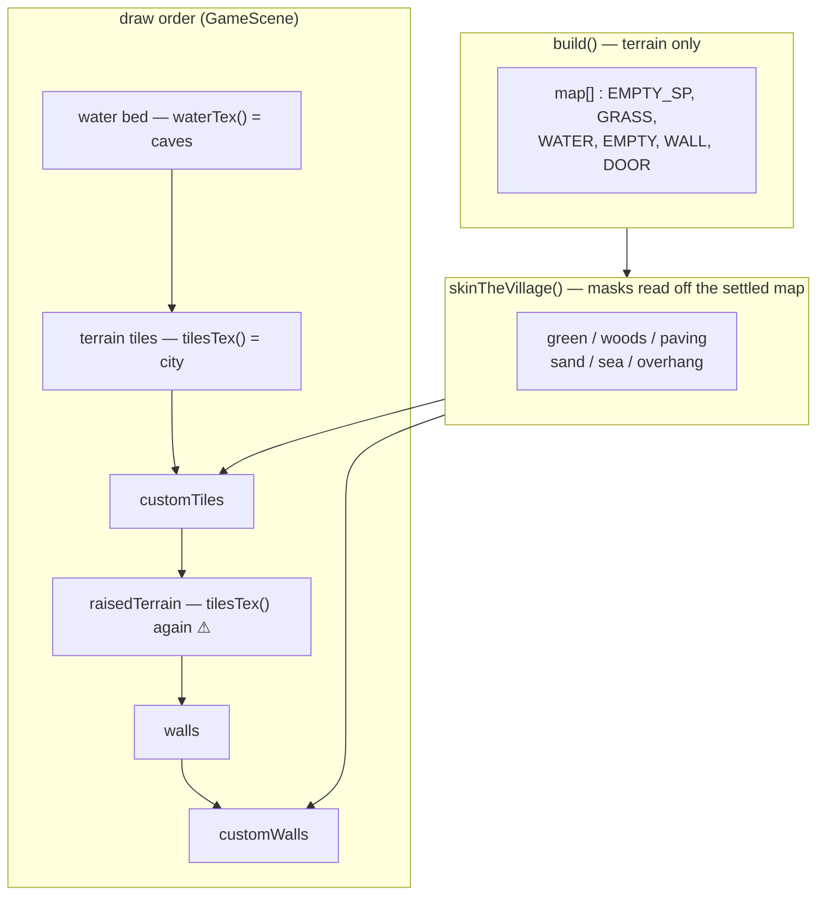

# Village redesign — design sketch

Status: **design agreed, not implemented.** This captures the layout decisions made during
sketching so implementation can start from a settled target. Current shipped layout is
[`village-map.png`](village-map.png), rendered by
[`VillageMapRenderer.java`](../../core/src/test/java/com/shatteredpixel/shatteredpixeldungeon/tools/VillageMapRenderer.java).

## Why

The village today is a 33×33 field of grass with a carpet path down column 8, a few
scattered props (well, firepit, market stall, two statues) and four villagers. It reads as
an empty lawn rather than an inhabited place, the map border is visible black, and the five
echo `DEPTH_POSTS` sit in an unremarkable row along the waterfront. The redesign makes the
village denser, makes its edges read as endless, and gives the echo bosses a real monument.

## Village layout

```
                    forest belt (N)
              ┌──────────────────────────┐
              │        DUNGEON gate      │   → WndDungeonMode
              │            │             │
   GUILD ─────┤            │             ├───── SMITHY
 (crier,      │            │             │    (forge glow)
  leaderboard)│      ECHO ALTAR          │
              │      (see below)         │
  ← wood-path ┼──────  ●  ───────────────┼ wood-path →
              │                          │
    ELDER ────┤            │             ├───── SHOP
              │          TAVERN          │    (awning, coin sign)
              │        (world chat)      │
              └────────────┬─────────────┘
                    sand ──┴── DOCK ──── boat
                        sea (S)
```

| Element | Placement | Notes |
| --- | --- | --- |
| Dungeon mouth | North, centre | **Not a building.** A 3×3 of paving with the stair at its middle, and a statue either side of the path just below it, so they are passed between on the way in rather than looked at from a forecourt. A walled gatehouse with its own door puts two thresholds between the town and the one thing the town exists to point at, and the second carries no meaning. |
| Echo Altar | Centre | See below. Replaces the plain plaza. |
| Guild | NW | Title crier + leaderboard board. |
| Smithy | NE | Forge glow as a light source. |
| Elder | W | Small cottage. |
| Shop | E | Replaces the player house, which is dropped entirely. Its door is on the **north** wall, facing the east road, not the beach. |
| Tavern | S, on the shore, pulled east, 8×4 | World-chat gathering spot, sited so the dock runs off its porch rather than off open beach. |
| Dock | S, into the water, off the tavern | Planks + moored boat. It starts on the cell below the tavern's **south door**, crosses the beach and runs out over open water — which is the whole reason the tavern was pulled east. The sea is brought fully in under its columns, so the jetty stands over water rather than stopping at the waterline. |
| Shore | S | An **organic** waterline: the sea bites one or two cells into the beach column by column, repeating across the map, because a ruled edge reads as the map being cut off rather than as a coast. The beach starts on a fixed row, so however far the sea comes in there is always **at least one row of sand above it and one row of water below** — a column that is all sand is not a sea, one that is all water is a hole in the map. The outer columns are left to the forest belt, so the beach is never the last thing on the map edge. |
| Shore, drawn | `WATER_CAVES` + [`VillageShore`](../../core/src/main/java/com/shatteredpixel/shatteredpixeldungeon/village/VillageShore.java) | The sand is caves floor, so the sea and its lip are caves too. The water texture is set by `waterTex()`; the **lip is not** — the terrain layer stitches it from `tilesTex()`, which is the city's pale worked kerb, and a kerb like that against raw cave floor reads as a harbour wall dropped into open coast. `VillageShore` recomputes the four-bit stitch from the sea's own shape and redraws it from the caves sheet, on top. Same fix as [`AltarShore`](../../core/src/main/java/com/shatteredpixel/shatteredpixeldungeon/village/AltarShore.java), different reason: the altar had no lip at all, the sea has the wrong one. The basins are excluded from the mask, since they keep their own. |
| Villagers | Indoors | Each keeps their own house. The elder is the exception — a ghost has no house to keep, and standing out in the open is most of what makes them read as one. |
| Roads | E only | The east road runs out through the trees and off the map, barricaded where it leaves town. There is no west track: paths in the village exist to reach doors, and a road to nowhere on the west side reached none. |
| Paths to doors | Two avenues + stubs | A spine down column 16, an avenue north of the altar and another south of it, and a short run to each door — so every building is stepped into off paving rather than off open grass. |
| Path shape | `VillageLevel.pave` | Every path **wanders**: it drifts a cell either side of its own line, held for three steps at a time, and never at its two ends, which have to meet the door or junction they were aimed at. Straight rules of paving read as surveying rather than as a track worn by walking. A drift that changed every step would zig-zag, and bridging one zig to the next fills the band in as a slab — so the hold is what keeps the path one cell wide. Anything already built wins: a drift onto a wall, a door or the water is dropped back onto the straight line, so a path can never open a hole in somebody's house. |

No village gate — the east/west dirt paths fading into the trees carry the "there is more
world out there" read instead.

### Endless edges

Two changes together:

1. **Forest belt** on the north, east and west edges and **sea** on the south, so no map
   border is ever the last thing you see.
2. **Camera pan clamp** so the player cannot scroll past that belt. This does not exist
   today — `com.watabou.noosa.Camera` has no bounds field and no clamping anywhere in the
   repo, and edge-scroll in `PixelScene`/`CellSelector` is unbounded. This is new code.

## The Echo Altar

One connected disc at the centre of the village, split into four quarters with a raised
circular dais at the middle.

```
            ╭─────────────────────╮
        ╱   SEWERS   │   PRISON    ╲
      ╱     echo     │    echo       ╲
     │      1–5      │    6–10        │
     ├──────────  ╭─────╮  ──────────┤   ← carpet cross = walkway
     │            │HALLS│             │
     │            │21–25│             │
     │            ╰─────╯             │
      ╲     CITY     │    CAVES      ╱
        ╲    echo    │    echo      ╱
            ╰──── 16–20 │ 11–15 ────╯
```

Quarters run clockwise by depth from the NW: Sewers → Prison → Caves → City, with Halls
raised at the centre on the Dwarf King's throne.

**Only echo bosses stand here.** The actual dungeon bosses (Goo, Tengu, DM-300, Dwarf King,
Yog-Dzewa) never appear in the village. Each quarter's occupant is the reigning player echo
for that depth band; the region identity is carried entirely by the ground under them.
Honorable mentions stay in their existing cluster around the well, which is now laid as a
paved court — the well's 5×5 square, exactly the reach of the cluster, with its two upper
corners dropped and a short run north onto the row-11 avenue so the court is reached by road.

### Construction

| Piece | Mechanism |
| --- | --- |
| Four quarter wedges | One `CustomTilemap` each, `texture` set to that region's sheet — `TILES_SEWERS`, `TILES_PRISON`, `TILES_CAVES`, `TILES_CITY`. |
| Halls centre | A fifth `CustomTilemap` on `TILES_HALLS`. |
| Basins | A basin of `Terrain.WATER` in each quarter, **cut to its own shape** — a sluice for the sewers, a squared tank for the prison, a wandering stream for the caves, a formal pool for the city — with an [`AltarPool`](../../core/src/main/java/com/shatteredpixel/shatteredpixeldungeon/village/AltarPool.java) laid over it drawing that region's own water image (`water0..3.png`). A level has one water texture, so four different waters cannot be terrain — the region's colour has to come from the overlay. The cost is that these basins do not ripple, the overlay drawing above the scrolling bed. |
| Basin shores | [`AltarShore`](../../core/src/main/java/com/shatteredpixel/shatteredpixeldungeon/village/AltarShore.java), one per basin, laid over the water it edges. Necessary because the plaza is floored with `EMPTY_SP`, which is **not** in `DungeonTileSheet.waterStitcheable`: the terrain layer stitches every basin cell against nothing, lands on the bare `WATER` index, and `DungeonTerrainTilemap.needsRender` then skips it — leaving water with no shoreline at all, a square hole cut in the floor. The four-bit stitch is worked out from the basin's own shape instead, and drawn from the region's sheet so the lip matches the water. A corollary: **no basin cell may have water on all four sides**, or it lands back on that skipped index and the pool renders with a hole in it. |
| Dock | [`VillageDock`](../../core/src/main/java/com/shatteredpixel/shatteredpixeldungeon/village/VillageDock.java), east of the road down through town, planked with the **sewers** sheet's `FLOOR_SP`. The city sheet has no wood on it at all — its worked floor is the walkway's red carpet, so a dock in the level's own tiles reads as a rug on the water. |
| Throne | A sixth `CustomTilemap` on `Assets.Environment.CITY_BOSS`, art borrowed from [`CityBossLevel.CustomGroundVisuals`](../../core/src/main/java/com/shatteredpixel/shatteredpixeldungeon/levels/CityBossLevel.java). Throne tiles are `13*8+1..3`, `14*8+1..3`, `15*8+1..3`; shadow is `13*8+5`, on the **ground** layer with the rest of the chair so it stays behind the sitting echo's name tag. The seat sits on the dead centre of the disc and stays **walkable** — unlike the arena's `Terrain.CUSTOM_DECO`, because the deepest echo's post *is* the chair: the reigning Halls champion is found sitting in it, not standing in front of it. |
| Raised dais | The halls sheet's **plain** floor over a **3×3** centre — the centre is the halls quarter, so it is laid like the other four. No step treads: the walkway runs up to the platform's edge in the same paving it carries everywhere else, which reads as one road arriving rather than as a stepped approach. The disc reaches four, so the quarters are small; basins and quarter posts sit between a reach of two and four from the centre. *(The sketch's elevation ring on `customWalls` is not built — it needs art the halls sheet does not contain.)* |
| Walkway | A cross of the **city**'s `FLOOR_SP` through the disc — no overlay at all, since `EMPTY_SP` terrain is already drawn from `tilesTex()`, which is the city sheet. The halls paving that carries the town's roads stops at the disc's edge: the altar is a city monument and its four walkways read as its own stonework rather than as a road running through it. North to the dungeon gate, south to the tavern and dock, east/west to the wood-paths. |
| Village skin | Four [`VillageSkin`](../../core/src/main/java/com/shatteredpixel/shatteredpixeldungeon/village/VillageSkin.java) overlays outside the disc: **caves** `GRASS`/`GRASS_ALT` as the default ground, **sewers** `RAISED_HIGH_GRASS`/`_ALT` for the forest belt, **halls** `FLOOR_SP` for every path outside the disc, **caves** `FLOOR_ALT_2` for the shore's sand, and a **sewers** `HIGH_GRASS_OVERHANG` pass on `customWalls`. The caves ground is painted under the woods as well as under the open green: tall grass is drawn with gaps between its blades, so without an opaque tile beneath it the tile below shows through. The overhang is a separate overlay because `DungeonWallsTilemap` draws it on the cell *above* the grass.<br><br>**The woods are not `HIGH_GRASS` terrain.** They cannot be: `GameScene` adds `raisedTerrain` (a `RaisedTerrainTilemap`, drawn from `tilesTex()`) **after** `customTiles`, so the city's white-flowered blades sit above every skin and no overlay can cover them. The belt and the scattered tufts are therefore laid as tall grass during `build()`, captured as a mask, and then dropped back to plain `GRASS` at the end of `skinTheVillage` — the tallness is drawn entirely by the two skins. This costs nothing here, since village grass neither blocks sight nor can be trampled. |
| Occupants | The existing `VillageEcho` pattern: `PASSIVE` + `IMMOVABLE` NPC, `level.mobs.add(body)` then `GameScene.addSprite(body)`, as in [`VillageFigures.java`](../../core/src/main/java/com/shatteredpixel/shatteredpixeldungeon/village/VillageFigures.java). |

Base terrain under the entire disc stays a walkable floor type. Every region texture is a
purely visual overlay on top of it.

## How the village is drawn

Terrain and appearance are two separate things here. `map[]` carries only
*meaning* — walkable, water, door, wall — and a level has exactly one terrain
sheet (`tilesTex()`, the city's) and one water sheet (`waterTex()`). Everything
that makes the village look like five different regions is a `CustomTilemap`
laid over that, each with its own `texture`.



| Layer | What the village puts there |
| --- | --- |
| `customTiles` | 4 `AltarQuadrant` → 4 `AltarPool` → 4 `AltarShore` → `AltarDais` → `AltarThrone`, then the `VillageSkin`s (caves ground, caves sand, sewers blades, halls paving) and `VillageShore` |
| `customWalls` | `AltarThroneShadow`, and the sewers grass overhang |

Two rules fall out of that stack, and both were found the hard way:

- **`raisedTerrain` sits above `customTiles`.** Tall grass drawn by the terrain
  layer can never be covered by a skin, so the woods are dropped to plain
  `GRASS` terrain and drawn entirely as overlays.
- **`customWalls` sits above the mobs.** `GameScene` adds the walls, and the
  custom walls with them, after the mob layer — so anything of the throne left
  up there is drawn over the name tag of whoever is sitting in it.
  `AltarThroneShadow` therefore goes on `customTiles`, below the mobs, unlike
  `CityBossLevel`'s equivalent: the z order the scene wants is throne, echo,
  echo's name, and its shouted title, which floats up off the head as the
  game's own good-news text does.
- **A shoreline is not free.** `EMPTY_SP` is not in `waterStitcheable`, so altar
  basins get *no* lip; the sea gets the *city's* lip, which does not match the
  caves sand. Both are fixed by recomputing the four-bit stitch from the shape
  itself — `AltarShore` and `VillageShore`.

Where the geometry lives splits the two overlay families: the altar pieces read
their shape from [`EchoAltar`](../../core/src/main/java/com/shatteredpixel/shatteredpixeldungeon/village/EchoAltar.java)
(pure maths, no level), while the skins are handed an explicit mask built from
the finished map. Neither reaches for `Dungeon.level`. Every piece implements
[`AltarOverlay`](../../core/src/main/java/com/shatteredpixel/shatteredpixeldungeon/village/AltarOverlay.java)
— a pure `tileData()` plus `textureName()` — which is what lets the tests and
the map renderer run with no GL context, since `create()` needs one.

## Implementation notes

- `VillageLevel.tilesTex()` returns `TILES_CITY` and the village previously used **no**
  `CustomTilemap` at all. Six of them is a new pattern for this level — mechanically fine,
  since `CustomTilemap.texture` is per-instance, but no existing level in the repo mixes
  region tilesets like this.
- **Nothing on the altar may call `create()` outside the game.** It resolves the texture
  through the texture cache and so needs a GL context the headless test harness does not
  have. Every altar piece therefore implements
  [`AltarOverlay`](../../core/src/main/java/com/shatteredpixel/shatteredpixeldungeon/village/AltarOverlay.java)
  — a pure `tileData()` plus the sheet it is read from — which is what both the tests and
  [`VillageMapRenderer`](../../core/src/test/java/com/shatteredpixel/shatteredpixeldungeon/tools/VillageMapRenderer.java)
  use. `create()` only feeds that array to the tilemap.
- **Every quarter takes its own sheet's plain `FLOOR`.** What tells one quarter from the
  next is the sheet, not the slot, and picking a different slot per region made the four
  read as four unrelated materials rather than as one plaza laid in four stones. What
  separates them is the walkway between: the disc's own `EMPTY_SP` paving, which the city
  sheet draws as red carpet under no overlay at all.
- **Every tile each sheet offers is catalogued in
  [`village-tilesets.png`](village-tilesets.png)** — floors, water and grass side by side,
  with what is in use marked and duplicate slots called out. The notes below are read off it.
- **Each quarter has seven floor slots, not one**: `FLOOR`, `FLOOR_ALT_1`,
  `FLOOR_ALT_2`, `FLOOR_DECO`, `FLOOR_DECO_ALT`, `FLOOR_SP`, `FLOOR_SP_ALT`. An earlier
  version of this note claimed the `_ALT` floors are pixel-identical to `FLOOR` on all five
  sheets; that is true only of `tiles_city`. On the other four `FLOOR_ALT_1` is a genuinely
  different weave, and only the prison and caves fold `FLOOR_ALT_2` back onto it — so real
  per-quarter variance is available on four sheets of five. The `_DECO` pair is a scatter
  overlay (sewer moss, prison blood, cave quartz, halls veining) and would read as ground
  cover rather than as a floor swap.
- **Water is the odd one out.** The
  animated bed is one texture for the whole level, so the four basin colours can only come
  from `AltarPool` overlays, while the 16 stitched `WATER+n` slots on each region sheet are
  transparent in the middle with a painted rim — which is exactly why `WATER+0`, the
  fully-blank slot, is the one the terrain layer skips. Grass has six slots per sheet
  (`GRASS`, `GRASS_ALT`, and raised/furrowed tall grass with an alt each), but the village
  only ever reaches its own `tilesTex()` grass; the other four sheets' grass would need a
  `CustomTilemap`, the way the quarters do.
- All five `tiles_*.png` share **one 16-column layout, and tile index N is the same terrain on
  every sheet** — `DungeonTerrainTilemap.getTileVisual()` computes indices from
  `DungeonTileSheet` constants with no region branching at all. So `DungeonTileSheet.FLOOR`
  is plain floor on the sewers sheet, the caves sheet and the rest alike; no per-sheet index
  hunting is needed. (`custom_tiles/city_boss.png` is the exception: it is 8 columns, not 16.)
- The five `DEPTH_POSTS` move from `PROMENADE_X`/`PROMENADE_Y` onto the altar quarters.
  `MENTION_POSTS` keep their arrangement but follow the well, which moves off the middle of
  town to (7,13) to make room for the altar.

### Tests this will break

These assert exact coordinates and layout invariants, so they need updating alongside:

- [`VillageLevelBuildTest.java`](../../core/src/test/java/com/shatteredpixel/shatteredpixeldungeon/village/VillageLevelBuildTest.java) — map size, exit position, arrival cell one step short of the mouth, path reachability.
- [`VillageFigurePlacementTest.java`](../../core/src/test/java/com/shatteredpixel/shatteredpixeldungeon/village/VillageFigurePlacementTest.java) — every post unique, walkable, and not blocking the path.
- [`VillageFiguresTest.java`](../../core/src/test/java/com/shatteredpixel/shatteredpixeldungeon/village/VillageFiguresTest.java) — reconciliation against the post arrays.

Per the repo's TDD rule, characterize-then-change: update these tests to the new layout
first, watch them fail, then build.

## Open

- Exact disc radius in tiles, and whether the altar footprint forces the 33×33 `SIZE` up.
- Whether the dungeon gate moving north changes `arrivalCell()`/`dungeonEntrance()` semantics.
- Camera clamp design — where the bounds live and how they are set per level.
